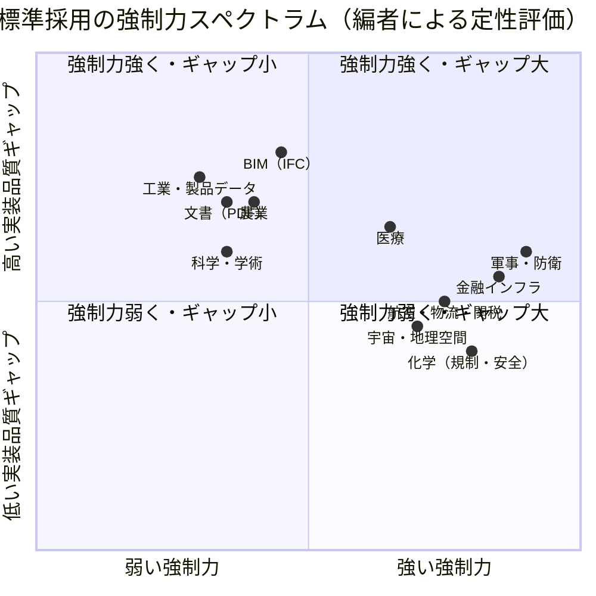

# 国際標準規格の採用実態に関する総括レポート（改訂版）

作成日: 2026年7月24日（改訂版）
対象: PDF標準（ISO 32000系）の普及状況から始まる一連の議論の整理・総括
目的: 資料として活用可能な、領域横断的な比較分析
改訂概要: 11領域の標準名・採用実態・数値を一次情報で再検証し、版・年号を最新化。分析枠組みに反証・多元的要因を補強。事実（観察）と自プロジェクトへの戦略的含意（提言）を明確に区別。

> **凡例**：本文中の数値・年号は 2026年7月時点で確認した一次情報に基づく。編者の定性評価には〔評価〕と付す。

---

## 1. はじめに：問題意識

国際標準規格は「技術的に正しい」「相互運用を促進する」ことを目的に策定される。しかし実際の普及は、技術的優位性だけでは決まらない。

民間企業の現実的判断（互換性維持・ベンダーロック・短期収益・既存顧客基盤の保護）が大きく影響し、結果として「標準はあるが本気で実装されない」「名目上の準拠に留まる」現象が広範に観察される。

一方で、その逆も真である。**技術的優位・低い採用コスト・ネットワーク効果が揃えば、法的強制がなくても標準は支配的になる**（PDF そのもの、HTTP、USB、Unicode など）。したがって採用を決めるのは単一因子ではなく、複数の駆動メカニズムの合成である。

本レポートでは、PDFを起点に、BIM、工業、金融、医療、物流、軍事、宇宙・地理空間、農業、化学、科学・学術の各領域を横断的に整理し、採用を左右する構造的要因を明らかにする。

---

## 2. 領域区分の整理枠組み

採用力を決定する主要因を以下の軸で整理する。

### 2.1 主要軸

| 軸 | 内容 | 強い場合の例 | 弱い場合の例 |
|----|------|--------------|--------------|
| **排除圧力（Exclusion Pressure）** | 準拠しないとネットワーク・業務から排除されるか | 金融決済、軍事相互運用 | 一般文書PDF、研究データ |
| **規制・政策強制力** | 法律・中央銀行・公共調達による義務化の強さ | REACH/GHS、ISO 20022、NATO STANAG | 任意の学術データ標準 |
| **ネットワーク効果** | 参加者が多いほど価値が高まるか | 決済、税関事前情報、空間データ統合 | 単一企業内ツール |
| **互換性リスク** | 新標準導入で既存資産が壊れるリスクの大きさ | PDF 1.7大量資産、レガシーCAD | 新規システム |
| **商業インセンティブ** | 標準実装が直接収益に結びつくか | 防衛調達、規制対応コンサル | 一般OSSライブラリ |
| **技術的複雑性** | 完全実装のコスト・難易度 | IFC全エンティティ、PDFタグ構造 | 単純な識別子（ORCID等） |
| **標準アクセスコスト**〔改訂で追加〕 | 仕様書の入手容易性（無償/有償）・実装参照の得やすさ | 無償公開のW3C/IETF系、2023年以降のPDF仕様 | 長らく有料販売のみだったISO系 |

> **補足（標準アクセスコスト）**：ISO規格の有料販売は、特に個人・中小・OSS開発者にとって実装障壁になる。PDF 2.0仕様が2017〜2023年はISO有料販売のみで、2023年4月に無償公開されたことは、採用の転機を理解するうえで重要な独立要因である。

### 2.2 領域分類マップ（強制力スペクトラム）

> **注**：以下の座標は編者による定性評価であり、統計値ではない〔評価〕。各領域の位置は「強制メカニズムの合成強度」と「名目準拠と実質活用の乖離（実装品質ギャップ）」の相対関係を示す。

### 2.3 簡易分類表

| 分類 | 領域例 | 特徴 |
|------|--------|------|
| **高強制力型** | 金融、軍事、一部航空・関税、化学規制 | 従わなければ業務が成立しない。採用は進むが「最低限対応」が多い |
| **中強制力型** | 医療、宇宙・地理空間、航空物流 | 規制・国際協力で推進されるが、実装ばらつき・レガシー残存が目立つ |
| **低強制力型** | 文書（PDF）、BIM、工業データ、農業、科学・学術 | 民間判断が優先。標準は存在するが本気実装は限定的 |

---

## 3. 領域別分析

### 3.1 文書（PDF / ISO 32000系）

- **標準**: ISO 32000-1（PDF 1.7、2008年）、ISO 32000-2（PDF 2.0、初版2017年・改訂2020年）、ISO 14289（PDF/UA：Part 1=UA-1、**Part 2=UA-2, ISO 14289-2:2024**）、ISO 19005（PDF/A：Part 1〜4）
- **採用実態**: PDF 2.0は2017/2020公開後も文書割合は極めて低い（Web上のPDFで2.0互換は1%未満との調査）。**PDF/UA-2はPDF 2.0前提**のためさらに遅れる。既存資産との互換性・規制がPDF/UA-1やPDF 1.7を前提としていることが主因。加えて**2017〜2023年は仕様がISO有料販売のみ**で、2023年4月の無償公開まで普及の下地が整いにくかった（標準アクセスコスト要因）。
- **PDF/A のベース版**: PDF/A-1はPDF 1.4ベース、PDF/A-2/-3はPDF 1.7ベース、**PDF/A-4（ISO 19005-4:2020）はPDF 2.0ベース**。PDF 2.0系（UA-2・A-4）を条文駆動で扱う実装は特に希少。
- **企業行動**: 大手は既存製品の安定性を優先。「壊さない」ことが最重要。
- **ギャップ**〔評価〕: 仕様は高度だが、生成・検証ツールの本気実装は希少。条文駆動の完全実装は空白が大きい。

### 3.2 BIM（IFC / ISO 16739-1）

- **標準**: Industry Foundation Classes。**ISO 16739-1**（Part 1: Data schema）。現行は**IFC4.3 = ISO 16739-1:2024**（旧 ISO 16739-1:2018＝IFC4相当を置換）。
- **採用実態**: 公共調達で義務化が進む国もある（例：英国は2016年4月から中央政府調達で最低BIM Level 2を義務化、現在はISO 19650ベースの「UK BIM Framework」に発展）。ただし実務での完全利用は限定的。中小企業での利用率は低い。
- **課題**: バージョン間非互換、情報損失、プロプライエタリ形式（Revit等）の優位性。
- **特徴**: 「交換用」として使われ、ネイティブ運用に至らないケースが多い。

### 3.3 工業・製品データ（STEP / ISO 10303 等）

- **標準**: **STEP=ISO 10303**（主要AP242＝ISO 10303-242）、**JT=ISO 14306**、**PLCS=ISO 10303-239** など
- **採用実態**: CAD間・PLM間の交換に使われるが、完全相互運用は困難。幾何精度・属性損失が頻発。STEP/JTは主に交換・可視化・長期保存用途で、ネイティブ形式が依然主流。
- **企業行動**: 自社形式のロックインを維持するインセンティブが強い。
- **位置づけ**: 低強制力型の典型。オープン標準は存在するが「本気実装」は少ない。

### 3.4 金融インフラ（ISO 20022 等）

- **標準**: ISO 20022（金融メッセージング）
- **採用実態**: **SWIFTのクロスボーダー決済（CBPR+）でMT/MX共存期間が2025年11月22日に終了**。ただし「MT全廃」ではなく、MT101等は2026年11月14日まで継続、構造化アドレス必須化も2026年11月から段階適用。主要RTGSはネイティブ移行済み（ECB T2＝2023年3月、英CHAPS＝2023年6月、**米Fedwire＝2025年7月14日**）。排除圧力が極めて強い。
- **特徴**: 採用は進むが、翻訳レイヤー依存や「最低限対応」が多く、標準の潜在能力を十分活かしきれていないケースが残る。
- **示唆**: 強制力があれば普及する。ただし「名目準拠」と「実質活用」のギャップは残る。

### 3.5 医療

- **標準**: HL7 FHIR、DICOM、HL7 v2/CDA、SNOMED CT／LOINC／RxNorm 等
- **採用実態**: FHIRは政策的後押し（米国ONC/CMS、EU EHDS）で拡大中（2025年調査で調査対象国の約7割が国内利用、規制国の約7割が義務化/推奨）。DICOMは画像領域でほぼ定着。**EU EHDS規則 (EU) 2025/327 は2025年3月26日発効**だが、本格運用は段階的（患者サマリ等2029年、画像等2031年）。
- **課題**: 実装ばらつき、知識不足、レガシー残存、FHIRのバージョン分断（R4/R4B/R5）。規制は強いが「完全相互運用」までは到達していない。
- **位置づけ**: 中強制力型。金融ほど排除圧力は絶対的でない。

### 3.6 航空・船舶・関税・流通

- **標準**: IATA（e-AWB、**ONE Record**）、WCOデータモデル、UN/EDIFACT、PLACI 等
- **採用実態**: e-AWBは主要ルートで高普及（feasible laneベース約48〜50%、全AWBベース約70%と指標系統が2つある点に注意）。**ONE RecordはIATAの「推奨標準（preferred standard）」として2026年1月1日発効**（義務ではない）。一方、事前貨物情報（PLACI）は義務化が進む国が多く、従わないと貨物が動かないため強制力が高い。
- **課題**: 国ごとの要件ばらつき、最低限対応、中小事業者の遅れ。
- **位置づけ**: 高〜中強制力型。金融に近い実務的排除圧力がある。

### 3.7 軍事・防衛

- **標準**: NATO STANAG、MIL-STD 等（例：STANAG 4586＝無人機管制システムの標準インターフェース）
- **採用実態**: 相互運用性が作戦成否に直結するため、標準準拠は調達・運用で事実上必須。ただしSTANAGは**各国が批准（ratify）して国内適用**される枠組みで、自動的な一律義務ではなく、各国の批准・実装宣言を通じて担保される。
- **特徴**: 強制力は非常に強い。ただし機密性制約、実装ばらつき、プロプライエタリ拡張の残存がある。
- **位置づけ**: 最高レベルの強制力。公開性の制約が民間標準と異なる。

### 3.8 宇宙・地理空間

- **標準**: CCSDS（宇宙データ）、ISO 19100シリーズ（ISO/TC 211）、OGC標準、EPSG/CRS（現在はIOGPが維持）
- **採用実態**: CCSDSは公式に「1000超のミッション（累積）」「28か国協働」を掲げる。地理空間は国家空間データ基盤でISO/OGCが中核（OGCの多くはISO/TC 211と共同規格化）。
- **要因**: 国際協力とデータ統合の必然性が高い。
- **課題**: 実装ばらつき、民間での独自形式残存。
- **位置づけ**: 中〜高強制力型。

### 3.9 農業

- **標準**: ISOBUS（**ISO 11783**）、ADAPT（AgGateway、**2024年6月にADAPT Standard 1.0リリース**）、GS1 等
- **採用実態**: 機械通信（ISOBUS）はメーカー横断の業界標準として20年以上普及。精密農業のデータプラットフォーム層はプロプライエタリが強い（John Deere Operations Center等の囲い込み）。
- **課題**: 大手メーカーのエコシステム優先、中小農家の負担、データ所有権問題。ADAPTはこの相互運用の痛点を埋めるために存在する。
- **位置づけ**: 低〜中強制力型。民間主導。

### 3.10 化学

- **標準**: GHS（国連UNECE、**最新Rev.11／2025年**）、REACH/TSCA、InChI（**IUPAC公認**）、SMILES（Daylight起源の事実上標準、OpenSMILES含め公的規格ではない）、CML 等
- **二層構造**:
  - 規制・安全・貿易（GHS、REACH/TSCA）: 法的強制力が強く採用が進む。
  - 研究・実験データ（InChI/SMILES/CML）: 民間判断が強く、ばらつきが大きい。なかでもInChIはIUPAC公認で公的性が高いのに対し、SMILES/CMLは事実上標準・非統一という非対称がある。
- **特徴**: 規制と研究の温度差が顕著。

### 3.11 科学・学術

- **標準**: ORCID、DOI、FAIR原則（**原則であり規格・仕様ではない**）、JATS（**ANSI/NISO Z39.96-2024＝v1.4**）、分野特化標準 等
- **採用実態**: 識別子（ORCID/DOI）は制度化が進む（主要出版社・研究助成機関が要求）。ただし論文の全著者カバー率は低いなど徹底には至らない。研究データ本体の完全相互運用は途上。
- **課題**: 強制力の弱さ、分野差、実装負担、インセンティブ不足。FAIRが「原則」に留まり実装がばらつく。
- **位置づけ**: 低〜中強制力型。政策推進はあるが個人・研究室の裁量に委ねられやすい。

---

## 4. 横断的洞察

### 4.1 採用を決める本質的要因

標準の普及を左右するのは、単一の要因ではなく**複数の強制メカニズムの合成**である。

- 排除圧力（従わないと取引・作戦・業務から排除される）が強い領域（金融、軍事、一部物流・関税）では採用が進む。
- 規制・法的強制（REACH/GHS、ISO 20022、公共調達）も直接の駆動力となる。
- **一方、法的強制がなくても、技術的優位・低い採用コスト・ネットワーク効果が揃えば標準は支配的になる**（PDFそのもの、HTTP、USB、Unicode）。
- これらの駆動力がいずれも弱い領域（一般文書の高度機能、BIM、工業データ、研究データ）では、企業の短期的判断が優先され、普及が遅れる。

つまり「技術的正しさや長期的メリットだけでは普及しない」は正しいが、正確には「**強制力または強いネットワーク効果/低コストのいずれかが働かないと普及しない**」と表現するのが妥当である。

### 4.2 「名目準拠」と「実質活用」のギャップ

強制力があっても、以下の現象が頻発する。

- 翻訳レイヤーやゲートウェイに依存した最低限対応
- 標準の豊富なデータ構造を活かさない運用
- 実装のばらつきによる情報損失

「標準に対応している」ことと「標準の意図を十分に実現している」ことの間には、常に距離がある。

### 4.3 企業行動の合理性

大手企業が本気で動かない理由は、技術的不可能性ではない。

- 既存資産との互換性維持
- ベンダーロックによる収益保護
- 規制が旧標準を前提としていること
- 顧客の大多数が「見た目・基本機能」を優先すること

これらは合理的な経営判断である。結果として、条文駆動の厳密実装の空白が残る。

### 4.4 LLM時代の変化〔評価〕

個人・小規模チームがLLMを活用して条文を読み、厳密な実装を進めるハードルは下がっている。仕様書の機械可読化、条文からのテストケース・検証ツールの半自動生成などが具体的な手段となる。企業が動かない空白を突く戦略が現実的になりつつある。ただし、需要が本格化するまでの時間は領域によって大きく異なる。

---

## 5. PDF Family / normativepdf への戦略的含意〔提言・編者の立場〕

> 本節は3〜4章の観察分析とは性質が異なり、編者自身のプロジェクト戦略に関する提言である。

### 5.1 現状認識

- PDF領域は低〜中強制力型に属し、認知度と採用実績が最大の障害。仕様が長らく有料だった構造要因も普及の下地を弱めていた（2023年の無償公開が転機）。
- PDF 2.0 + PDF/UA-2 / PDF/A-4を本気で扱う実装は希少であり、差別化の余地がある。
- 既存のpdf-lib依存を解消し、条文駆動の構造層ライブラリ（normativepdf）を作ることは、Familyの閉ループ完成に論理的に必要。

### 5.2 戦略的位置づけ

- 「今すぐ市場が動く」ことを期待するより、「Familyの基盤を自前で握る」「将来の強制力・需要増加に備える」投資と位置づけるのが堅実。
- スコープを構造層に絞り、PDF/Aは名乗らず実力で通す方針は一貫している。
- 認知度向上（紹介サイト、発信、コミュニティ）を並行して進めなければ、技術的完成度だけでは埋もれるリスクが高い。

### 5.3 他領域とのアナロジー

| 類似点 | 内容 |
|--------|------|
| IFC・STEP | 標準はあるが本気実装が少ない空白 |
| 金融・軍事 | 強制力が高まれば急速に動く可能性（規制・調達要件） |
| 化学規制 | 安全・コンプライアンス要求が強まれば需要が顕在化 |

PDFも、電子署名法・電子帳簿保存法・アクセシビリティ規制（例：EUのアクセシビリティ関連規制）の強化により、将来的に強制力が増す可能性がある。その際に「条文に忠実な実装」を持っていることが競争優位になる。

---

## 6. 総合比較表

| 領域 | 強制力 | 採用速度 | 実装品質ギャップ | 主なボトルネック | 備考 |
|------|--------|----------|------------------|------------------|------|
| 金融インフラ | 非常に強 | 速い | 中 | 最低限対応・翻訳依存 | 排除圧力が決定的。CBPR+共存終了2025/11 |
| 軍事・防衛 | 非常に強 | 速い | 中 | 機密・実装ばらつき | 調達で事実上必須（各国批准で担保） |
| 航空・物流・関税 | 強 | 中〜速 | 中 | 国ごとのばらつき | 貨物が動かない圧力。ONE Recordは推奨標準 |
| 宇宙・地理空間 | 強 | 中〜速 | 中 | 実装ばらつき | 国際協力の必然性。CCSDS 1000+（累積） |
| 化学（規制） | 強 | 比較的速 | 低〜中 | 研究データとの乖離 | 二層構造。GHS Rev.11(2025) |
| 医療 | 中〜強 | 中 | 高 | 知識不足・レガシー | FHIR拡大中。EHDS 2025/327発効 |
| 農業 | 弱〜中 | 中〜遅 | 高 | プロプライエタリ | ISOBUSは進展。ADAPT Standard 1.0(2024) |
| 科学・学術 | 弱〜中 | 中 | 中〜高 | 強制力不足・分野差 | 識別子は普及。FAIRは原則で規格ではない |
| BIM（IFC） | 中 | 遅 | 高 | バージョン非互換・情報損失 | IFC4.3=ISO 16739-1:2024。公共調達でも品質課題 |
| 工業・製品 | 弱 | 遅 | 高 | ベンダーロック | STEP=ISO 10303等 |
| 文書（PDF） | 弱〜中 | 遅 | 高 | 互換性・認知度・旧仕様有料 | 本レポート起点 |

---

## 7. 結論と提言

1. **国際標準の普及は技術ではなくインセンティブ構造で決まる。ただし単一因子ではなく複数の駆動力の合成である。**
   排除圧力・規制・ネットワーク効果・低い採用コストのいずれかが強い領域では採用が進み、いずれも弱い領域では民間の現実的判断が優先される。強制がなくてもネットワーク効果と低コストで普及した例（PDF/HTTP/USB/Unicode）がある点に留意する。

2. **「標準がある」ことと「本気で実装されている」ことは別である。**
   多くの領域で名目準拠と実質活用のギャップが観察される。

3. **PDF領域は低〜中強制力型であり、現時点では認知度が最大の障害である。**
   技術的完成度を高めると同時に、発見性とコミュニティ形成が不可欠。旧仕様が長く有料だった構造要因も認識しておく。

4. **normativepdfの意義は「空白を突く」ことにある〔提言〕。**
   PDF 2.0 + PDF/UA-2 / PDF/A-4を条文駆動で扱う実装は希少。Familyの基盤強化と将来の規制強化への備えとして合理性がある。ただし、スコープ管理と認知度施策を怠ると効果が限定される。

5. **領域横断的に見ると、強制力が高まるタイミングを待つ戦略と、空白を先行して埋める戦略の両方が取り得る。**
   PDFの場合は後者を選択しつつ、前者の到来に備えるのが現実的である。

---

## 8. 付録

### 8.1 議論の時系列概要

- PDF標準（特に2.0 + PDF/UA）の普及の遅れと企業行動の合理性
- normativepdfを今作るメリットの検討
- 古いライブラリの作り直しトレンド
- IFC、工業規格、金融、医療、航空・物流、軍事、宇宙・地理、農業、化学、科学・学術への拡張比較
- 強制力スペクトラムによる領域整理

### 8.2 改訂の主な更新点（初版→改訂版）

- 金融：「MT全廃」→「CBPR+共存終了（2025/11/22）」に精緻化、主要RTGS移行年を明記
- 物流：ONE Recordは「推奨標準（2026/1/1発効）」であり義務ではない旨を明記、e-AWB普及率の指標系統を注記
- BIM：ISO 16739-1、現行IFC4.3=ISO 16739-1:2024へ更新、英国義務化の具体を追記
- 工業：STEP/JT/PLCSの規格番号を明記
- 医療：EHDS規則2025/327（2025/3/26発効・段階運用）、FHIRバージョン分断を追記
- 農業：ADAPT Standard 1.0（2024）を反映
- 化学：GHS Rev.11（2025）、SMILESの位置づけ（事実上標準）を明記
- 学術：JATS v1.4（2024）、FAIRが原則で規格ではない点を明記
- PDF：PDF/A-4（PDF 2.0ベース）と仕様の有償→無償公開（2023）を追記
- 枠組み：軸に「標準アクセスコスト」を追加、4章に反証事例（ネットワーク効果駆動の普及）を補強、5章を「提言」として明示区別、quadrantChartを定性評価と注記

### 8.3 一次情報の出典（主要）

- SWIFT ISO 20022: https://www.swift.com/standards/iso-20022/iso-20022-financial-institutions-focus-payments-instructions
- Fed Fedwire ISO 20022: https://www.frbservices.org/financial-services/wires/iso-20022-implementation-center
- IATA ONE Record: https://www.iata.org/en/programs/cargo/e/one-record/ ／ e-freight: https://www.iata.org/en/programs/cargo/e/efreight/
- WCO Data Model: https://www.wcoomd.org/en/topics/facilitation/instrument-and-tools/tools/data-model.aspx
- CCSDS: https://ccsds.org/ ／ ISO/TC 211: https://committee.iso.org/home/tc211 ／ OGC: https://www.ogc.org/standards/ ／ EPSG(IOGP): https://epsg.org/
- ISO 32000-2:2020 (PDF 2.0): https://www.iso.org/standard/75839.html ／ ISO 14289-2:2024 (PDF/UA-2): https://www.iso.org/standard/82278.html ／ ISO 19005-4 (PDF/A-4): https://www.iso.org/standard/71832.html
- ISO 16739-1:2024 (IFC4.3): https://www.iso.org/standard/84123.html ／ UK Government Construction Strategy: https://assets.publishing.service.gov.uk/media/5a80ac49ed915d74e622fca7/Government_Construction_Strategy_2016-20.pdf
- STEP (ISO 10303) / AP242: https://steptools.com/stds/step/ ／ https://www.prostep.org/en/medialibrary/fact-sheets/iso-10303-242-step-ap242
- EHDS 規則 2025/327: https://www.arnoldporter.com/en/perspectives/advisories/2025/03/european-health-data-space-regulation-published ／ FHIR State 2025: https://fire.ly/blog/the-state-of-fhir-in-2025/
- ISOBUS (ISO 11783): https://www.iso.org/standard/57556.html ／ AEF: https://www.aef-online.org/about-us/isobus.html ／ ADAPT: https://aggateway.org/
- GHS Rev.11 (2025): https://unece.org/transport/dangerous-goods/ghs-rev11-2025 ／ InChI (IUPAC): https://iupac.org/who-we-are/divisions/division-details/inchi/ ／ OpenSMILES: http://opensmiles.org/opensmiles.html
- FAIR原則 (Nature 2016): https://www.nature.com/articles/sdata201618 ／ JATS Z39.96-2024: https://www.niso.org/publications/z3996-2024-jats
