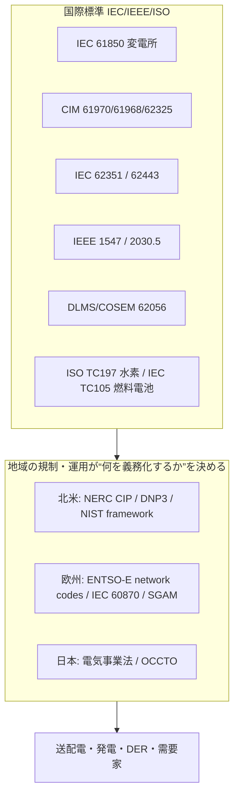

# エネルギー・電力標準の総括：領域横断カタログと採用実態分析

作成日: 2026年7月24日
対象: 電力系統運用・変電所自動化（IEC 61850／CIM）、電力サイバー（IEC 62351／NERC CIP）、分散電源・スマートグリッド（IEEE 1547／2030.5／OpenADR）、スマートメーター（DLMS/COSEM）、水素・燃料電池（ISO/TC197・IEC/TC105）まで、エネルギー・電力を支える国際標準の全体像。
目的: 軍事・医療・金融・通信・自動車の総括レポートと同レベルで、前半に領域別カタログ（層構造）、後半に採用・相互運用の実態を分析する。**日本の関与を厚めに**扱い、横断コラム「標準化の地政学」のレンズを適用する。
凡例: 版・年号は2026年7月時点で確認した公開情報に基づく。断定を避ける箇所は〔要確認〕と付す。

---

## 1. はじめに：エネルギー・電力標準の特殊性

エネルギー・電力は、**規制（M2）とネットワーク効果（M5）が効くが、その M5 が「地域限定」である** 点で本シリーズの他分野と決定的に異なる。インターネットや金融決済は地球規模で一つの網に収斂したが、電力は**物理的な同期系統（グリッド）が地域で分かれている**ため、標準も地域ごとに分岐する。特殊性は4点。

第一に、**M5（ネットワーク効果）が地域内でしか働かない**。北米・欧州・日本はそれぞれ別の同期グリッドで、海を越えて相互接続しない。だから「繋がる便益」が国際収斂を生まず、むしろ**地域ごとの標準分断**（北米のDNP3 vs 欧州のIEC 60870、NERC CIP vs ENTSO-E network codes）を許容する。

第二に、**IECが国際標準の核を作るが、各地域の規制が別サブセットを義務化する**。IEC TC57 が IEC 61850・CIM・IEC 62351 という国際標準を用意しても、実際に何を強制するかは北米（NERC）・欧州（EU/ENTSO-E）・日本（電気事業法）で異なる。「国際標準はあるが、義務化は地域主権」という構造。

第三に、**資産が超長寿命でレガシーが極端に残る**。変電所・送電設備は30〜40年使われ、旧来のSCADAプロトコル（DNP3、Modbus、IEC 60870）が IEC 61850 と長く共存する。軍事・医療で見た「レガシーの長期共存」がインフラ規模で起きる。

第四に、**OT（制御系）とIT（情報系）の融合でサイバーが後付けの重荷になる**。元々インターネットと切り離されていた制御系が接続され、IEC 62351・IEC 62443・NERC CIP といったセキュリティ標準を後から積む必要が生じている。

そして日本。電力系統では IEC 標準を着実に採用する「利用者・実装者」だが、**水素では例外的に「ルールを書く側」に立つ**（ISO/TC197 の議長を保持）。自動車で見た「基幹・戦略産業ではルール層に食い込む」パターンが、ここでも現れる（後述6.4）。

---

## 2. 標準の統治構造（誰がどう決めるか）

| 主体 | 性格 | 役割・主な標準 |
|------|------|----------------|
| **IEC TC57**（電力システム管理・情報交換） | 国際標準化機関 | IEC 61850（変電所）、CIM（IEC 61970/61968/62325）、IEC 62351（電力サイバー） |
| **IEC TC13** | 国際標準化機関 | 電力量計測（DLMS/COSEM＝IEC 62056） |
| **IEC TC105 / ISO TC197 / IEC TC120** | 国際標準化機関 | 燃料電池／水素／エネルギー貯蔵 |
| **IEEE PES（SCC21等）** | 学会 | IEEE 1547（DER連系）、IEEE 2030/2030.5、IEEE 1815（DNP3） |
| **NERC**（北米電力信頼度協議会） | 規制執行機関 | NERC CIP（拘束力・罰金あり） |
| **ENTSO-E**（欧州TSO連合） | 地域運用機関 | 欧州ネットワークコード、CIM運用 |
| **DLMS UA / SunSpec / OpenADR Alliance** | 業界団体 | メーター／DER／デマンドレスポンスの実装仕様 |
| **各国当局・系統運用者** | 法的強制・運用 | 米FERC、EU、日本（経産省・OCCTO）、中国 |
| **IAEA** | 国際機関 | 原子力安全標準 |

エネルギー標準は「国際標準化機関（IEC/IEEE/ISO）」「地域運用・規制機関（NERC・ENTSO-E・OCCTO）」「業界団体（DLMS UA・SunSpec・OpenADR）」「各国当局」の四層。特徴は、**IECが共通言語を作り、地域の運用機関・規制が“どれを義務化するか”を握る**分業構造にある。



---

## 3. 領域別カタログ（層構造）

### 3.1 系統運用・変電所自動化

| 標準 | 用途 | 実態 |
|------|------|------|
| **IEC 61850** | 変電所自動化・機器レベル | TC57の中核。保護・制御・監視の相互運用。近年はDER・系統端へ拡張 |
| **CIM（IEC 61970/61968/62325）** | 制御所・系統モデル・市場 | 系統トポロジ（線路・変圧器・発電機・負荷）を抽象モデル化。EMS/DMS/市場で使用 |
| **IEC 61850 ↔ CIM 調和（IEC 62361-102）** | 両モデルの橋渡し | 機器レベルと系統レベルの整合。TC57 WG19で継続作業 |
| **DNP3（IEEE 1815）** | SCADA遠制（北米中心） | レガシーだが北米で根強い |
| **IEC 60870-5-101/104** | SCADA遠制（欧州・アジア） | 欧州系レガシー。61850へ移行途上 |
| **Modbus** | 産業・機器 | 単純で普及。DERでも使用 |

系統運用は「IEC 61850（機器）＋CIM（系統全体）」の二層モデルが国際標準の骨格。ただし遠制プロトコルは**北米（DNP3）と欧州（IEC 60870）で地域分裂**し、レガシーが長く残る。

### 3.2 サイバーセキュリティ

| 標準/規制 | 性格 | 実態 |
|-----------|------|------|
| **IEC 62351** | 通信セキュリティ | 61850等の電力プロトコルを保護（RBAC・鍵管理・監査） |
| **IEC 62443** | IACS/OT全体 | 産業制御システムの包括的枠組み。電力OTにも適用 |
| **NERC CIP** | 北米・拘束力あり | CIP-002〜014。**罰金を伴う数少ない強制的サイバー規制**。2025年6月26日にFERC Order 907がCIP-015-1（内部ネットワーク監視INSM）を承認 |
| **NIS2（EU）** | 欧州・規制 | 重要インフラのサイバー義務〔要確認〕 |

サイバーは「国際標準（IEC 62351/62443）」を「地域規制（北米NERC CIP・EU NIS2）」が義務化する構図。**NERC CIPは罰金付き＝M2が最も強く効く例**。

### 3.3 分散電源（DER）・スマートグリッド・デマンドレスポンス

| 標準 | 主体 | 実態 |
|------|------|------|
| **IEEE 1547-2018** | IEEE | DER連系の相互運用。通信にModbus/DNP3/IEEE 2030.5/SunSpecを許容。**米国の約75%の州が参照** |
| **IEEE 2030.5（SEP2.0）／CSIP** | IEEE | DER制御。**カリフォルニアRule 21が義務化**、豪州もCSIP-AUSを4州で採用。2024年12月に新版、CSIP 3.0が2025年に始動 |
| **OpenADR** | OpenADR Alliance | デマンドレスポンス信号の主要標準。**3.1.0を2025年9月公開**（複数市場登録を簡素化） |
| **SunSpec Modbus** | SunSpec | 太陽光・インバータのデータモデル |
| **参照アーキ** | — | 欧州SGAM（EU mandate M/490）／米NIST Smart Grid Framework。**参照モデルも地域で二分** |

DERは再エネ急増で最も動きの速い層。ただし**IEEE 2030.5義務化（加州）とOpenADR（DR）が併存**し、参照アーキも欧米で分かれる。

### 3.4 スマートメーター

| 標準 | 実態 |
|------|------|
| **DLMS/COSEM（IEC 62056）** | TC13 WG14。電力量データ交換の国際標準。**電気・ガス・水・熱**の計量に横断利用。オブジェクト指向データモデル＋アプリ層 |

### 3.5 再エネ・蓄電・EV連系

| 領域 | 標準 |
|------|------|
| エネルギー貯蔵 | IEC TC120（系統用蓄電の要件・安全） |
| EV連系・充電 | 充電規格は自動車レポート（B3）参照。系統側はIEEE 1547/2030.5でDERとして扱う |
| グリッドコード | 各国TSOが再エネ連系要件を規定（ENTSO-E network codes等） |

### 3.6 水素・燃料電池

| 標準 | 主体 | 実態 |
|------|------|------|
| **ISO/TC197（水素技術）** | ISO | 水素の製造・貯蔵・輸送・計量・利用。**議長は日本（HySUT）**。39カ国が参加、16カ国が観察（2024年12月ソウルで第33回総会） |
| **IEC/TC105（燃料電池）** | IEC | 定置用・輸送用など全FC。日本が定置（ENE-FARM）・FCVで強い |

水素・燃料電池は**日本が国際標準の主導権を握る数少ない領域**（後述6.4）。

### 3.7 原子力

IAEAの安全標準（Safety Standards）が国際的な参照枠組み。各国規制当局が国内法へ取り込む。本レポートでは詳細は範囲外とし、電力系統との接点（発電側）に留める。

---

## 4. 政策・地域動向

### 4.1 欧州 ― IEC標準＋地域運用の規制エンジン（M2）

欧州は IEC 61850・CIM を系統運用の基盤に採用し、**ENTSO-E のネットワークコード**で連系要件を法的に規定。参照アーキは**SGAM**（EU mandate M/490）。サイバーはNIS2で義務化。「国際標準＋地域規制」で標準採用を強制するEU流。

### 4.2 北米 ― 拘束力ある信頼度規制（M2）

北米は **NERC CIP** が罰金を伴う拘束的サイバー規制として際立つ（2025年にINSMのCIP-015-1が加わる）。DERは IEEE 1547/2030.5、DRはOpenADR、遠制はDNP3、参照アーキはNIST Framework。FERCが承認権を握る。欧州とは別系統・別プロトコルの「もう一つの世界」。

### 4.3 日本 ― 系統は実装者、水素はルールの書き手（厚め）

日本は電力系統では IEC 標準を着実に採用する実装者だが、**広域運用の制度設計**と**水素の国際標準**で独自の存在感を持つ。

**広域系統運用（OCCTO）**: 電気事業法に基づく**電力広域的運営推進機関（OCCTO）**が、全電気事業者を会員として全国の需給を調整。広域系統運用、系統増強のマスタープラン策定、**需給調整市場（2024年度に本格運用）**・**容量市場**、脱炭素電源を促す**長期脱炭素電源オークション（2023年創設）**を運用。再エネ大量導入と安定供給を両立させる制度インフラ。

**スマートメーター**: 全戸展開が進み、**次世代スマートメーター**（通信・機能を高度化）への移行が進行〔要確認〕。

**水素 ― ルール層への食い込み**: **ISO/TC197（水素技術）の議長を日本（HySUT）が務める**。ENE-FARM（家庭用燃料電池）やトヨタMirai（FCV）で早くから商用化し、水素社会を国家戦略に据えてきた投資が、国際標準の主導権に結実。水素社会推進法（2024年）等で政策的に後押し〔要確認〕。**自動車と同じく「戦略産業ではルールの共著者になれる」パターン**。

### 4.4 中国・国際

中国はGB規格と独自の系統・スマートグリッド標準を持ちつつ、IEC/IEEEへの参加を強め、再エネ・蓄電・EVで規模を背景に影響力を拡大する第3極。国際的にはIECが共通言語を供給し続ける。

---

## 5. 層構造マップ（全体像）

```mermaid
flowchart TB
    subgraph L1[機器・現場層]
      DEV[IEC 61850 / Modbus / SunSpec / DER機器]
    end
    subgraph L2[遠制・通信層]
      COM[DNP3(IEEE1815) / IEC 60870 / IEEE 2030.5 / OpenADR / DLMS-COSEM]
    end
    subgraph L3[系統モデル・運用層]
      MODEL[CIM 61970/61968/62325 / EMS-DMS / 市場]
    end
    subgraph L4[セキュリティ層(横断)]
      SEC[IEC 62351 / IEC 62443 / NERC CIP / NIS2]
    end
    subgraph L5[エネルギー転換層]
      H2[水素 ISO TC197 / 燃料電池 IEC TC105 / 蓄電 IEC TC120]
    end
    L1 --> L2 --> L3
    L4 -.横断.- L1
    L4 -.横断.- L2
    L4 -.横断.- L3
    L5 -.連系.- L1
```

---

## 6. 採用実態分析

### 6.1 何が採用を駆動するか

エネルギーは **規制（M2）＋地域系統のネットワーク効果（M5）** で動く。IEC 61850・CIM・IEEE 1547 は、各地域の規制・運用機関（NERC・ENTSO-E・OCCTO・州PUC）が連系要件や信頼度基準に組み込むことで事実上強制される。とりわけ**NERC CIPは罰金付き**で、本シリーズでも金融・医療と並ぶ強い M2 の例である。

### 6.2 なぜ地域分断するのか ― M5が「地域限定」だから

最大の構造的特徴は、**物理グリッドが地域で分かれているため、ネットワーク効果が地球規模に働かない**こと。インターネット（一つの地球網）や金融（グローバル決済網）と違い、電力は北米・欧州・日本が別々の同期系統で、相互接続の便益が国際収斂を生まない。結果、遠制プロトコル（DNP3 vs IEC 60870）、参照アーキ（NIST Framework vs SGAM）、サイバー規制（NERC CIP vs NIS2）が**地域ごとに分裂したまま安定する**。「M5の収斂力は網の物理的到達範囲に比例する」という、通信レポートの一般則の裏返しがここで効く。

### 6.3 なぜ移行が遅いのか

変電所・送電資産は30〜40年の超長寿命で、旧SCADA（DNP3・Modbus・IEC 60870）が IEC 61850 と長く共存する。加えてOT/IT融合でサイバー標準（IEC 62351/62443）を後付けする負担が重い。金融のMT→MX、医療のHL7 v2→FHIRと同型の「新旧共存の過渡期」が、インフラ規模かつ数十年スケールで進行する。

### 6.4 日本の位置づけ ― 水素というもう一つの反例

自動車で「日本は戦略産業ではルール層に食い込める」と見たが、エネルギーはその**第二の反例**を示す。電力系統では日本は IEC 標準の実装者だが、**水素では ISO/TC197 の議長を握る＝ルールの書き手**である。理由は自動車と同じで、**ENE-FARM・FCVで早くから商用化し、水素を国家戦略に据えて標準化へ投資してきた**からだ。

一方、系統運用（IEC 61850/CIM）では主導権を取っていない。ここは日本の主戦場ではなく、投資も相対的に薄い。**「戦略投資した産業（自動車・水素）ではルールの共著者になれるが、そうでない領域（系統運用の国際標準）では実装者に留まる」**という、横断コラムの精緻化がここでも確認できる。

### 6.5 強制力スペクトラム上の位置づけ

```mermaid
quadrantChart
    title エネルギー・電力サブ領域の 強制力×実装ギャップ（編者による定性評価）
    x-axis 弱い強制力 --> 強い強制力
    y-axis 低い実装ギャップ --> 高い実装ギャップ
    quadrant-1 強制力強く・ギャップ大
    quadrant-2 強制力強く・ギャップ小
    quadrant-3 強制力弱く・ギャップ小
    quadrant-4 強制力弱く・ギャップ大
    NERC-CIP(北米サイバー): [0.90, 0.40]
    変電所(IEC61850): [0.65, 0.60]
    系統モデル(CIM): [0.62, 0.55]
    DER連系(IEEE1547): [0.72, 0.50]
    DR(OpenADR/2030.5): [0.58, 0.55]
    スマートメーター(DLMS): [0.60, 0.45]
    水素(ISO TC197): [0.45, 0.55]
    遠制レガシー(DNP3/60870): [0.55, 0.75]
```

NERC CIP（罰金付き）が最も右。系統・DER・メーターは中程度の強制力で、レガシー共存ゆえギャップは中〜大。遠制プロトコルは地域分裂＋レガシーでギャップ最大。

---

## 7. まとめ

エネルギー・電力は、**規制（M2）と地域系統のネットワーク効果（M5）** で動くが、その M5 が**物理グリッドの到達範囲に縛られて「地域限定」**である点で本シリーズの他分野と本質的に異なる。IEC TC57 が IEC 61850・CIM・IEC 62351 という国際共通言語を供給しても、何を義務化するかは北米（NERC CIP、罰金付き）・欧州（ENTSO-E／NIS2）・日本（電気事業法／OCCTO）が別々に決める。だから遠制プロトコル（DNP3 vs IEC 60870）も参照アーキ（NIST vs SGAM）もサイバー規制も**地域分裂したまま安定する**。「M5の収斂力は網の物理的到達範囲に比例する」という通信レポートの一般則が、逆向きにここで効いている。

移行は超長寿命資産（30〜40年）とレガシーSCADAの共存、OT/ITセキュリティの後付けで、インフラ規模かつ数十年スケールでゆっくり進む。

日本は電力系統では IEC 標準の着実な実装者だが、**水素では ISO/TC197 の議長を握り、ルールの書き手に立つ**。ENE-FARM・FCVで早くから商用化し水素を国家戦略に据えた投資の帰結で、自動車（WP.29・AUTOSAR）と同じ「戦略産業ではルールの共著者になれる」パターンである。日本が弱いのは"ルール層一般"ではなく"投資しなかった領域のルール層"――この命題が、自動車に続きエネルギー（水素）でも裏づけられた。

---

## 8. 主な出典（公開情報）

- 系統・変電所・CIM: [What is IEC 61850（Software Toolbox）](https://softwaretoolbox.com/resources/what-is-iec61850) ／ [IEC 62361-102 CIM-61850 序説（CIRED）](https://www.cired-repository.org/server/api/core/bitstreams/42e5a214-e422-4c6e-89a1-57c594fac610/content)
- 電力サイバー: [IEC 62351（IEC SyC Smart Energy）](https://syc-se.iec.ch/deliveries/cybersecurity-guidelines/security-standards-and-best-practices/iec-62351/) ／ [NERC CIP 解説（Industrial Defender）](https://www.industrialdefender.com/blog/what-is-nerc-cip) ／ [電力セクターのサイバー2025（Deepstrike）](https://deepstrike.io/blog/cybersecurity-in-the-power-sector-2025)
- DER・DR: [IEEE 1547-2018 ガイド](https://keentelengineering.com/ieee-1547-2018-der-interconnection-standards) ／ [IEEE 2030.5 最新（QualityLogic）](https://www.qualitylogic.com/knowledge-center/ieee-2030-5-takes-off/) ／ [OpenADR 3 と DER 管理](https://www.openadr.org/assets/OpenADR%203%20and%20DER%20Management_v1.0.pdf)
- スマートメーター: [IEC 62056（Wikipedia）](https://en.wikipedia.org/wiki/IEC_62056)
- 水素・燃料電池: [ISO/TC 197 Hydrogen technologies（ISO）](https://www.iso.org/committee/54560.html) ／ [ISO/TC197 活動（IECEx）](https://www.iecex.com/dmsdocument/4466/)
- 日本: [電力広域的運営推進機関（OCCTO）](https://www.occto.or.jp/) ／ [OCCTO 年次報告書2024](https://www.occto.or.jp/assets/houkokusho/2024/files/nenjihoukokusho_2024_241113.pdf)

> 注記: 版・年号は2026年7月時点の公開情報に基づく。次世代スマートメーターの展開時期、水素社会推進法の細目、NIS2の適用範囲、IEC 61850各版など変動・未確定の項目は〔要確認〕を付した。原子力（IAEA）と電力市場制度の詳細は本レポートの範囲外とし、必要に応じ別途深掘りする。
