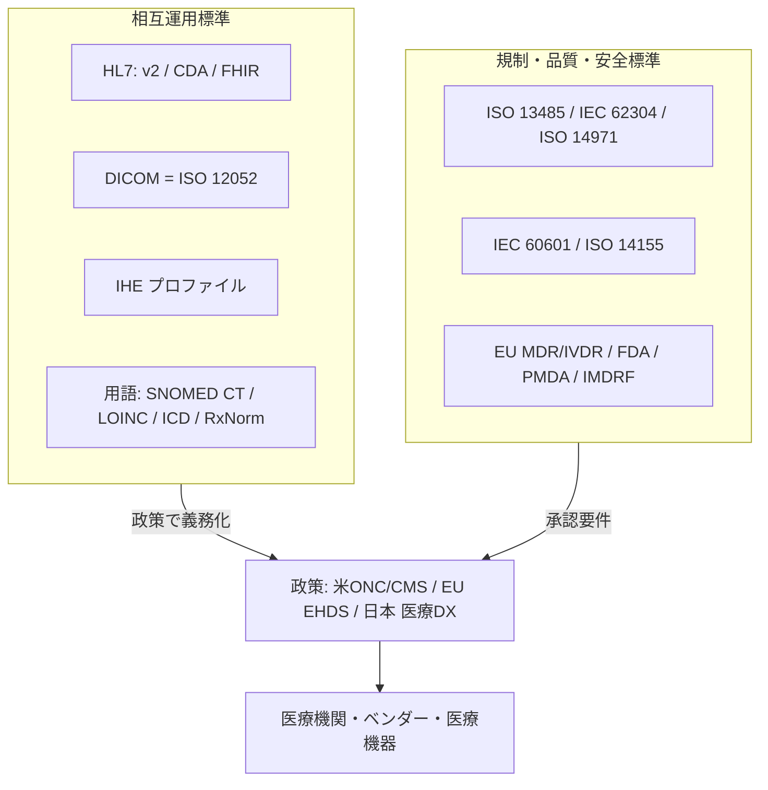
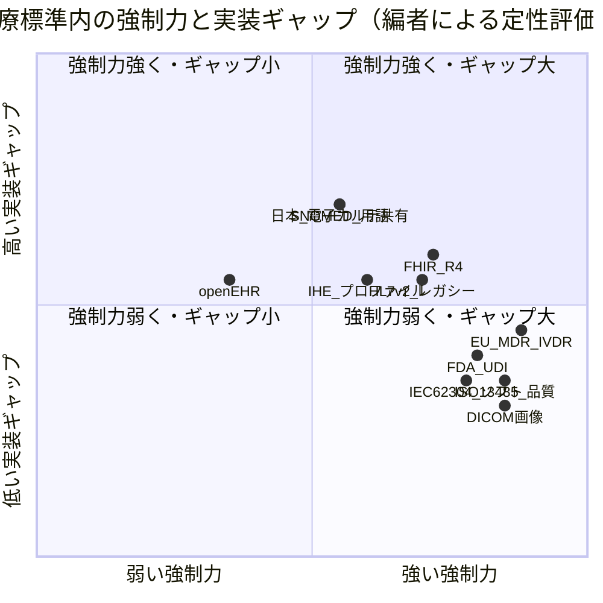

# 医療標準の総括：領域横断カタログと採用実態分析

作成日: 2026年7月24日
対象: 医療情報の相互運用標準（HL7・DICOM・IHE等）と、医療機器・ソフトウェア・品質・安全・規制の標準（ISO・IEC・各国規制）を含む医療標準の全体像
目的: 軍事標準の総括レポートと同レベルで、前半に領域別カタログ（層構造）、後半に採用・相互運用の実態を分析する。国際標準を中心に、日本の動向を明記する。
凡例: 版・年号は2026年時点で確認した公開情報に基づく。断定を避ける箇所は〔要確認〕と付す。

---

## 1. はじめに：医療標準の特殊性

医療標準は、他分野の標準と異なるいくつかの構造的特徴を持つ。

第一に、**「相互運用標準」と「規制標準」の二層**が並立する。前者（HL7 FHIR、DICOM、SNOMED CT等）はデータを繋ぐための合意であり、後者（ISO 13485、IEC 62304、EU MDR等）は製品の安全・品質を担保する法規制の基盤である。両者は目的も強制メカニズムも異なる。

第二に、**強制力の源が「規制・償還」に偏る**。金融の排除圧力や軍事の作戦要求ほど絶対的ではないが、各国政府の認証プログラム・診療報酬・情報ブロッキング禁止などが採用を駆動する。

第三に、**レガシーが極端に長く残る**。HL7 v2は数十年前の設計ながら今も世界最多の稼働メッセージ標準であり、FHIRへの移行は過渡期にある。

第四に、**用語標準にライセンス障壁がある**。SNOMED CTは加盟国では無料だが非加盟国では有償で、これが国ごとの採用格差を生む。

本レポートは、この体系を「統治構造」→「領域別カタログ」→「政策・地域」→「採用実態分析」の順に整理する。

---

## 2. 標準の統治構造（誰がどう決めるか）

| 主体 | 役割 | 主な標準 |
|------|------|----------|
| **HL7 International** | 医療情報交換標準の策定 | HL7 v2、CDA/C-CDA、FHIR |
| **DICOM（NEMA / MITA）** | 医用画像標準 | DICOM（＝ISO 12052） |
| **IHE（Integrating the Healthcare Enterprise）** | 既存標準の実装プロファイル化 | XDS、PIX/PDQ、MHD等 |
| **SNOMED International** | 臨床用語 | SNOMED CT |
| **Regenstrief Institute** | 検査・単位 | LOINC、UCUM |
| **WHO** | 疾病分類・医薬品分類 | ICD-10/11、ATC/DDD |
| **ISO / IEC（TC 215、TC 210、SC 62A等）** | 品質・安全・情報の国際規格 | ISO 13485、ISO 14971、IEC 62304、IEC 60601 |
| **IMDRF** | 規制当局の国際整合 | SaMD枠組み、UDI、AI/ML |
| **各国規制当局** | 法的強制 | 米FDA、EU（MDR/IVDR）、日本PMDA/厚労省 |

医療標準は「業界コンソーシアム（HL7・DICOM・IHE）」「国際標準化機関（ISO/IEC）」「規制当局（FDA・EU・PMDA・IMDRF）」の三層が相互参照する構造にある。近年はFDAがISO 13485を法規制へ取り込む（後述QMSR）など、**業界標準と法規制の統合**が進む。



---

## 3. 領域別カタログ（層構造）

### 3.1 データ交換・相互運用

| 標準 | バージョン | 用途・実態 |
|------|-----------|-----------|
| **HL7 v2.x** | 最新 v2.9〔要確認〕 | イベント駆動メッセージング（ADT患者登録・オーダー・検査結果）。**世界最多の稼働臨床メッセージング標準**。パイプ区切り。FHIR時代もレガシー基盤として現役 |
| **HL7 v3** | Normative Edition | RIMベースのXML。複雑さゆえ**事実上普及せず**、新規開発はFHIRへ。CDAだけが派生し生存 |
| **CDA / C-CDA** | CDA R2.0／C-CDA R2.1 | 構造化臨床文書。C-CDAは米国で退院・診療サマリの主要文書標準（ONC認証で必須、年間数十億回交換） |
| **HL7 FHIR** | R4(2019)／R4B(2022)／R5(2023)／R6ボート2026 | RESTful API＋リソースモデル。**R4が事実上の業界標準**（Epic・Oracle Health等が本番API）。R5は本番未定着、R6は2027年頃公開見込み |
| **US Core IG** | v8系（USCDI v5対応） | 米国の必須データ相互運用プロファイル |
| **IPS（国際患者サマリ）** | FHIR IG v2系／**ISO 27269:2025** | 国境を越えた最小限の患者サマリ交換 |
| **DICOM** | NEMA PS3.1〜22 ＝ **ISO 12052:2026** | 医用画像の生成・保存・伝送・表示。**画像分野で事実上唯一の国際標準**。無償公開・年数回改訂 |
| **DICOMweb** | PS3.18 | RESTful Webサービス（WADO-RS/STOW-RS/QIDO-RS）。クラウド連携で普及拡大 |
| **IHE プロファイル** | ドメイン別（ITI/PCC/RAD） | 既存標準の実装プロファイル。従来型 **XDS.b/XCA/PIX/PDQ**、FHIR版 **MHD/PIXm/PDQm/QEDm**。国家・地域HIEで広く採用 |
| **openEHR** | RM＋Archetype/Template（2レベルモデリング） | ベンダー中立EHRの構造化・永続保存。スロベニア（国家義務化）・ブラジル・豪州等。FHIR（交換）と補完関係 |
| **X12（ASC X12N）** | Version 5010 | 米国保険EDI（請求837・資格270/271・支払835）。**HIPAA義務標準** |
| **NCPDP SCRIPT** | v2017071→v2023011（2028必須） | 電子処方・薬局請求。米国 |
| **Direct Standard** | DirectTrust保守 | SMTP＋S/MIMEのセキュアメッセージング。米国ONC認証必須 |

> DICOMが画像で唯一標準として君臨する一方、臨床データ交換はHL7 v2（レガシー）とFHIR（新世代）が併存し、IHEがそれらを組み合わせて実装可能にする、という三層構造になっている。

### 3.2 用語・コード体系

| 標準 | 管理団体 | 用途・ライセンス |
|------|----------|-----------------|
| **SNOMED CT** | SNOMED International | 臨床用語の網羅的オントロジー。**加盟国は無料、非加盟国は有償**（加盟50超）。日本は非加盟〔要確認〕で本格採用は限定的 |
| **LOINC** | Regenstrief Institute | 検査・観察項目（"何を測ったか"）。無料。SNOMED CTと長期協定（2025年に LOINC Ontology公開） |
| **ICD-11** | WHO | 疾病分類。**2022年発効**、2025年版で14言語対応。各国はICD-10を必要な限り継続使用可 |
| **ICD-10-CM** | 米NCHS/CMS | 米国臨床修正版。FY2026版（2025年10月発効） |
| **ICD-O** | WHO/IARC | 腫瘍学分類。現行3.2、4は開発中 |
| **RxNorm** | 米NLM | 医薬品正規化名称・RXCUI。パブリックドメイン |
| **NDC** | 米FDA | 医薬品製品識別子 |
| **ATC/DDD** | WHO Collaborating Centre（オスロ） | 解剖治療化学分類。ライセンス条件〔要確認〕 |
| **UCUM** | Regenstrief | 測定単位コード。無料 |
| **HGNC** | HUGO（2024年ケンブリッジ大へ移管） | ヒト遺伝子命名の唯一の国際公認機関 |
| **CPT / HCPCS** | 米AMA／CMS | 米国の診療行為コード。CPTは有償 |

**日本固有のコード体系**

- **ICD10対応標準病名マスター（傷病名マスター）**: MEDIS-DCが厚労省委託で維持。約2万語にICD-10とレセプト電算コードを対応。電子カルテ・電子レセプトの傷病名フィールド標準。無償。
- **医薬品コード群（MEDIS 医薬品HOTコードマスター）**: **YJコード**（個別医薬品、英数12桁）、**レセプト電算コード**（9桁）、**HOTコード**（13桁、薬価・YJ・レセ電・JANを横断対応）。
- **レセプト電算処理システム**: 支払基金/国保連への電子レセプトのコード体系（傷病名・診療行為・医薬品・特定器材）。

### 3.3 品質マネジメント・ソフトウェア・リスク

| 標準 | 版 | 用途・実態 |
|------|----|-----------|
| **ISO 13485** | 2016（第3版） | 医療機器QMS。世界のデファクト。**FDAは2026年2月2日発効のQMSRでISO 13485:2016を法規制（21 CFR Part 820）に参照組込み** |
| **IEC 62304** | 2006/Amd1:2015 | 医療機器ソフトのライフサイクル。安全クラスA/B/C。第2版は2026年頃予定〔要確認〕 |
| **IEC 82304-1** | 2016 | ヘルスソフト製品全体の安全（62304が「作り方」、82304-1が「完成品の安全」） |
| **ISO 14971** | 2019（第3版） | 医療機器リスクマネジメント。ガイダンスは ISO/TR 24971:2020。国際デファクト |
| **IEC 60601-1** | Edition 3.2（2020統合版） | 医用電気機器の基礎安全・基本性能。世界的基幹規格 |
| **IEC 60601-1-2** | Edition 4.1（2020統合版） | 医用電気機器のEMC |
| **ISO 14155** | 2020（第3版） | 医療機器臨床試験のGCP。ICH-GCPと整合強化 |

**SaMD・AI/ML**

- **SaMD（Software as a Medical Device）**: ハードウェア医療機器の一部でなく医療目的を果たすソフト。**IMDRF SaMD枠組み（N12:2014）** が情報の重要度×病態の重篤度でカテゴリI〜IVに4分類。対象をソフト全般へ広げるドラフトN81を検討中〔要確認〕。
- **AI/ML医療機器**: FDAは2022年FDORAでFD&C法**515C条**を新設し **PCCP（事前変更管理計画）** の承認権限を獲得。**GMLP（Good Machine Learning Practice）10原則**（FDA・Health Canada・英MHRAが2021年共同公表）、2025年8月にはPCCPの5指針を3当局共同公表。

### 3.4 セキュリティ

- **ISO 27799:2016**: ISO/IEC 27002の医療分野向け実装（基盤の27002は2022年版）。
- **IEC 81001-5-1:2021**: ヘルスソフトのライフサイクルにおけるセキュリティ活動。EU MDR/IVDRのサイバー要求に対する事実上の標準（正式整合は2028年予定〔要確認〕）。
- **FDA 524B条**: 2022年オムニバスでFD&C法に新設。**2023年10月以降、SBOM（ソフトウェア部品表）・脆弱性管理計画を欠く市販前申請は受理拒否（RTA）対象**。

### 3.5 規制枠組み

| 枠組み | 内容・現況 |
|--------|-----------|
| **EU MDR（規則2017/745）** | 医療機器規則。2021年5月適用開始。**規則2023/607で移行猶予を段階延長**（Class III・IIb植込みは2027年末、その他は2028年末）。認証機関の能力不足が理由 |
| **EU IVDR（規則2017/746）** | 体外診断規則。2022年5月適用。移行猶予は高リスク2025年→低リスク2027年→院内製造一部2028年 |
| **米FDA 市販前経路** | 510(k)（実質的同等性）、PMA（Class III）、De Novo（新規低〜中リスク） |
| **UDI（一意機器識別）** | UDI-DI＋UDI-PI。発行機関はGS1・HIBCC・ICCBBA。米はGUDID、EUはEUDAMED登録 |
| **IMDRF** | 各国規制当局の国際整合フォーラム（GHTF後継）。SaMD・UDI・AI/ML・サイバーのガイダンス発出 |

---

## 4. 政策・地域動向（相互運用の実際の駆動力）

### 4.1 米国

医療標準の採用を最も強く駆動してきたのが米国の規制群である。**21st Century Cures Act（2016）** が情報ブロッキングを禁止し、2024年7月には医療提供者への不利益措置（罰則）が発効した。認証プログラムは **ONC**（2024年7月に **ASTP/ONC** へ改称）が所管し、**HTI-1最終規則（2024年1月）** で **USCDI v3** を2026年1月のベースラインに、アルゴリズム透明性要件を導入した。**CMS-0057-F** はFHIRベースの相互運用API・事前承認を2026〜2027年に段階義務化する。全米の交換基盤 **TEFCA/QHIN** は2023年末に稼働し、TEFCA規則が2025年1月に発効した。

ただし**2025年末に規制緩和へ大きく方針転換**した点が最新の重要事項である。**HTI-5提案規則（2025年12月）** で USCDI v4採用やHTI-2残余提案の撤回が提案され、従来の「標準を年々引き上げる」路線が見直されている〔一次確認推奨〕。一方でCMS-0057-Fは予定通り進行している。

### 4.2 EU

**European Health Data Space（EHDS、規則(EU) 2025/327）** が2025年3月26日に発効した。一次利用（患者アクセス・ポータビリティ）と二次利用（研究・政策）の共通枠組みで、施行は段階的である。一般適用は2027年3月、**患者サマリ・電子処方の全加盟国交換は2029年**、**医用画像・検査結果・退院サマリの共有義務は2031年**。越境サービス基盤 **MyHealth@EU**（ePrescription・Patient Summary）が既に展開中で、EHDSがこれを全加盟国へ広げる。

### 4.3 日本

日本は **医療DX推進本部** の工程表に基づき、①全国医療情報プラットフォーム、②電子カルテ情報の標準化、③診療報酬改定DXを進める。中核の **電子カルテ情報共有サービス** はFHIR形式で「**3文書6情報**」（診療情報提供書・退院時サマリー・健診結果報告書／傷病名・アレルギー・薬剤禁忌・感染症・検査・処方）を共有する全国基盤である。2025年2月にモデル事業を開始したが、仕様・接続の課題から**本格運用を2026年度冬ごろへ延期**し、2026年3月に仕様を抜本見直しした〔最新状況につき要フォロー〕。

標準面では、日本HL7協会・日本医療情報学会が策定した **HL7 FHIR記述仕様** が2023年3月に厚労省標準規格（HS036等）として採択された。既存の相互運用基盤 **SS-MIX2**（HL7 v2.5メッセージの標準化ストレージ）が実務で広く稼働し、FHIRへの移行が過渡期にある。**標準型電子カルテ**（中小病院・診療所向けのクラウド型・FHIR準拠）はαモデル事業を2025年3月に開始した。

保険・本人確認では、**マイナ保険証**への移行が進み、紙健康保険証は2024年12月に新規発行停止、2025年12月に失効した。医療機器では、**PMDA** が2024年7月に「プログラム医療機器審査部」へ格上げし、**DASH for SaMD 2** や二段階承認制度でSaMD開発を促進している。研究データ利活用では、**次世代医療基盤法** の改正（2024年4月施行）で仮名加工医療情報の枠組みが創設された。

日本は用語標準でSNOMED CT非加盟である一方、独自の病名マスター・医薬品コード（HOT/YJ）を整備しており、国際標準と国内標準の接続が課題として残る。

### 4.4 国際

**WHO Global Strategy on Digital Health** は2025年5月の世界保健総会で期間を**2027年まで延長**し、2028-2033の新戦略策定が要請された。**GDHP（Global Digital Health Partnership）** が政府間の政策協働を担う。

---

## 5. 層構造マップ（全体像）

```text
政策・償還による駆動
  └ 米: Cures Act / HTI / USCDI / TEFCA / CMS-0057-F
  └ EU: EHDS(2025/327) / MyHealth@EU
  └ 日本: 医療DX / 電子カルテ情報共有サービス / マイナ保険証

規制・品質・安全（製品を通す層）
  └ ISO 13485(QMS) / IEC 62304(ソフト) / ISO 14971(リスク)
  └ IEC 60601(電気安全) / ISO 14155(臨床GCP)
  └ EU MDR/IVDR / FDA 510k・PMA / IMDRF SaMD / UDI
  └ セキュリティ: ISO 27799 / IEC 81001-5-1 / FDA 524B(SBOM)

相互運用（データを繋ぐ層）
  └ 交換: HL7 v2(レガシー) / FHIR(新世代) / DICOM(画像) / X12・NCPDP・Direct(米)
  └ 文書: CDA / C-CDA / IPS(ISO 27269)
  └ プロファイル: IHE(XDS / PIX/PDQ / MHD / PIXm/PDQm)
  └ EHR基盤: openEHR

用語・コード（意味を揃える層）
  └ 臨床: SNOMED CT / ICD-10・11 / ICD-O
  └ 検査・単位: LOINC / UCUM
  └ 医薬品: RxNorm / NDC / ATC / (日本)HOT・YJ
  └ 遺伝子: HGNC
```

---

## 6. 採用実態分析

前回の国際標準・軍事標準レポートで用いた枠組み（排除圧力・規制強制・ネットワーク効果・互換性リスク・実装品質ギャップ）を医療に適用する。医療は **中〜強強制力型** に位置づけられる。

### 6.1 何が採用を駆動するか

医療の強制力は主に **規制と償還** から来る。米国の情報ブロッキング禁止・認証プログラム、EUのMDR/EHDS、日本の診療報酬加算がそれぞれ標準採用を後押しする。金融の排除圧力（従わないと決済網から外れる）ほど絶対的ではないが、画像分野のDICOMのように**ネットワーク効果で事実上唯一の標準**になった例もある。DICOMは「他形式では機器・PACS・読影が繋がらない」という点で軍事のデータバスに近い強制力を持つ。

### 6.2 なぜ実装ギャップが大きいのか

医療は他の高強制力領域に比べ**実装品質ギャップが大きい**。要因は次の通り。

第一に **レガシーの極端な長寿命**。HL7 v2が数十年現役で、FHIRへの移行は遅い。v2とFHIRとCDAが同時に流通し、変換の各所で情報損失が起きる。第二に **バージョン分断**。FHIRはR4が事実上標準だが、R4B・R5・R6が併存し、US Core等のプロファイルも版を重ねる。「FHIR対応」と言っても中身の相互運用は保証されない。第三に **用語ライセンスの障壁**。SNOMED CTが非加盟国で有償のため、国ごとに使う用語標準が異なり、意味的相互運用が分断される（日本は独自マスターを使用）。第四に **プロファイルの多様性**。IHEプロファイルや各国IG（US Core、日本のFHIR記述仕様、EUのIPS）が地域ごとに分岐し、グローバルな相互運用には翻訳が要る。第五に **政策の不安定性**。米国の2025年末の規制緩和転換や日本の電子カルテ情報共有サービスの延期のように、駆動力である政策自体が揺れる。

### 6.3 「規制標準」と「相互運用標準」の統合トレンド

2026年の最大の変化は、**業界標準が法規制へ取り込まれる**動きである。FDAが2026年2月にQSRを廃してISO 13485:2016を参照するQMSRへ移行したのはその象徴で、米欧の品質規制が国際規格へ収斂しつつある。AI/ML医療機器のPCCP/GMLPも3当局共同で国際整合が進む。相互運用側でも、FHIRが各国規制（米CMS、日本の標準規格）の必須要件になることで、業界標準と法的強制が一体化している。

### 6.4 強制力スペクトラム上の位置づけ



〔評価〕強制力が強く実装ギャップが小さいのは、DICOM（画像で繋がらないと業務不能）と品質・安全規制（ISO 13485・IEC 62304・MDR：合わなければ市場に出せない）。逆にFHIR・SNOMED CT・各国の相互運用基盤は、規制の後押しはあるがバージョン分断・ライセンス・地域IGの多様性でギャップが残る。

---

## 7. まとめ

1. **医療標準は「相互運用」と「規制・品質・安全」の二層構造**である。前者はデータを繋ぎ、後者は製品を市場に通す。強制メカニズムが異なる。
2. **医療は中〜強強制力型**。規制と償還が採用を駆動するが、金融・軍事ほど絶対的ではない。例外はDICOMで、ネットワーク効果により画像分野で唯一標準となった。
3. **実装ギャップは他の高強制力領域より大きい**。HL7 v2の長寿命、FHIRのバージョン分断、SNOMED CTのライセンス障壁、地域IGの多様性、政策の不安定性がその源泉である。
4. **2026年の潮流は「業界標準と法規制の統合」**。FDA QMSR（ISO 13485取込み）、AI/MLのGMLP国際整合、FHIRの規制必須化がそれを示す。
5. **日本は独自基盤から国際標準へ橋渡しする過渡期**にある。FHIR記述仕様の標準規格化・電子カルテ情報共有サービスが進む一方、SNOMED CT非加盟や電子カルテ共有の延期など、国際整合と実装定着に課題を残す。
6. **今後の焦点は EHDS（2029/2031施行）と日本の全国基盤の定着**。規制の駆動力が一段強まる局面で、FHIRベースの実装品質と用語の意味的相互運用が問われる。

---

## 8. 主な出典（公開情報）

- HL7 FHIR: https://www.hl7.org/fhir/ ／ US Core: https://www.hl7.org/fhir/us/core/ ／ IPS: https://hl7.org/fhir/uv/ips/
- HL7 v2 Product Brief: https://www.hl7.org/implement/standards/product_brief.cfm?product_id=185
- DICOM: https://www.dicomstandard.org/current ／ ISO 12052: https://www.iso.org/standard/86414.html
- IHE プロファイル: https://profiles.ihe.net/ ／ FHIRベース: https://www.ihe-europe.net/
- openEHR: https://openehr.org/
- SNOMED CT: https://www.snomed.org/ ／ LOINC: https://loinc.org/ ／ LOINC-SNOMED: https://loinc.org/collaboration/snomed-international/
- ICD-11: https://www.who.int/news/item/11-02-2022-icd-11-2022-release ／ ICD-10-CM: https://www.cms.gov/medicare/coding-billing/icd-10-codes
- RxNorm: https://www.nlm.nih.gov/research/umls/rxnorm/ ／ ATC/DDD: https://www.whocc.no/ ／ UCUM: https://ucum.org/ ／ HGNC: https://www.genenames.org/
- 日本 標準病名マスター（MEDIS）: https://www2.medis.or.jp/stdcd/byomei/index.html ／ 医薬品HOTコード: https://www2.medis.or.jp/master/hcode/
- ISO 13485:2016: https://www.iso.org/standard/59752.html ／ FDA QMSR: https://www.fda.gov/medical-devices/postmarket-requirements-devices/quality-management-system-regulation-qmsr
- IEC 62304: https://webstore.iec.ch/en/publication/22794 ／ ISO 14971:2019: https://www.iso.org/standard/72704.html
- IEC 60601-1（ANSI版）: https://webstore.ansi.org/standards/iec/iec60601eden2020-2421195 ／ IEC 60601-1-2: https://webstore.iec.ch/en/publication/67554
- ISO 14155:2020: https://www.iso.org/standard/71690.html
- IMDRF SaMD: https://www.imdrf.org/working-groups/software-medical-device-samd ／ FDA AI/ML: https://www.fda.gov/medical-devices/software-medical-device-samd/artificial-intelligence-software-medical-device
- EU MDR 2017/745・IVDR 2017/746（延長）: https://www.exponent.com/article/eu-mdr-transition-period-officially-extended
- FDA UDI: https://www.fda.gov/medical-devices/unique-device-identification-system-udi-system
- ISO 27799: https://www.iso.org/standard/62777.html ／ IEC 81001-5-1: https://www.iso.org/standard/76097.html ／ FDA 524B: https://www.federalregister.gov/documents/2023/03/30/2023-06646/
- 米 情報ブロッキング/HTI-1: https://www.healthit.gov/ ／ HTI-5（撤回提案）: https://www.federalregister.gov/documents/2025/12/29/2025-23896/ ／ CMS-0057-F: https://www.cms.gov/ ／ TEFCA: https://rce.sequoiaproject.org/tefca/
- EU EHDS: https://health.ec.europa.eu/ehealth-digital-health-and-care/european-health-data-space_en
- 日本 医療DX（厚労省）: https://www.mhlw.go.jp/stf/iryoudx.html ／ HL7 FHIR記述仕様: https://std.jpfhir.jp/ ／ 日本HL7協会: https://www.hl7.jp/ ／ PMDA プログラム医療機器: https://www.pmda.go.jp/review-services/drug-reviews/about-reviews/devices/0048.html
- WHO Global Strategy on Digital Health（2027延長）: https://www.who.int/news/item/23-05-2025-world-health-assembly-endorses-extension-of-the-global-digital-health-strategy-to-2027

> 注記: 版数・施行時期のうち〔要確認〕を付した項目（HL7 v2最新版、IEC 62304第2版、ISO 27799改訂、米HTI-4/-5の最終化、指定QHIN数、日本の電子カルテ情報共有サービスの最新スケジュール、SNOMED日本非加盟、3文書6情報 vs 7情報の整理）は、各機関の一次情報での最終確認を推奨する。
