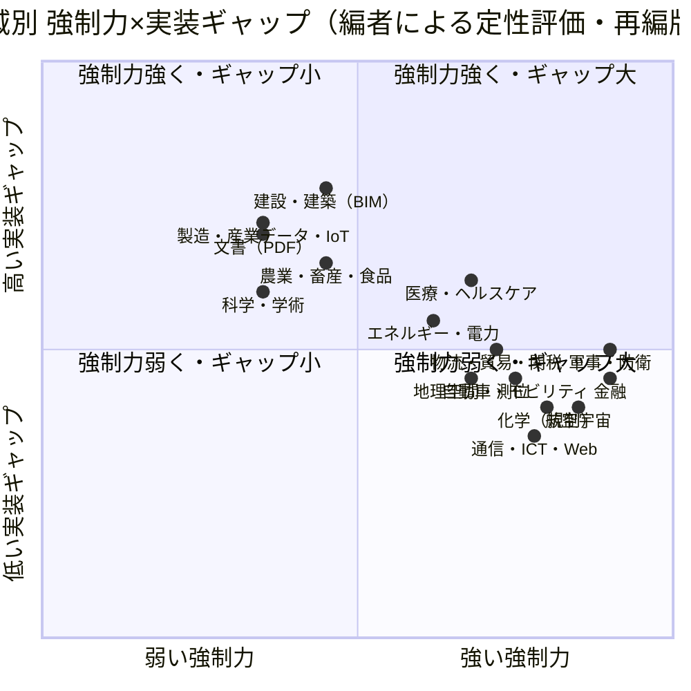
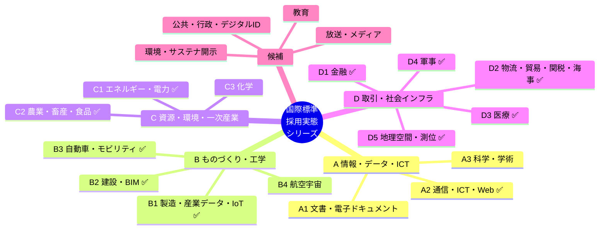

# 国際標準規格の採用実態に関する総括レポート（再編版：索引兼分析）

作成日: 2026年7月24日（再編版）
改訂: 2026年9月14日（金融カードの補完、ロードマップの作成済誤記の訂正、農業の二層注記）
位置づけ: 領域別の深掘りレポート群（軍事・医療・金融・通信・自動車ほか、作成済11本）への **入り口（索引）** 兼 **横断分析**。
再編の理由: 初版の「領域」は粒度が不揃いだった（PDFは狭く、軍事・医療・物流は超広い）。軍事・医療を実際に深掘りした結果、各領域は「大領域 → サブ領域 → 深掘りレポート」で展開すべきと判明したため、区分を粒度を揃えて切り直し、未収録の大領域を追加した。

> [!TIP]
> 第I部（分析）で採用を決める構造を把握し、第II部（入り口カード集）で各領域のスコープ・主要標準・深掘り状況を参照する。カードは深掘りレポートの「目次」に相当する。

---

# 第I部　横断分析

## 1. 中心命題（初版からの更新）

標準の普及は **技術的優位性だけでは決まらない**。ただし初版の「排除圧力が最大要因」という単一軸の説明は、軍事・医療の深掘りを経て次のように精緻化する。

**採用は複数の「強制メカニズム」のいずれかが働くときに進む。** 逆に、いずれも弱い領域では民間の短期的判断が優先され、普及が遅れる。技術的正しさや長期メリットは、これらのメカニズムを補強はするが、単独では十分条件にならない。

## 2. 強制メカニズムの類型（再編の核）

初版が「排除圧力」と一括りにしていたものを、6つの独立したメカニズムに分解する。領域ごとに効くメカニズムが異なる。

| # | メカニズム | 内容 | 強く効く領域 |
|---|-----------|------|-------------|
| M1 | **市場排除** | 従わないと取引・決済網から物理的に外れる | 金融決済、通信接続 |
| M2 | **規制・法的義務** | 法律・規則で準拠を義務化 | 化学（REACH）、医療機器（MDR）、自動車（WP.29） |
| M3 | **認証・型式承認（安全）** | 安全認証を通らないと市場・運用に出せない | 航空（DO-178C）、自動車（ISO 26262）、医療機器 |
| M4 | **公共調達・調達要件** | 発注者が準拠を要求 | 軍事、BIM（公共工事） |
| M5 | **ネットワーク効果** | 法的強制なしでも参加者増で支配的に | 通信、Web、文字コード、PDF閲覧 |
| M6 | **なし（任意）** | 自発性に委ねられる | 研究データ、一部産業データ |

**含意**: 「強制力が強い＝規制がある」ではない。通信やPDF閲覧は法規制ではなく **M5（ネットワーク効果）** で支配的になった。逆に研究データは M6 で普及が遅い。深掘りレポートを作る際は、その領域に効くメカニズムを最初に特定するとよい。

## 3. 「名目準拠」と「実質活用」のギャップ

強制メカニズムが働いても、実装品質のギャップは残る。深掘りで繰り返し観察された要因は次の通り。

- **レガシーの長期共存**（HL7 v2とFHIR、Link 11とLink 16、MT電文とISO 20022、PDF 1.7と2.0）。
- **バージョン分断**（FHIR R4/R5、IFCのバージョン非互換）。
- **翻訳レイヤー依存**（金融の変換ゲートウェイ、軍事のVSM＝機体固有モジュール）。
- **プロプライエタリ拡張の残存**（標準I/Fの外側にベンダー固有部分）。
- **アクセスコスト・ライセンス障壁**（ISO有料規格、SNOMED CTの非加盟国有償）。

## 4. 業界標準と法規制の統合トレンド（医療深掘りからの新知見）

近年、**業界コンソーシアム標準が法規制に取り込まれる** 動きが顕著になっている。FDAが品質規制にISO 13485を参照組込みしたQMSR、FHIRが各国の相互運用義務要件になった例、自動車のUNECE規則がISO標準を前提にする例など。これは「M2/M3（規制・認証）」と「業界標準」の境界が溶けつつあることを意味し、標準戦略上は「規制の参照先になれるか」が重要度を増している。進行中の実例が金融の **ERC-3643** で、任意のコミュニティ標準から ISO 化を進めている途中である（結果は未確定。『金融標準の総括』3.8・6.3）。

## 5. 強制力×実装ギャップ マップ（新領域を反映）

## 6. 強制力による3分類（更新）

| 分類 | 領域 | 主に効くメカニズム |
|------|------|-------------------|
| **高強制力型** | 金融、軍事、航空宇宙、自動車、通信、化学規制、物流・関税 | M1・M2・M3・M4・M5 |
| **中強制力型** | 医療、地理空間、エネルギー・電力 | M2＋M5（規制＋ネットワーク） |
| **低強制力型** | 製造・産業データ、建設BIM、農業（生産データ）、文書PDF、科学・学術 | M6中心（民間判断優先） |

農業・畜産・食品は **二層** である。食品安全・トレーサビリティは Codex/WTO 経由で M2 に近く、生産データは M6。上表の「低強制力」は後者。化学も規制側は高強制、研究データ側は低強制で、同じ割れ方をする。

---

# 第II部　領域別 入り口カード集

各カードは深掘りレポートの「目次」に相当する。**深掘り状況**は ✅=作成済 / ⬜=未着手候補。

## グループA　情報・データ・ICT

### A1. 文書・電子ドキュメント　⬜（PDF Familyは自プロジェクト）
- **スコープ**: 電子文書のフォーマット・アクセシビリティ・長期保存・電子署名。
- **主な標準**: PDF（ISO 32000-2）、PDF/UA（ISO 14289）、PDF/A（ISO 19005）、ODF（ISO 26300）、OOXML（ISO 29500）、EPUB。
- **主な統治主体**: ISO/TC 171、PDF Association、OASIS、W3C。
- **強制力/速度/ギャップ**: 弱〜中 / 遅 / 高（M5中心。閲覧はネットワーク効果で普及、高度機能は未実装）。
- **サブ領域**: 表示・生成 / アクセシビリティ / 長期保存(PDF/A) / 電子署名(PAdES) / タグ付き構造 / 電子帳簿保存法対応。
- **隣接**: 電子署名は金融・行政と、長期保存は法務と重複。

### A2. 通信・ICT・Web　✅深掘り済（★新規領域）
- **スコープ**: ネットワーク・モバイル・Web・データ表現・文字コード・ID/セキュリティの基盤標準。
- **主な標準**: IETF（TCP/IP, HTTP, TLS, DNS、RFC 9421 HTTP Message Signatures）、W3C（HTML, CSS, WCAG, WebAuthn）、3GPP（4G/5G/6G）、ITU-T、IEEE 802（Ethernet/Wi‑Fi）、Unicode、ISO/IEC JTC1、OAuth/OIDC。
- **主な統治主体**: IETF、W3C、WHATWG、3GPP、ITU、IEEE、Unicode Consortium。
- **深掘り**: 『通信・ICT・Web標準の総括_カタログと採用実態.md』参照。
- **強制力/速度/ギャップ**: 強（M5）/ 速 / 中（ネットワーク効果が極めて強く自発普及。ただしブラウザ実装差・後方互換の負債）。
- **サブ領域**: インターネット基盤(IETF) / Web(W3C/WHATWG) / モバイル(3GPP) / 無線LAN・有線(IEEE802) / 文字コード・国際化 / ID・認証・暗号（Web Bot Auth 含む） / アクセシビリティ(WCAG)。
- **隣接**: shuji氏の専門（Web/PWA/RFC）と最も重なる。ほぼ全領域の下地。エージェントの身元（RFC 9421）はここ、支払いは金融。

### A3. 科学・学術・研究データ　⬜
- **スコープ**: 研究の識別・出版・データ共有。
- **主な標準**: ORCID、DOI、FAIR原則、JATS（NISO Z39.96）、Dublin Core、DataCite。
- **主な統治主体**: DOI Foundation/Crossref、ORCID、NISO、GO FAIR。
- **強制力/速度/ギャップ**: 弱〜中 / 中 / 中〜高（識別子はM2で普及、データ本体はM6で途上）。
- **サブ領域**: 識別子(ORCID/DOI) / メタデータ / FAIRデータ / 出版XML(JATS) / リポジトリ相互運用。

---

## グループB　ものづくり・エンジニアリング

### B1. 製造・産業データ・IoT　✅深掘り済（★拡張：旧「工業・製品データ」を統合）
- **スコープ**: 設計〜生産〜稼働のデータ。CAD/PLM、産業オートメーション、IIoT、半導体・実装。
- **主な標準**: STEP（ISO 10303）、JT（ISO 14306）、PLCS（ISO 10303-239）、OPC UA（IEC 62541）、ISA-95（IEC 62264）、MTConnect、AAS（Asset Administration Shell / Industrie 4.0）、JEDEC、IPC。
- **主な統治主体**: ISO TC184、IEC、OPC Foundation、Plattform Industrie 4.0、JEDEC、IPC。
- **深掘り**: 『製造・産業データ・IoT標準の総括_カタログと採用実態.md』参照。
- **強制力/速度/ギャップ**: 弱 / 遅 / 高（M6中心。ベンダーロックが強く、交換用途に留まりやすい）。
- **サブ領域**: 製品データ交換(STEP/JT) / PLM / 産業通信(OPC UA) / 生産管理(ISA-95) / デジタルツイン(AAS) / 半導体・実装(JEDEC/IPC)。
- **隣接**: 自動車・エネルギー・防衛の製造基盤。

### B2. 建設・建築・インフラ（BIM）　✅深掘り済
- **スコープ**: 建築・土木のデジタル情報連携。
- **主な標準**: IFC（ISO 16739-1、現行IFC4.3）、ISO 19650（情報管理）、bSDD、CityGML、LandXML。
- **主な統治主体**: buildingSMART International、ISO TC59/SC13、OGC。
- **深掘り**: 『建設・BIM標準の総括_カタログと採用実態.md』参照。
- **強制力/速度/ギャップ**: 中 / 遅 / 高（M4：公共調達で義務化する国あり。実装は交換用途中心）。
- **サブ領域**: モデル交換(IFC) / 情報管理プロセス(ISO 19650) / 分類体系 / 都市モデル(CityGML) / インフラ(土木)。

### B3. 自動車・モビリティ　✅深掘り済（★新規領域）
- **スコープ**: 車載ソフト・機能安全・サイバー・型式認可・自動運転・コネクテッド。
- **主な標準**: AUTOSAR（Classic/Adaptive）、ISO 26262（機能安全）、ISO 21434（サイバー）、ISO/SAE、UNECE WP.29（R155サイバー/R156ソフト更新/R157 ALKS）、ISO 23150、V2X。
- **主な統治主体**: AUTOSAR、ISO TC22、UNECE WP.29、SAE。
- **深掘り**: 『自動車・モビリティ標準の総括_カタログと採用実態.md』参照。
- **強制力/速度/ギャップ**: 強 / 中〜速 / 中（M2＋M3：型式認可と機能安全認証が必須）。
- **サブ領域**: 車載SWアーキ(AUTOSAR) / 機能安全(ISO 26262) / サイバー(ISO 21434/R155) / 型式認可(WP.29) / 自動運転 / V2X・コネクテッド。
- **隣接**: 機能安全は航空・産業と、サイバーは通信と重複。

### B4. 航空宇宙　⬜（宇宙は初版の「宇宙・地理空間」から分離）
- **スコープ**: 航空機の搭載系・認証と、宇宙ミッションのデータ標準。
- **主な標準**: 航空＝DO-178C/ED-12C（ソフト認証）、DO-254、ARINC 429/664、ARP4754A。宇宙＝CCSDS、ECSS、PUS。
- **主な統治主体**: RTCA/EUROCAE、ARINC、CCSDS、ESA/ECSS。
- **強制力/速度/ギャップ**: 非常に強（M3：安全認証）/ 中 / 低〜中。
- **サブ領域**: 搭載ソフト認証(DO-178C) / ハード(DO-254) / 機体データバス(ARINC) / 宇宙データ(CCSDS) / 宇宙工学(ECSS)。
- **隣接**: 軍事（防衛航空・宇宙）と強く重複。

---

## グループC　資源・環境・一次産業

### C1. エネルギー・電力　✅深掘り済（★新規領域）
- **スコープ**: 電力系統・スマートグリッド・石油ガス・原子力・再エネの相互運用と安全。
- **主な標準**: IEC 61850（変電所自動化）、IEC 61970/61968（CIM 系統モデル）、IEC 62351（電力サイバー）、IEEE 2030/1547（DER連系）、OpenADR、石油ガス（ISO 15926）、原子力（IAEA）。
- **主な統治主体**: IEC TC57、IEEE PES、CIGRE、ISO、IAEA。
- **深掘り**: 『エネルギー・電力標準の総括_カタログと採用実態.md』参照。
- **強制力/速度/ギャップ**: 中〜強 / 中 / 中（M2＋M5：規制と系統連系要件）。
- **サブ領域**: 変電所・系統(IEC 61850/CIM) / DER・スマートグリッド / 電力サイバー(62351) / 石油ガス(ISO 15926) / 再エネ・水素 / 原子力。
- **隣接**: サイバーは通信・OTセキュリティと重複。

### C2. 農業・畜産・食品　✅深掘り済（★拡張：初版「農業」を拡張）
- **スコープ**: 農業機械通信、精密農業データ、家畜個体識別、食品トレーサビリティ・安全。
- **主な標準**: ISOBUS（ISO 11783）、ADAPT（AgGateway Standard 1.0）、GS1（GTIN/GLN/EPCIS）、家畜個体識別（ICAR、RFID ISO 11784/11785）、Codex Alimentarius、GLOBALG.A.P.。
- **主な統治主体**: ISO TC23、AgGateway、AEF、GS1、ICAR、FAO/WHO Codex。
- **深掘り**: 『農業・畜産・食品標準の総括_カタログと採用実態.md』参照。
- **強制力/速度/ギャップ**: 弱〜中 / 中 / 高（M6中心。ただし食品安全・トレーサビリティはM2で強まる）。
- **サブ領域**: 農機通信(ISOBUS) / 精密農業データ(ADAPT) / 家畜個体識別・畜産 / 食品トレーサビリティ(GS1/EPCIS) / 食品安全(Codex/HACCP)。
- **隣接**: トレーサビリティは物流・GS1と重複。

### C3. 化学　⬜
- **スコープ**: 化学品の規制・安全・貿易と、研究・実験データ。
- **主な標準**: GHS（最新Rev.11/2025）、REACH/TSCA、InChI（IUPAC）、SMILES/OpenSMILES、CML、PubChem/CAS。
- **主な統治主体**: 国連UNECE、EU ECHA、米EPA、IUPAC。
- **強制力/速度/ギャップ**: 規制系は強（M2）、研究系は弱（M6）＝二層構造 / 比較的速 / 低〜中。
- **サブ領域**: 分類・表示(GHS) / 登録規制(REACH/TSCA) / 化学構造識別(InChI/SMILES) / 実験データ(CML)。

---

## グループD　取引・社会インフラ・公共

### D1. 金融　✅深掘り済
- **スコープ**: 決済メッセージ・証券・カード・API・デジタル資産・エージェント決済。
- **主な標準**: ISO 20022（メッセージング）、ISO 8583（カード）、FIX（証券取引）、ISO 4217（通貨）、SWIFT、SEPA、オープンバンキングAPI、ISO 24165（DTI＝識別子）、ERC-20/ERC-3643（トークン表現）、x402/AP2（エージェント決済）。
- **主な統治主体**: ISO TC68、SWIFT、FIX Trading Community、各国中央銀行、BIS。加えて Linux Foundation（x402）、FIDO Alliance（AP2）、Ethereum コミュニティ／ERC3643 Association。企業が de facto を取ったあと中立財団へ移す **財団化** が第五の統治の型として立つ。
- **深掘り**: 『金融標準の総括_カタログと採用実態.md』参照。
- **強制力/速度/ギャップ**: 非常に強（M1＋M2）/ 速 / 中（排除圧力が決定的。翻訳依存・最低限対応は残る。トークン表現とエージェント決済は M5 寄り）。
- **サブ領域**: 決済メッセージ(ISO 20022/CBPR+) / RTGS・即時決済 / カード(ISO 8583) / 証券(FIX/ISO 15022) / オープンバンキングAPI / エージェント決済(x402/AP2/ACP) / デジタル資産・トークン化・CBDC / KYC/AML。
- **隣接**: API・ID（RFC 9421 / Web Bot Auth）は通信と、電子署名は文書・行政と重複。エージェントの身元は通信、支払いは金融。

### D2. 物流・貿易・関税・海事　✅深掘り済（初版「航空・船舶・関税・流通」を整理）
- **スコープ**: 貨物・貿易手続き・関税事前情報・サプライチェーン識別・海事。
- **主な標準**: IATA（e-AWB、ONE Record）、WCOデータモデル、UN/EDIFACT、GS1（GTIN/EPCIS）、海事（IMO、S-100/ENC）、PLACI。
- **主な統治主体**: IATA、WCO、UN/CEFACT、GS1、IMO、IHO。
- **深掘り**: 『物流・貿易・関税・海事標準の総括_カタログと採用実態.md』参照。
- **強制力/速度/ギャップ**: 強（M1＋M2）/ 中〜速 / 中（貨物が動かない実務圧力）。
- **サブ領域**: 航空貨物(e-AWB/ONE Record) / 貿易手続き(UN/EDIFACT) / 関税事前情報(WCO/PLACI) / SC識別(GS1) / 海事・港湾(IMO/IHO)。

### D3. 医療・ヘルスケア　✅深掘り済
- **スコープ**: 医療データ相互運用と医療機器・ソフトの品質・安全・規制。
- **主な標準**: HL7 FHIR、DICOM（ISO 12052）、SNOMED CT/LOINC/ICD、ISO 13485、IEC 62304、ISO 14971、EU MDR/IVDR。
- **主な統治主体**: HL7、DICOM/NEMA、IHE、SNOMED International、ISO/IEC、FDA/EU/PMDA、IMDRF。
- **深掘り**: 『医療標準の総括_カタログと採用実態.md』参照。
- **強制力/速度/ギャップ**: 中〜強（M2＋M5）/ 中 / 高。
- **サブ領域**: データ交換(FHIR/HL7 v2) / 画像(DICOM) / 用語(SNOMED/LOINC/ICD) / 機器品質(ISO 13485) / 規制(MDR/FDA)。
- **隣接**: 用語ライセンスは科学・学術と、機器安全は自動車・航空と重複。

### D4. 軍事・防衛　✅深掘り済
- **スコープ**: C2・データリンク・ISR・暗号・IFF・無人系・兵站・工学・弾薬。
- **主な標準**: STANAG群、MIL-STD群、SOSA/FACE、MIP/FMN。
- **主な統治主体**: NATO NSO、米DoD、MIP、FMN、ABCANZ、SAE / The Open Group。
- **深掘り**: 『軍事標準の総括_カタログと採用実態.md』参照。
- **強制力/速度/ギャップ**: 非常に強（M4＋M3）/ 速 / 中。
- **サブ領域**: C2・TDL(Link 16) / ISR / 暗号・IFF / 無人(STANAG 4586) / 兵站 / オープンアーキ(SOSA/FACE)。
- **隣接**: 航空宇宙・通信と強く重複。STANAG は批准を通じて各国適用（一律義務ではない）。

### D5. 地理空間・測位　✅深掘り済（初版「宇宙・地理空間」から地理空間を分離）
- **スコープ**: 地理情報・座標系・地図・測位。
- **主な標準**: ISO 19100シリーズ（TC211）、OGC（WMS/WFS/GML/OGC API）、EPSG（IOGP）、WGS 84、GNSS。
- **主な統治主体**: ISO TC211、OGC、IOGP。
- **深掘り**: 『地理空間・測位標準の総括_カタログと採用実態.md』参照。
- **強制力/速度/ギャップ**: 中〜強 / 中〜速 / 中（国家空間データ基盤で採用、民間独自形式も残存）。
- **サブ領域**: 地理情報モデル(ISO 19100) / Webサービス(OGC) / 座標系(EPSG) / 測位(GNSS) / 3D都市(CityGML)。
- **隣接**: EPSGはshuji氏のepsg-mcpと関連。海事・建設・農業と重複。

---

## 7. 今後の拡張候補（未追加だが認識しておく領域）

- **放送・メディア・エンタメ**: SMPTE、MPEG（ISO/IEC）、DVB、EBU。M5（ネットワーク効果）が強い。
- **環境・気候・サステナビリティ開示**: ISO 14000、GHG Protocol、ISSB（IFRS S1/S2）、CSRD/ESRS。M2が急速に強まりつつある。
- **公共・行政・デジタルID**: 電子政府、eIDAS、Verifiable Credentials、法令XML。
- **教育**: xAPI、LTI、IMS/1EdTech。
- **横断レイヤー**（どの領域にも効く）: セキュリティ・暗号・デジタルID、文字コード・国際化、電子署名・長期保存、データモデル・セマンティクス（RDF/JSON-LD）。深掘り時は各領域内で扱う。

---

## 8. シリーズ全体マップ

---

## 9. 深掘りロードマップ

作成済の深掘りは README の収録一覧を参照。下表は **未着手候補** と、作成済のうち強制メカニズムの再掲である。

| 領域 | 主な強制メカニズム | メモ |
|------|-------------------|------|
| 軍事・防衛 | M4＋M3 | 深掘り済 |
| 医療・ヘルスケア | M2＋M5 | 深掘り済 |
| 金融 | M1＋M2 | 深掘り済。トークン表現は M5、ERC-3643 は M5→M2 遷移中 |
| 通信・ICT・Web | M5 | 深掘り済 |
| 自動車・モビリティ | M2＋M3 | 深掘り済。日本が例外的にルール層へ |
| エネルギー・電力 | M2＋M5 | 深掘り済。水素で日本が ISO TC197 議長 |
| 製造・産業データ・IoT | M6 | 深掘り済。本シリーズ最大の任意ギャップ |
| 物流・貿易・関税・海事 | M1＋M2 | 深掘り済。eBL は法・網・信頼が別条件 |
| 地理空間・測位 | M2＋M5 | 深掘り済 |
| 建設・BIM | M4 | 深掘り済。公共調達が駆動 |
| 農業・畜産・食品 | M6＋M2 | 深掘り済。生産データは任意、食品安全は Codex/WTO |
| 化学 | M2（二層） | 未着手候補 |
| 文書（PDF） | M5 | 別枠（normativepdf 戦略） |
| 科学・学術 | M6 | 未着手候補 |
| 航空宇宙 | M3 | 未着手候補。軍事と隣接 |

---

## 10. 初版からの主な変更点

- 中心命題を「排除圧力が最大要因」→「**6つの強制メカニズム（M1〜M6）の合成**」へ精緻化。
- 領域を粒度を揃えて再区分：初版11領域 → **4グループ・15領域＋横断・候補** に再編。
- **新規追加**: 通信・ICT・Web、自動車・モビリティ、エネルギー・電力、製造・産業データ・IoT（旧工業を統合・拡張）。
- **拡張・分離**: 農業→農業・畜産・食品、宇宙・地理空間→航空宇宙／地理空間・測位に分離、物流を「物流・貿易・関税・海事」に整理。
- 各領域を **入り口カード化**（スコープ・主要標準・統治主体・強制力・サブ領域・深掘り状況）し、深掘りレポートの目次として機能させた。
- 医療深掘りから得た「**業界標準の法規制統合トレンド**」を横断洞察に追加。
- **深掘りロードマップ**を新設。その後、通信・自動車・エネルギー・製造・物流・地理空間・建設・農業の深掘りを順に作成し、2026年9月時点で11本が揃っている。
- 2026年9月改訂: 金融カードにトークン表現・エージェント決済・財団化を反映。建設・農業を「未着手」と誤記していたロードマップを実態に合わせた。

> [!NOTE]
> 第II部のカードは索引である。規格番号・版・現況の一次検証は各深掘りレポートを正とする。未着手（化学・学術・航空宇宙・文書PDF）の記述は初版改訂版の検証結果を引き継ぐ。
