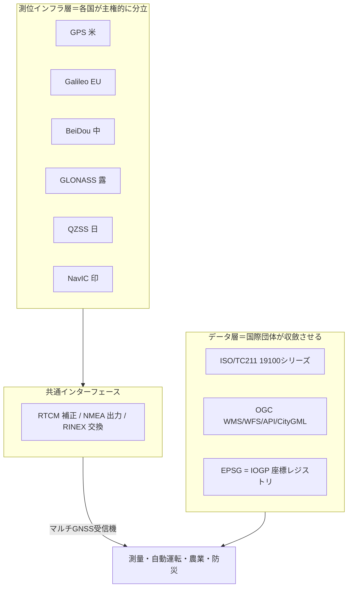
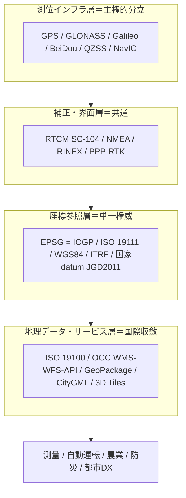

# 地理空間・測位標準の総括：領域横断カタログと採用実態分析

作成日: 2026年7月24日
対象: 地理情報モデル（ISO 19100／OGC）、座標参照系・測地（EPSG／ISO 19111）、3D都市モデル（CityGML／3D Tiles）、GNSS測位（GPS／Galileo／BeiDou／QZSS）、補正フォーマット（RTCM）、国家測地基準（JGD2011）まで、地理空間・測位を支える国際標準の全体像。
目的: 軍事・医療・金融・通信・自動車・エネルギー・製造・物流の総括レポートと同レベルで、前半に領域別カタログ（層構造）、後半に採用・相互運用の実態を分析する。**日本の関与を厚めに**扱い（QZSS/みちびき・CLAS・JGD2011）、横断コラム「標準化の地政学」のレンズを適用する。
凡例: 版・年号は2026年7月時点で確認した公開情報に基づく。断定を避ける箇所は〔要確認〕と付す。

---

## 1. はじめに：地理空間・測位の特殊性

この領域は、本シリーズで **「データ層は高度に収斂し、インフラ層は主権的に分立する」二重構造** が最も明瞭に現れる分野である。特殊性は4点。

第一に、**測位インフラ（衛星）は“わざと”分立している**。GPS（米）・GLONASS（露）・Galileo（EU）・BeiDou（中）という4つの全球システムに加え、地域補完のQZSS（日）・NavIC（印）。測位は軍事・安全保障に直結する二重用途ゆえ、**大国は他国システムへの依存を避け、自前を持つ**。通信やインターネットが世界で一つに収斂したのと**正反対**の、「主権的な冗長性（sovereign redundancy）」がここでは選ばれた。

第二に、**それでもインターフェースは収斂している**。受信機は複数の衛星系を同時に使う（マルチGNSS）し、補正フォーマットは **RTCM SC-104**、出力は **NMEA**、観測交換は **RINEX** に共通化されている。「**複数インフラ＋共通インターフェース**」という、この領域独特の折り合いが成立している。

第三に、**座標の“共通言語”は単一権威に収斂**。世界中の座標参照系を **EPSG データセット（IOGP）** が一元的に定義し、ISO 19111 に準拠して PROJ 等のツールが実装する。誰もがEPSGコードで座標系を指す（M5＝ネットワーク効果）。

第四に、**日本はこの領域で稀に強い**。自前の測位衛星 **QZSS（みちびき）**、無料でセンチメートル級の補正 **CLAS**、全国の電子基準点網（GSI）、独自測地基準 **JGD2011** を持つ。測位を戦略インフラとして投資してきた成果で、shuji氏の **epsg-mcp**（JGD2011平面直角座標系のEPSGコード提供）とも直結する。

---

## 2. 標準の統治構造（誰がどう決めるか）

| 主体 | 性格 | 役割・主な標準 |
|------|------|----------------|
| **ISO/TC 211** | 国際標準化機関 | 地理情報（ISO 19100シリーズ：19111座標参照、19136 GML等） |
| **OGC（Open Geospatial Consortium）** | 業界コンソーシアム | WMS/WFS、OGC API、GeoPackage、CityGML、3D Tiles。ISO/TC211と共同 |
| **IOGP（Geomatics/Geodesy小委員会）** | 業界団体（石油系起源） | **EPSGデータセット**（座標参照系の権威レジストリ） |
| **IERS** | 国際科学機関 | ITRS/ITRF（最高精度の地球基準座標系） |
| **RTCM SC-104** | 業界団体 | GNSS補正データの標準 |
| **各国測位当局** | 国家・安全保障 | GPS（米宇宙軍）、Galileo（EU/EUSPA）、BeiDou（中）、QZSS（日・内閣府） |
| **各国測地機関** | 国家 | 国家測地基準・地図（日本＝国土地理院GSI） |
| **UN-GGIM** | 国連 | 地理空間情報のグローバル管理・調和 |

地理空間・測位は「国際標準化機関（ISO/OGC）」「権威レジストリ（IOGP/EPSG）」「国家測位・測地当局（各国）」「国連（UN-GGIM）」の四層。**データ標準は国際団体が、測位インフラは各国が**、という分業が構造の核。



---

## 3. 領域別カタログ（層構造）

### 3.1 地理情報モデル・交換

| 標準 | 主体 | 実態 |
|------|------|------|
| **ISO 19100シリーズ** | ISO/TC211 | 地理情報の国際規格群（基盤モデル・メタデータ・座標参照等） |
| **GML（ISO 19136）** | OGC/ISO | 地理データのXML表現。多くの派生スキーマの母体 |
| **GeoPackage** | OGC | SQLiteベースの可搬な地理データ形式。軽量・普及 |

### 3.2 地理空間Webサービス・API

| 標準 | 状況 | 実態 |
|------|------|------|
| **WMS/WFS/WMTS** | OGC | 地図配信・地物取得の古典的Webサービス。広く稼働 |
| **OGC API（Features等）** | **Part 1がISO 19168-1:2025** | OpenAPI/JSONベースの現代的後継。モジュール式でWeb親和的 |

WebサービスはWMS/WFSからOGC API（JSON/REST）へ世代交代が進む。shuji氏の実務（Web/API）と接点が濃い層。

### 3.3 座標参照系・測地（EPSG）

| 標準 | 状況 | 実態 |
|------|------|------|
| **EPSGデータセット** | IOGP管理 | 座標参照系・変換の**権威レジストリ**。世界中がEPSGコードで座標系を指す |
| **ISO 19111:2019** | ISO/TC211 | 座標による参照の概念モデル。**動的測地基準・データムアンサンブル**等を導入。EPSGはこれに準拠 |
| **WGS 84 / ITRF** | 米/IERS | WGS 84（EPSG:4326、GPSの基準）、ITRFは最高精度の全球実現 |
| **PROJ** | OSS | ISO 19111実装＋EPSGを内蔵したSQLite DB。GDAL等が利用 |

**EPSGは“座標系の共通言語”として単一権威に収斂**した好例。shuji氏のepsg-mcpはこのレジストリを扱う。

### 3.4 3D・都市・シーン

| 標準 | 主体 | 実態 |
|------|------|------|
| **CityGML** | OGC/ISO | 3D都市モデルのデータモデル（GML3応用スキーマ）。都市DX・デジタルツインの基盤 |
| **3D Tiles / I3S** | OGC | 大規模3Dのストリーミング配信 |
| **3D GeoVolumes** | OGC | 3D Tiles・I3S・glTF・CityGML等を束ねるAPI |

### 3.5 GNSS測位インフラ

| システム | 主体 | 状況 |
|----------|------|------|
| **GPS** | 米宇宙軍 | 全球。無料開放で事実上の世界標準バックボーン |
| **GLONASS** | 露 | 全球 |
| **Galileo** | EU（EUSPA） | 全球。2016年初期サービス開始。高精度サービスHAS |
| **BeiDou** | 中 | 全球 |
| **NavIC** | 印 | 地域（7機、2018〜） |
| **QZSS（みちびき）** | 日・内閣府 | 地域補完（後述4.4）。天頂付近に常時衛星 |

2026年時点で4全球系あわせて約130機が運用。**測位は「分立」が既定路線**。

### 3.6 補正・観測フォーマット

| 標準 | 用途 | 実態 |
|------|------|------|
| **RTCM SC-104** | 補正データ | DGNSS・RTK・**PPP-RTK（SSRメッセージ1057-1068）**。バイナリで効率的。補正の事実上標準 |
| **NMEA 0183** | 受信機出力 | 位置データのASCII出力形式 |
| **RINEX** | 観測データ交換 | 生観測のプレーンテキスト交換形式 |

RTK（〜1-2cm）、PPP（収束後2-5cm）等の高精度測位は、これらの共通フォーマットの上に成立。**インフラは分立でも界面は共通**。

### 3.7 国家測地基準

各国が自国の公式測地基準を持つ（日本JGD2011、米NAD83、欧ETRS89等）。**いずれも国際レジストリEPSGに登録**され、共通言語で相互参照される。国家datumは主権的だが、その“住所録”は国際共通、という二重性。

---

## 4. 政策・地域動向

### 4.1 米国 ― GPSの無料開放でデファクト化

米国は **GPS** を無料開放し、事実上の世界標準バックボーンにした。座標基準WGS 84もGPS由来。「開いて普及させ、標準の座を握る」典型（かつ軍が運用する主権インフラでもある）。

### 4.2 EU ― Galileoと空間データ指令

EUは自前の **Galileo**（高精度サービスHAS）で対米依存を回避しつつ、**INSPIRE指令**で加盟国の空間データ基盤を法的に調和。測位は主権、データは規制で統一するEU流。

### 4.3 中国・ロシア ― 主権インフラ

中国 **BeiDou**、ロシア **GLONASS** は、安全保障上の自立を目的とした主権的測位インフラ。BeiDouは一帯一路圏で採用を広げる第3極。

### 4.4 日本 ― 測位で築いた主権インフラ（厚め）

日本は、この領域で**戦略的な自前インフラ**を築いた数少ない国である。

**QZSS（みちびき）**: 内閣府が運用する準天頂衛星システム。**日本の天頂付近に常時衛星が見える軌道**で、都市・山間部でも安定測位。現行4機から、**2026年に7機体制**へ拡張（みちびき6号機を2025年2月にH3で打ち上げ）。7機体制は**GPSに依存しない持続測位**を可能にする＝測位主権の確立。

**CLAS（センチメータ級測位補強サービス）**: QZSSが放送する**全国・無料のPPP-RTKサービス**。約1分でセンチメートル級精度。GSIの電子基準点網の観測から補正情報を生成。**無料でcm級を全国に配る、世界的に見ても先進的な公共サービス**。

**測地基準・地図（GSI）**: 国土地理院が **JGD2011**（GRS80楕円体・地心、旧東京測地系を置換）を国家基準として整備し、全国約1,300点の電子基準点を運用。測量法がJGD2011を公式基準に定める。JGD2011は **EPSG:6668**（地理座標）と平面直角座標系（EPSG:6669-6687）として国際レジストリに登録――**shuji氏のepsg-mcpが扱う領域そのもの**。

**政策**: 地理空間情報活用推進基本法（2007年）でNSDI（国家空間データ基盤）を制度化。G空間・Society 5.0でも測位を基盤に据える。

総じて、**QZSS/CLAS/電子基準点/JGD2011という主権的インフラでは世界先進級**。ただし全球バックボーン（GPS）と座標レジストリ（EPSG）、データ標準（OGC/ISO）の“世界標準の座”は米・国際団体にあり、**日本は強力な自前インフラを持ちつつ、グローバルな標準の土台は輸入している**構図。

### 4.5 国際 ― レジストリと国連調和

IOGPが EPSG を、OGC/ISO TC211 がデータ標準を、UN-GGIM が各国地理空間情報の調和を担う。**測位は各国主権、座標・データは国際共通**という分業が国際的に維持される。

---

## 5. 層構造マップ（全体像）



---

## 6. 採用実態分析

### 6.1 データ層の収斂 vs 衛星層の分立 ― 二重構造

この領域の本質は、**層によって“収斂”と“分立”が正反対に働く**ことである。データ・座標・サービス層（ISO 19100・OGC・EPSG）は、ネットワーク効果（M5）と単一レジストリの便益で**高度に収斂**した。一方、測位インフラ層（GNSS衛星）は、安全保障上の理由で**わざと分立**した。通信が全層で収斂したのと対照的に、地理空間は**層で収斂と分立が同居**する。

### 6.2 「複数インフラ＋共通インターフェース」の妙

分立する衛星系を実用で束ねるのが、**共通インターフェース**である。RTCM（補正）・NMEA（出力）・RINEX（交換）が共通化され、受信機はGPSもGalileoもBeiDouもQZSSも同時に使う（マルチGNSS）。**インフラは主権的に複数でも、界面を共通化すれば統合できる**。これは「収斂は界面だけで十分な場合がある」という、他領域にも効く一般則を示す。

### 6.3 なぜ測位だけ収斂しないのか ― 主権的冗長性 by design

通信・金融・製造では「一つの標準に収斂」が進んだのに、測位は逆に分立が進んだ。理由は明快で、**測位が軍事・安全保障の二重用途**だからだ。GPSは平時無料でも、有事に劣化・遮断されうる（歴史的にSA＝選択利用性の前例）。だから各大国は**依存を避けて自前を持つ**。これは「強制メカニズム」以前の、**国家安全保障による分立**であり、標準の収斂力（M5）を上回る力が働く数少ない例である。

### 6.4 日本の位置づけ ― 測位は主権インフラで先進、標準の土台は輸入

日本は、この領域で**自動車・水素と並ぶ「戦略投資でルール/インフラに食い込んだ」事例**を示す。QZSS（自前衛星）、CLAS（世界的に先進的な無料cm級補正）、電子基準点、JGD2011――**測位という戦略・安全保障インフラでは世界先進級**。測位も、エネルギーと同じく「依存が国家リスクになる」領域で、日本は自前を築いた。

ただし限界も明確だ。全球バックボーンはGPS、座標レジストリはEPSG（IOGP）、データ標準はOGC/ISO――**“世界標準の座”は米・国際団体にあり、日本は強力な自前インフラを持ちつつ土台は輸入している**。QZSSはGPSを補完する地域システムで、GPSを置換しない。JGD2011も国際レジストリEPSGに登録される一利用者だ。「主力・安全保障領域では自前を築くが、グローバルな共通基盤の胴元にはならない」という、シリーズ一貫のパターンがここでも成立する。

### 6.5 強制力スペクトラム上の位置づけ

```mermaid
quadrantChart
    title 地理空間・測位サブ領域の 強制力×実装ギャップ（編者による定性評価）
    x-axis 弱い強制力 --> 強い強制力
    y-axis 低い実装ギャップ --> 高い実装ギャップ
    quadrant-1 強制力強く・ギャップ大
    quadrant-2 強制力強く・ギャップ小
    quadrant-3 強制力弱く・ギャップ小
    quadrant-4 強制力弱く・ギャップ大
    EPSG座標レジストリ: [0.80, 0.20]
    RTCM補正フォーマット: [0.70, 0.25]
    国家測地基準(JGD2011): [0.78, 0.30]
    GNSSインフラ(主権分立): [0.85, 0.30]
    OGC-API-Web: [0.50, 0.45]
    CityGML-3D: [0.42, 0.60]
    地理データモデル(ISO19100): [0.55, 0.45]
    NSDI政策整合: [0.55, 0.50]
```

座標レジストリ・国家測地基準・GNSS・補正フォーマットは「強制力強・ギャップ小」に寄る（単一権威・国家運用・共通界面が効く）。相対的に3D都市モデルやWebサービスは実装差が残る。**本シリーズでは全体に“ギャップの小さい”領域**――座標という土台が単一権威で収斂しているのが効いている。

---

## 7. まとめ

地理空間・測位は、本シリーズで **「データ層は収斂、インフラ層は分立」の二重構造** が最も鮮明な領域である。座標参照系（EPSG）・地理データ（ISO 19100／OGC）・補正フォーマット（RTCM）は、単一権威とネットワーク効果で高度に収斂した。一方、測位衛星（GPS/GLONASS/Galileo/BeiDou/QZSS/NavIC）は、軍事・安全保障の二重用途ゆえに**わざと分立**した。通信が全層で収斂したのと正反対の「主権的冗長性」で、標準の収斂力（M5）を国家安全保障が上回る数少ない例だ。それでも**共通インターフェース（RTCM/NMEA/RINEX）が分立インフラを束ね、受信機はマルチGNSS**で動く――「複数インフラ＋共通インターフェース」というこの領域独特の折り合いが成立している。

日本は、ここで自動車・水素・海事と並ぶ「戦略投資でインフラに食い込んだ」事例を示す。**QZSS（みちびき、2026年に7機体制でGPS非依存の持続測位へ）、CLAS（全国無料のcm級PPP-RTK）、電子基準点、JGD2011**――測位という安全保障インフラでは世界先進級を築いた。ただし全球バックボーン（GPS）、座標レジストリ（EPSG）、データ標準（OGC/ISO）という**“世界標準の座”は米・国際団体にあり、日本は強力な自前インフラを持ちつつ土台は輸入している**。「主力・安全保障領域では自前を築くが、グローバルな共通基盤の胴元にはならない」というシリーズ一貫の像が、測位でも確認できた。なお本領域は、座標という土台が単一権威（EPSG）で収斂しているため、本シリーズでは相対的に実装ギャップの小さい領域である。

---

## 8. 主な出典（公開情報）

- 地理データ・OGC/ISO: [OGC Standards](https://www.ogc.org/standards/) ／ [OGC API - Features（GitHub）](https://github.com/opengeospatial/ogcapi-features) ／ [CityGML（Wikipedia）](https://en.wikipedia.org/wiki/CityGML)
- 座標参照系 EPSG/ISO 19111: [EPSG Geodetic Parameter Dataset](https://epsg.org/) ／ [EPSG Dataset（Wikipedia）](https://en.wikipedia.org/wiki/EPSG_Geodetic_Parameter_Dataset) ／ [Geodesy（IOGP）](https://www.iogp.org/workstreams/engineering/geomatics/geodesy/)
- GNSS・補正: [Other GNSS（GPS.gov）](https://www.gps.gov/other-global-navigation-satellite-systems-gnss) ／ [RTCM SC-104（Wikipedia）](https://en.wikipedia.org/wiki/RTCM_SC-104)
- 日本 QZSS/CLAS/GSI: [みちびき QZSS（内閣府）](https://qzss.go.jp/en/) ／ [CLAS（内閣府）](https://qzss.go.jp/en/overview/services/sv06_clas.html) ／ [みちびき6号機打ち上げ（JAXA, 2025）](https://global.jaxa.jp/press/2025/01/20250130-1_e.html) ／ [国土地理院 GSI](https://www.gsi.go.jp/)
- JGD2011（EPSG）: [JGD2011 EPSG:6668](https://epsg.io/6668) ／ [JGD2011 平面直角座標系 EPSG:6671](https://epsg.io/6671)

> 注記: 版・年号は2026年7月時点の公開情報に基づく。QZSS 7機体制の開始時期、OGC API各Partの標準化状況、ITRF最新実現など変動・評価が分かれる項目は〔要確認〕を付した。海図（IHO S-100）は物流・海事レポートと、屋内測位・LBSは通信レポートと重複し、詳細は必要に応じ別途深掘りする。
