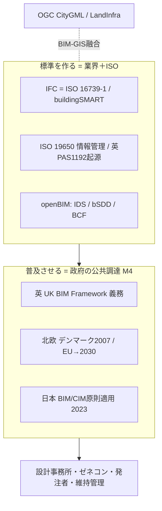
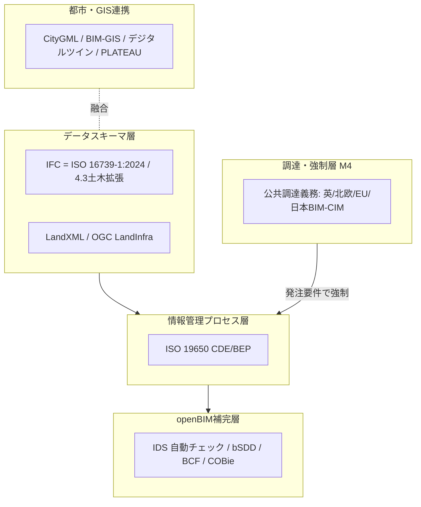

# 建設・BIM標準の総括：領域横断カタログと採用実態分析

作成日: 2026年7月24日
対象: 建築・土木を含む建設（construction）のデジタル情報連携。データスキーマ（IFC）、情報管理プロセス（ISO 19650）、openBIMエコシステム（IDS/bSDD/BCF）、土木・インフラ（IFC4.3／LandXML）、都市・GIS連携（CityGML）まで、建設・BIMを支える国際標準の全体像。
目的: 軍事・医療・金融・通信・自動車・エネルギー・製造・物流・地理空間の総括レポートと同レベルで、前半に領域別カタログ（層構造）、後半に採用・相互運用の実態を分析する。**日本の関与を厚めに**扱い、横断コラム「標準化の地政学」のレンズを適用する。
凡例: 版・年号は2026年7月時点で確認した公開情報に基づく。断定を避ける箇所は〔要確認〕と付す。

> 用語の整理: 「建設（construction）」は**建築（buildings）＋土木（civil/infrastructure）**を包む傘。BIM（Building Information Modeling）はその上の**手法・情報の在り方**で、軸になる標準が **IFC（buildingSMART／ISO 16739-1）**。かつてIFCは建物中心で、土木側は日本で「CIM」と別称されたが、**IFC 4.3で道路・鉄道・橋梁・港湾等の土木インフラに拡張**され、建築・土木を一体で扱える。本レポートは両方をカバーする。

---

## 1. はじめに：建設・BIMの特殊性

建設・BIMは、本シリーズで **「公共調達（M4）」が採用を決める代表領域** である。政府が発注者として「BIMで納品せよ」と要件化すると採用が跳ね、しなければ停滞する。特殊性は4点。

第一に、**M4（公共調達）が主エンジン**。デンマーク（2007年に世界初の公共BIM義務化）、英国（2016年のBIM Level 2義務化）、日本（2023年度のBIM/CIM原則適用）と、**政府が“買い手”としてBIMを強制することで普及が進む**。EUも公共調達でのBIM義務化を2030年に向け拡大中。

第二に、**「情報管理」と「データスキーマ」の二層**。プロセス側は **ISO 19650**（英国PAS 1192起源の情報管理）、データ側は **IFC（ISO 16739-1）**。両者は目的が異なり、揃って初めて機能する。

第三に、**プロプライエタリ支配＋openBIMが交換層**。オーサリングはRevit等の独自ツールが支配し、**IFC/openBIM はベンダー中立の“交換”層**として働く。だがIFC往復でのデータ欠損、単一分野で完結する「lonely BIM」、ライフサイクル全体（維持管理）まで届かない等で、**実装ギャップが大きい**。

第四に、**BIMとGISの融合**。建物のBIM（IFC）と地理空間のGIS（CityGML）という別世界が、IFC 4.3のジオリファレンスやOGC LandInfra、デジタルツインで融合しつつある（地理空間レポートと接続）。

そして日本。**i-ConstructionやPLATEAU（3D都市モデル）等の国家実行では世界的に先進的**だが、コア標準（IFC・ISO 19650）は buildingSMART International／英国が主導し、**日本は採用・実装の側**。自動車・エネルギー・測位と違い、ここでは日本の主権的な標準の強みは薄い（後述6.4）。

---

## 2. 標準の統治構造（誰がどう決めるか）

| 主体 | 性格 | 役割・主な標準 |
|------|------|----------------|
| **buildingSMART International** | 業界団体（openBIM） | IFC（＝ISO 16739-1）、IDS、bSDD、BCF、MVD |
| **ISO TC59/SC13** | 国際標準化機関 | ISO 19650（情報管理）、IFC のISO化 |
| **英国（UK BIM Framework）** | 国家枠組み | ISO 19650の母体（PAS 1192）。事実上の設計思想の源流 |
| **OGC** | 業界団体 | LandInfra/InfraGML、CityGML（BIM-GIS連携） |
| **各国政府・発注者** | 法的強制（調達） | 英・北欧・EU・日本（国交省）の公共調達BIM義務 |
| **分類体系団体** | 業界 | Uniclass（英）、OmniClass（米） |
| **各国bSIチャプター** | 業界 | buildingSMART Japan等の国内展開 |

建設標準は「業界団体（buildingSMART・OGC）」「国際標準化機関（ISO TC59）」「国家調達枠組み（英・日等）」の三層。特徴は、**標準を作るのは業界＋ISO、普及させるのは政府の調達義務（M4）**という分業。



---

## 3. 領域別カタログ（層構造）

### 3.1 データスキーマ（IFC）

| 標準 | 版 | 実態 |
|------|-----|------|
| **IFC** | **ISO 16739-1:2024（IFC 4.3）** | 建設・FMのベンダー中立データスキーマ。**2024年1月にISO最終承認**。IFC 4.3で**道路・鉄道・橋梁・水路等の土木インフラ**とジオリファレンスに拡張。openBIMの核 |

### 3.2 情報管理プロセス（ISO 19650）

| 標準 | 主体 | 実態 |
|------|------|------|
| **ISO 19650シリーズ** | ISO TC59（英PAS 1192起源） | BIMの**情報管理**（CDE共通データ環境、BEP実行計画、役割・責任）。**IFCがデータの中身なら、19650はその流れと約束事**。英国が母体 |

### 3.3 openBIMエコシステム

| 標準 | 状況 | 実態 |
|------|------|------|
| **IDS（Information Delivery Specification）** | v1.0（2024年6月） | 必要情報の機械可読な仕様。**IFCに紐づき自動適合チェック**を可能に。どの検証ソフトでも同結果 |
| **bSDD（buildingSMART Data Dictionary）** | サービス | 分類・属性・単位・訳語の共有ライブラリ |
| **BCF（BIM Collaboration Format）** | 標準 | 課題・指摘のやり取り |
| **COBie** | 標準 | 竣工引渡し情報（維持管理へ） |

IDS・bSDD・BCFは、IFCを補完して「交換・相互運用・協業」の課題に対処する openBIM の実装群。IDSの自動チェックは近年の重要トレンド。

### 3.4 土木・インフラ

| 標準 | 主体 | 実態 |
|------|------|------|
| **IFC 4.3（土木拡張）** | buildingSMART | 道路・鉄道・橋梁等の線形インフラを表現 |
| **LandXML** | 業界デファクト | 測量点・地形・線形・管路等の**土木データ交換の事実上標準**。CAD間交換で広範に稼働 |
| **OGC LandInfra / InfraGML** | OGC | LandXMLの機能をGMLベースで標準化した後継。土地・線形・道路・鉄道・測量等 |

土木は歴史的にLandXMLがデファクトで、IFC 4.3とOGC LandInfraが国際標準として整理を進める。**BIM（IFC）とGIS（GML系）の橋渡し**が土木の焦点。

### 3.5 都市・GIS連携

| 標準 | 主体 | 実態 |
|------|------|------|
| **CityGML** | OGC/ISO | 3D都市モデル。BIM-GIS融合・都市デジタルツインの基盤（地理空間レポート参照） |
| **BIM-GIS統合** | 各種 | IFC 4.3のジオリファレンス、LandInfra等で建物と地理空間を接続 |

### 3.6 分類・成熟度

Uniclass（英）・OmniClass（米）等の分類体系、LOD（Level of Development）／LOIN（Level of Information Need、ISO 19650／EN 17412）で情報の詳細度・成熟度を規定する。

---

## 4. 政策・地域動向

### 4.1 英国 ― ISO 19650の母体、調達義務の先駆

英国は **BIM Level 2 義務化（2016年）** を起点に、**UK BIM Framework** で公共プロジェクトにBIMを要求。その情報管理手法（PAS 1192）が **ISO 19650** として国際標準化された。**建設BIMの“設計思想の源流”は英国**にある。

### 4.2 北欧・EU ― 早期義務化と2030年目標

**デンマークは2007年に世界初の公共BIM義務化**。北欧（ノルウェー・フィンランド）も先進。EUは**35%の国が義務化を導入／計画**し、公共調達でのBIM義務を2030年に向け拡大（チェコはBIM法で2027年から大型公共工事に義務化）。**M4（公共調達）が標準採用を牽引する**EU/北欧型。

### 4.3 米国 ― 市場主導、国家義務化は限定的

米国はGSA（連邦調達庁）等の先行はあるが、英国のような国家一律のBIM義務化はなく、市場・州・発注者ごとにばらつく。OmniClass等の分類は米国系。

### 4.4 日本 ― 国家実行は先進、コア標準は輸入（厚め）

日本は、建設DXの**国家的な実行**では世界的に先進だが、**標準の策定**では国際団体に従う側にいる。

**BIM/CIM原則適用**: 国土交通省は **2023年（令和5年）度から、発注する詳細設計・工事でBIM/CIMを原則適用**（小規模除く）。発注者が活用目的を定め、受注者が3次元モデルを作成・活用。**公共調達（M4）で採用を駆動**する典型。2026年春からBIM図面審査制度を段階開始予定。

**i-Construction / i-Construction 2.0**: 2016年開始のICT施工推進。**2040年までに生産性1.5倍**を掲げる。省人化・自動化を国家目標に。

**PLATEAU（3D都市モデル）**: 国交省の **CityGMLベースの全国3D都市モデル・オープンデータ**（2020年〜）。**世界的に見ても先進的なオープン地理・都市データの取り組み**だが、これは国際標準（CityGML/OGC）の**優れた実装・データ整備**であって、日本発の標準ではない。

**国内展開**: buildingSMART Japanが国内でIFC/openBIMを推進、J-LandXMLが土木データを整備。ただし**コア標準（IFC・ISO 19650）は buildingSMART International／英国が主導**する。

総じて、**国家実行（BIM/CIM原則化・i-Construction・PLATEAU）は先進的だが、コア標準は輸入**。しかも日本のBIM義務化は英国（2016）・デンマーク（2007）より遅く、**この領域では日本は“後発の優れた実装者”**である。自動車・エネルギー・測位のような主権的な標準の強みは、建設では相対的に薄い。

### 4.5 国際 ― buildingSMartの求心力

buildingSMART International が IFC・IDS・bSDD 等の openBIM 標準を、ISO TC59 が ISO 19650 を担う。**業界コンソーシアム（buildingSMART）が事実上の求心力**を持ち、各国政府が調達で採用を後押しする構図。

---

## 5. 層構造マップ（全体像）



---

## 6. 採用実態分析

### 6.1 何が採用を駆動するか ― M4（公共調達）が決定的

建設・BIMは、本シリーズで **公共調達（M4）が採用を最も明快に決める** 領域である。政府が発注者として「BIMで納品」を要件化すると採用が跳ね（英2016・日2023）、しなければ停滞する。デンマーク（2007）から日本（2023）、チェコ（2027）まで、**義務化の時期が普及の時期とほぼ一致**する。金融のM1、医療のM2と並ぶ、明快な単一メカニズムの実例。

### 6.2 なぜ実装ギャップが大きいのか

M4で導入されても、質のギャップは大きい。第一に、**プロプライエタリ支配**。オーサリングはRevit等が握り、IFCは交換層に留まる。**IFC往復でデータが欠損**し、完全な相互運用に届かない。第二に、**「lonely BIM」**。単一分野・単一社内で完結し、発注者・維持管理まで繋がる協業型openBIMに至らない。第三に、**ライフサイクル未達**。設計・可視化には使われても、竣工後の維持管理（COBie等）まで活かされない。「モデルは作ったが活用は限定的」という名目準拠が残る。製造のベンダーロック＋交換用途と同型の構図。

### 6.3 BIM-GIS融合と土木統合

IFC 4.3の土木拡張とジオリファレンス、OGC LandInfra、CityGMLにより、**建物のBIMと地理空間のGISが融合**しつつある。これは地理空間レポートで見た「都市デジタルツイン」と地続きで、日本のPLATEAUはその実装の代表例。土木（LandXML）と建築（IFC）の統合も、IFC 4.3で前進した。

### 6.4 日本の位置づけ ― 後発の優れた実装者

建設は、日本が**「主権的な標準の強みを持たない」ことがむしろ明瞭に出る**領域である。i-Construction・PLATEAU・BIM/CIM原則化という**国家実行は世界的に先進的**だが、コア標準（IFC・ISO 19650）は buildingSMART International／英国が主導し、日本はその**優れた採用・実装者**にとどまる。しかも義務化は英・北欧より遅い後発。

これはシリーズの命題を裏側から補強する。日本がルール層に食い込めたのは自動車・水素・測位・海事のような**「輸出主力産業」または「安全保障インフラ」**だった。建設はそのどちらでもない（内需中心・輸出比率が低い）ため、**日本は投資を標準策定より国内実装に振り、結果として“優れた実装者・後発採用者”に落ち着いた**。PLATEAUの先進性も、NACCS同様「国際標準の優れた国内実装」であって「輸出された標準」ではない、という一貫パターンで説明できる。

### 6.5 強制力スペクトラム上の位置づけ

```mermaid
quadrantChart
    title 建設・BIMサブ領域の 強制力×実装ギャップ（編者による定性評価）
    x-axis 弱い強制力 --> 強い強制力
    y-axis 低い実装ギャップ --> 高い実装ギャップ
    quadrant-1 強制力強く・ギャップ大
    quadrant-2 強制力強く・ギャップ小
    quadrant-3 強制力弱く・ギャップ小
    quadrant-4 強制力弱く・ギャップ大
    公共調達義務(英/日BIM-CIM): [0.72, 0.60]
    情報管理(ISO19650): [0.60, 0.62]
    データスキーマ(IFC): [0.55, 0.68]
    openBIM自動チェック(IDS): [0.42, 0.55]
    土木(LandXML/LandInfra): [0.45, 0.65]
    都市モデル(CityGML/PLATEAU): [0.48, 0.50]
    維持管理(COBie): [0.35, 0.78]
```

公共調達義務は右寄り（M4で強制）だが、**全体に実装ギャップが大きい**（プロプラ支配・往復欠損・ライフサイクル未達）。とりわけ維持管理（COBie）はギャップ最大。「義務化はしたが活用は道半ば」がこの領域の実態。

---

## 7. まとめ

建設・BIMは、本シリーズで **公共調達（M4）が採用を最も明快に決める** 領域である。政府が発注者としてBIMを要件化すると採用が跳ね（英2016・デンマーク2007・日本2023・チェコ2027・EU→2030）、義務化の時期が普及の時期とほぼ一致する。標準は「情報管理（ISO 19650、英国起源）」と「データスキーマ（IFC＝ISO 16739-1:2024、IFC 4.3で土木統合）」の二層で、buildingSMART International が openBIM（IDS/bSDD/BCF）の求心力を担う。

ただしM4で導入されても実装ギャップは大きい。プロプライエタリツール支配、IFC往復のデータ欠損、単一分野の「lonely BIM」、維持管理まで届かないライフサイクル未達で、「モデルは作ったが活用は限定的」という名目準拠が残る。BIM-GIS融合（IFC 4.3・CityGML）は都市デジタルツインへ前進し、地理空間レポートと地続きになっている。

日本は、i-Construction・PLATEAU・BIM/CIM原則化という**国家実行では世界的に先進的**だが、コア標準（IFC・ISO 19650）は英国／buildingSMART International が主導し、**日本は優れた採用・実装者**にとどまる。義務化も英・北欧より後発。これはシリーズの命題を裏側から補強する――日本がルール層に食い込めたのは自動車・水素・測位・海事のような**輸出主力産業か安全保障インフラ**であり、建設はそのどちらでもない（内需中心）。だから日本は投資を標準策定より国内実装に振り、PLATEAUの先進性も「国際標準（CityGML）の優れた国内実装」であって「輸出された標準」ではない。NACCS・ケータイ・ゆるやかな標準と同じ、「国内実装では優秀だが世界のルールにはならない」パターンが、建設でも一貫して確認できた。

---

## 8. 主な出典（公開情報）

- IFC / ISO 16739-1: [IFC 4.3 approved as Final Standard（buildingSMART）](https://www.buildingsmart.org/ifc-4-3-approved-as-a-final-standard/) ／ [ISO 16739-1:2024（ISO）](https://www.iso.org/standard/84123.html)
- ISO 19650: [ISO 19650（Wikipedia）](https://en.wikipedia.org/wiki/ISO_19650) ／ [What is ISO 19650 for UK infrastructure（VE3）](https://ve3.global/blog/what-is-iso-19650-and-why-does-it-matter-for-uk-infrastructure-projects)
- openBIM（IDS/bSDD/BCF）: [Information Delivery Specification（buildingSMART）](https://www.buildingsmart.org/standards/bsi-standards/information-delivery-specification-ids/) ／ [IDS（Wikipedia）](https://en.wikipedia.org/wiki/Information_Delivery_Specification)
- 土木・インフラ: [LandXML（Wikipedia）](https://en.wikipedia.org/wiki/LandXML) ／ [OGC LandInfra/InfraGML](https://www.ogc.org/publications/standard/infragml/)
- BIM義務化・欧州: [BIM Mandates 2025（BIMobject）](https://business.bimobject.com/blog/bim-mandates-which-countries-will-require-them-in-2025/) ／ [Czech Republic BIM Act（EU Public Buyers Community）](https://public-buyers-community.ec.europa.eu/communities/bim-and-public-procurement/news/czech-republic-adopts-bim-mandate-major-public)
- 日本 BIM/CIM: [2023年度までにBIM/CIM原則適用（Archi Future）](https://www.archifuture-web.jp/headline/522.html) ／ [BIM/CIM原則適用の解説（国土工営）](https://www.kokudo-kc.co.jp/column/uncategorized/894/)

> 注記: 版・年号は2026年7月時点の公開情報に基づく。各国BIM義務化の細目、PLATEAUの整備範囲、IFC 4.3土木の実装成熟度、BIM図面審査制度の開始時期など変動・評価が分かれる項目は〔要確認〕を付した。建築設備・積算・不動産（IFC派生や不動産IDとの接続）は必要に応じ別途深掘りする。
