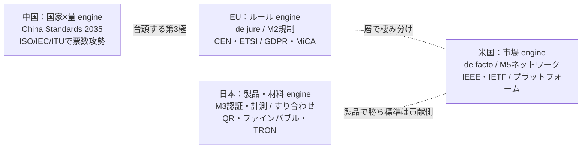

# 横断コラム：標準化の地政学 ― 日本は「製品・材料・計測」で勝ち、「ルール・プラットフォーム」で取りにいけない

作成日: 2026年7月24日
位置づけ: 「国際標準の採用実態」シリーズの横断コラム。特定領域の深掘りではなく、どの領域（通信・金融・自動車…）にも共通して効く「誰が標準を作る力を握るのか」という地政学的な視点を整理する。

---

## 1. 問い

日本は技術で世界を取ることがあるのに、なぜ「国際標準そのもの」を主導することは少ないのか。逆に、なぜ EU と米国は標準を量産できるのか。これは「日本の技術が弱いから」ではなく、**標準を作る“エンジン”が地域ごとに違う**という構造の問題として整理できる。

---

## 2. 標準を作る4つのエンジン

標準化の主導権は、地域ごとに異なる原理で動いている。

| 主体 | エンジン | 効く強制メカニズム | 代表的な武器 | 取りやすい層 |
|------|---------|-------------------|-------------|-------------|
| **EU** | ルール（de jure） | **M2 規制** | CEN/CENELEC/ETSI、ニューアプローチ指令、ブリュッセル効果 | 規制・データ標準・安全 |
| **米国** | 市場（de facto） | **M5 ネットワーク効果** | IEEE/IETF等の業界コンソーシアム、巨大市場、プラットフォーム企業 | インターネット・Web・プラットフォーム |
| **中国** | 国家 × 量 | M2＋票数 | China Standards 2035、ISO/IEC/ITUへの人員・投票攻勢 | 新興・インフラ・通信 |
| **日本** | 製品・材料・計測 | **M3 認証・計測** | すり合わせ型ものづくり、材料・計測技術、ISO/TC幹事国 | 材料・計測・製造プロセス・製品 |

重要なのは、**EUと米国は同じ土俵で正面衝突しているのではなく、レイヤーで棲み分けている**こと。たとえば通信では、モバイル（GSM/3GPP）はEU主導の共同体が世界を取り、インターネット（IETF）は米国が握る。「規制で決める層」と「市場で決める層」が分業している。

---

## 3. 本コラムの核：日本が勝つ土俵／取りにいけない土俵

日本の立ち位置を、レイヤーで二分すると像がはっきりする。

### 3.1 日本が勝てる土俵 ＝ 下のレイヤー（M3：認証・計測・材料・製品）

| 例 | 種類 | 主体 | 状況 |
|----|------|------|------|
| **QRコード** | データ記号系（ISO/IEC 18004） | デンソーウェーブ | 特許を実質開放し世界標準化。日本発の最大の成功例 |
| **ファインバブル** | 製造プロセス・計測（ISO/TC 281） | 日本提案・幹事国 | 2013年京都で初会合、日本主導で国際化 |
| **光触媒** | 材料・計測（ISO/TC 206 内） | TOTO等 | 日本が中核貢献 |
| **ファインセラミックス** | 材料（ISO/TC 206） | 日本 | 計測・評価法で強い |
| **ロボット安全** | 安全規格（ISO 13482 生活支援ロボット） | 日本が主導的関与 | 計測・安全の土俵 |
| **TRON / μITRON** | 組込みOS仕様 | 坂村健 | 組込みでデファクト（オープン仕様） |

共通点は、**「計測できる」「認証できる」「材料・プロセスとして評価できる」**という、日本の強みが直接効く層であること。ここは M3（認証・型式承認・計測）が価値を決めるので、すり合わせ型のものづくり文化が優位に働く。

### 3.2 日本が取りにいけない土俵 ＝ 上・横断のレイヤー（M2規制／M5プラットフォーム）

| 領域 | 誰が握るか | 日本の位置 |
|------|-----------|-----------|
| 金融メッセージング（ISO 20022） | 欧州系＋SWIFT | 実装者・追随者 |
| Web・インターネット（W3C/IETF） | 米国中心 | 貢献者 |
| ID・認証プラットフォーム（OAuth/OIDC） | 米国 | 利用者 |
| OSプラットフォーム | 米国 | ほぼ不在 |
| デジタル資産規制（MiCA/DTI） | EU | 追随 |

ここは「ルールを書く」「プラットフォームを握る」層で、価値の源泉が M2（規制）か M5（ネットワーク効果）にある。日本はこの層に**人と金と外交を張り切れていない**。

### 3.3 象徴的な2つの敗北と1つの勝利

- **FeliCa（敗北）**: 技術は優秀だったが ISO/IEC 14443 の Type C 入りを拒否され、ISO/IEC 18092 の「NFC-F」＋JIS X 6319-4 として併存に留まった。本流（Type A/B）は欧州勢。**技術で勝ってルールで負けた**典型。
- **TRON（敗北）**: 組込みでは世界に広く載ったが、PC向け（BTRON）が日本の学校標準になりかけたところで日米貿易摩擦のスーパー301条の対象になり失速したと言われる。プラットフォーム層に届かなかった。
- **QRコード（勝利）**: 唯一の例外は、特許を開放して自らネットワーク効果（M5）を起こしたこと。日本が上の層で勝った稀な事例で、「囲わずに開いた」戦略が効いた。

---

## 4. なぜ日本はルール層に弱いのか（構造的理由）

1. **すり合わせ最適の副作用**: 製品を丸ごと社内最適化する文化ゆえ、境界（インターフェース）を開く標準を作る動機が薄い。オープン標準は自分の強みを陳腐化させるため。
2. **ガラパゴス最適の成立**: 国内市場が十分大きく、独自最適が経済的に成り立ってしまった（FeliCa、ケータイ、ワンセグ）。
3. **政治ゲームへの投資不足**: 国際委員会は英語・外交・幹事国の奪取・数年がかりの合意形成という政治過程。ここへの国家＋企業の継続投資が、EUの制度力に比べて薄い。
4. **「守り」の標準化観**: 標準化を長く自国産業の保護（守り）と捉え、攻めの戦略と位置づけるのが遅れた。経産省が2000年代以降「標準化戦略」を掲げるのはこの反省から。

---

## 5. 強制メカニズムへの接続

本シリーズの強制メカニズム類型（M1〜M6）で見ると、地域とレイヤーの対応がきれいに揃う。

- **EU ＝ M2（規制）** を輸出するエンジン。
- **米国 ＝ M5（ネットワーク効果）** で押し切るエンジン。
- **日本 ＝ M3（認証・計測）** の層でのみ主導権を取れる。
- **中国 ＝ M2＋票数** で新興・インフラ層に食い込む第3極。

つまり「日本は M3 の土俵では世界を取れるが、M2／M5 の土俵には張れていない」と一行で要約できる。

---

## 6. 各深掘りでの使い方

通信・金融・自動車など、どの領域を深掘りするときも、冒頭で **「この領域は誰のエンジンが握るか」** を置くと構造が一気に見える。

- 通信 → モバイルはEU（3GPP）、インターネットは米国（IETF）。層で分かれる好例。
- 金融 → メッセージングは欧州＋SWIFT、規制はEU（MiCA）、即時決済網は各国当局。
- 自動車 → 型式認可はUNECE（欧州）、機能安全はISO、車載SWはAUTOSAR（独主導）。

日本はいずれも「製品では強いが標準は貢献側」に収まりやすい。この視点を各レポートに一欄設けると、シリーズ全体で一貫した読み筋になる。

---

## 7. 出典（公開情報）

- FeliCa / ISO 14443 Type C: [FeliCa（Wikipedia）](https://en.wikipedia.org/wiki/ISO/IEC_14443_Type_C) ／ [Sony FeliCa と NFC の関係](https://www.sony.co.jp/en/Products/felica/NFC/relation.html)
- QRコード: [ISO/IEC 18004:2015（ISO）](https://www.iso.org/standard/62021.html)
- ファインバブル: [ISO/TC 281（ISO）](https://www.iso.org/committee/4856666.html) ／ [ISO fine bubbles（京都2013）](https://www.acniti.com/technology/iso-fine-bubbles/)
- CHAdeMO/ChaoJi: [ChaoJi new protocol（CHAdeMO）](https://www.chademo.com/update-chaoji-new-protocol-swg)

> 注記: 地政学的な整理は編者の分析枠組みであり、個別事実（規格番号・年号・委員会の幹事国等）は本文リンク先の公開情報に基づく。ISO 13482への日本の関与度、TRON/スーパー301の因果など歴史的評価が分かれる点は各自の一次確認を推奨する。
