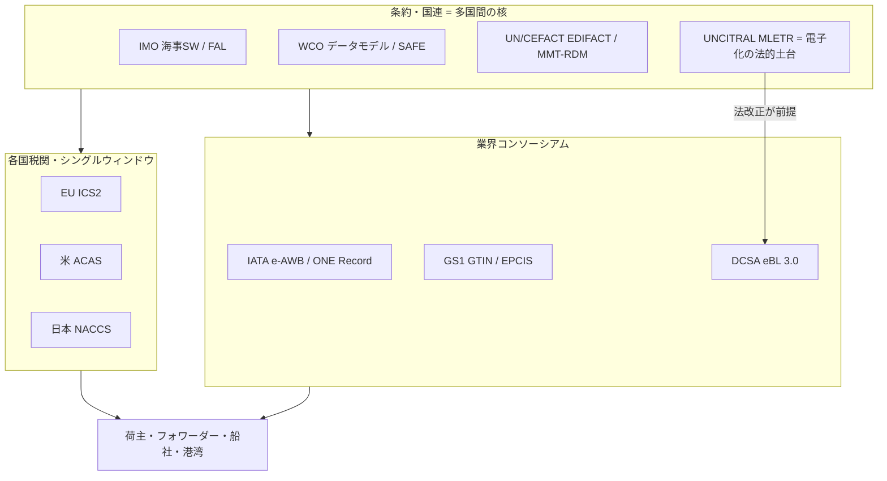

# 物流・貿易・関税・海事標準の総括：領域横断カタログと採用実態分析

作成日: 2026年7月24日
対象: 貿易手続き・EDI（UN/EDIFACT・UN/CEFACT）、通関・国境（WCO・PLACI）、海事（IMO・IHO）、電子船荷証券（MLETR・DCSA eBL）、航空貨物（IATA）、サプライチェーン識別（GS1・コンテナ）まで、物流・貿易・関税・海事を支える国際標準の全体像。
目的: 軍事・医療・金融・通信・自動車・エネルギー・製造の総括レポートと同レベルで、前半に領域別カタログ（層構造）、後半に採用・相互運用の実態を分析する。**日本の関与を厚めに**扱い、横断コラム「標準化の地政学」のレンズを適用する。
凡例: 版・年号は2026年7月時点で確認した公開情報に基づく。断定を避ける箇所は〔要確認〕と付す。

---

## 1. はじめに：物流・貿易・関税・海事の特殊性

この領域は、本シリーズで **最も「多国間・条約的」に統治される** 分野である。通信が米国、自動車がUNECE（欧州）、製造がドイツに主導されるのに対し、物流・貿易は **IMO・WCO・UNCITRAL・UN/CEFACT という国連ファミリーの機関＋業界コンソーシアムが分担**し、単一の覇権国が存在しない。特殊性は4点。

第一に、**物理手続きは強制（M1＋M2）だが、電子文書は任意（M6）で遅い**。貨物は通関を通らなければ動かない（M1的な実務排除）し、通関申告は法的義務（M2）。ところが**船荷証券（B/L）等の電子化は遅々として進まない**。2025年でも電子船荷証券（eBL）は全体の約11%に留まる。

第二に、**電子化の壁が「技術」ではなく「法」にある**。船荷証券は**権利証券（document of title）**で、「紙の占有＝所有権」という法概念に縛られる。これを電子化するには **MLETR（電子的移転可能記録モデル法）** に基づく各国の**法改正**が要る。標準があっても法が追いつかないと動かない。

第三に、**モード×手続き×商流の“多体harmonization問題”**。空（IATA）・海（IMO/DCSA）・陸・鉄で標準が分かれ、そこに通関（WCO）と商流識別（GS1）が重なる。これを **UN/CEFACT** が MMT-RDM（マルチモーダル参照データモデル）で束ねようとするが、統合は道半ば。

第四に、**日本は世界有数の海運・貿易国＝強力なオペレーター**。国家シングルウィンドウ（NACCS）は世界屈指、コンテナ船社ONE（NYK・MOL・K-Line統合）は世界大手。だが**標準そのものは国際機関・コンソーシアムが書き、日本は主に実装・採用の側**にいる（後述6.4）。

---

## 2. 標準の統治構造（誰がどう決めるか）

| 主体 | 性格 | 役割・主な標準 |
|------|------|----------------|
| **IMO**（国際海事機関） | 国連の条約機関 | FAL条約（海事シングルウィンドウ）、IMO Compendium |
| **WCO**（世界税関機構） | 政府間機関 | WCOデータモデル、SAFEフレームワーク |
| **UN/CEFACT**（UNECE） | 国連 | UN/EDIFACT、MMT-RDM、貿易手続き電子化 |
| **UNCITRAL** | 国連 | MLETR（電子的移転可能記録モデル法） |
| **IATA** | 業界団体（航空） | e-AWB、ONE Record |
| **IHO**（国際水路機関） | 政府間機関 | S-100／ENC（電子海図） |
| **GS1** | 業界団体 | GTIN、EPCIS、GDSN、Digital Link |
| **DCSA**（デジタルコンテナ海運協会） | 船社コンソーシアム | eBL標準（Bill of Lading 3.0）、API |
| **FIT Alliance** | 業界連合（BIMCO/DCSA/FIATA/ICC/SWIFT） | eBL普及 |
| **ISO TC104/TC8** | 国際標準化 | コンテナ（ISO 668/6346）、船舶 |
| **各国税関・当局** | 法的強制 | 米ACAS、EU ICS2、日本NACCS |

物流・貿易標準は「条約・政府間機関（IMO・WCO・IHO）」「国連（UN/CEFACT・UNCITRAL）」「業界コンソーシアム（IATA・GS1・DCSA）」「各国当局」の四層。**単一覇権がなく、多国間の合意形成で動く**のが最大の特徴。



---

## 3. 領域別カタログ（層構造）

### 3.1 貿易手続き・EDI・データモデル

| 標準 | 主体 | 実態 |
|------|------|------|
| **UN/EDIFACT** | UN/CEFACT | 貿易EDIの古典的国際標準。今も広く稼働、ただしレガシー |
| **UN/CEFACT MMT-RDM** | UN/CEFACT | マルチモーダル輸送参照データモデル。**GS1・WCO・ISO・IMO・IATAの標準を統合**する束ね役 |
| **GS1（GTIN/EPCIS/GDSN/Digital Link）** | GS1 | 商品・物流識別。**EPCIS**（追跡イベント）はUN/CEFACTにも取り込まれた |

### 3.2 通関・国境管理

| 標準/枠組み | 主体 | 実態 |
|-------------|------|------|
| **WCOデータモデル（v3、GOVCBR）** | WCO | 税関＋他省庁の規制情報交換。シングルウィンドウの基盤 |
| **WCO SAFEフレームワーク** | WCO | 国際サプライチェーンの安全・円滑化。**2025年6月版**が最新 |
| **PLACI（搭載前貨物事前情報）** | 各国 | 米ACAS、EU ICS2、英・加等。テロ・安全対策で事前申告を義務化 |
| **EU ICS2** | EU | より詳細な貨物データ（品目・経路・関係者）を要求。段階導入 |
| **シングルウィンドウ** | 各国 | 手続きの一元化（後述の日本NACCS等） |

### 3.3 海事

| 標準/条約 | 主体 | 実態 |
|-----------|------|------|
| **IMO 海事シングルウィンドウ（FAL条約改正）** | IMO | **2024年1月1日から全港で義務化**。入出港情報の電子交換・一度だけ提出原則 |
| **IMO Compendium** | IMO | データセット＋参照モデル。各国SWの相互運用を担保 |
| **IHO S-100 / ENC** | IHO | 電子海図の共通データモデル（S-57の後継）。航海の相互運用 |
| **コンテナ（ISO 668／6346）** | ISO TC104 | コンテナ寸法・識別コード。物流の物理的土台 |

海事は条約（IMO）が主導し、シングルウィンドウ義務化（2024）で電子化を前進させた**M2の強い層**。

### 3.4 電子船荷証券・貿易デジタル化

| 標準/枠組み | 状況 | 実態 |
|-------------|------|------|
| **MLETR（電子的移転可能記録モデル法）** | UNCITRAL 2017 | 「占有」を「排他的コントロール」に置換する**法的土台**。**英（電子取引文書法2023）・シンガポール・UAE・バーレーン・仏が採用、印も2025年に法整備** |
| **DCSA eBL標準（Bill of Lading 3.0）** | 2025年初 | 190超の属性、EU ICS2対応。船社（コンテナ貿易の約70%）が**2030年までにeBL 100%**を目標 |
| **相互運用（PINT API）** | 2025年5月 | 初の標準ベース相互運用eBL取引（CargoX×EdoxOnline）。プラットフォーム間連携 |
| **FIT Alliance** | 2022年設立 | BIMCO・DCSA・FIATA・ICC・SWIFTがeBL普及を推進 |

**eBLは標準・法・目標が揃いつつあるのに、2025年で普及率約11%（2021年の1.2%から上昇）**。この「揃っても遅い」ことの分析が後述6.2の核。

### 3.5 航空貨物

| 標準 | 状況 | 実態 |
|------|------|------|
| **e-AWB（電子航空運送状）** | 普及 | 出荷の**2/3超**が電子化 |
| **IATA ONE Record** | 2026年1月1日に推奨標準化 | 出荷を単一レコードで共有するAPI標準。**ただし任意・推奨で法的義務ではない**。PLACI（米ACAS・EU ICS2等）への給餌を狙うが、当局はまだONE Recordを直接受理せず |

### 3.6 サプライチェーン識別・コンテナ

GS1（GTIN商品識別・EPCIS追跡・Digital Link）が商流の識別基盤。物理面ではコンテナのISO 668（寸法）・ISO 6346（識別コード＝BICコード）が、モーダル横断の物流を支える土台。

---

## 4. 政策・地域動向

### 4.1 国際機関 ― 多国間主義の核

物流・貿易は **IMO（海事）・WCO（税関）・UN/CEFACT（貿易手続き）・UNCITRAL（法）** という国連ファミリーが主導する、本シリーズで最も多国間的な領域。**単一覇権国がなく、条約と合意形成で動く**。IMOの海事シングルウィンドウ義務化（2024）、WCO SAFEフレームワーク（2025年版）が近年の前進。

### 4.2 EU ― 事前情報と法整備の先行

EUは **ICS2** で搭載前貨物情報を厳格化し、詳細データを義務化。DCSAの主要船社（Maersk・MSC・Hapag-Lloyd等）は欧州系が中心。MLETR型の法整備でも欧州（英・仏）が先行。

### 4.3 米国 ― 安全規制と商習慣

米国は **ACAS**（航空貨物事前スクリーニング）等の安全規制を主導。商取引はUCC（統一商事法典）ベースで、MLETR統一とは別系統。

### 4.4 日本 ― 世界屈指のオペレーター、標準は輸入者（厚め）

日本は海運・貿易の**実務**では世界最上位だが、標準の**策定**では国際機関・コンソーシアムに従う側にいる。

**国家シングルウィンドウ（NACCS）**: **輸出入・港湾関連情報処理システム（NACCS）** は、**日本の輸出入手続きの約99%を処理**する世界屈指のシングルウィンドウ。税関・国交省・法務省・農水省・厚労省・経産省の各手続きを一元化。専用法に基づくNACCSセンターが運営。**国内システムとしては極めて高度**だが、これは「日本の国家システム」であって「輸出された国際標準」ではない。

**海運（ONE）**: **Ocean Network Express（ONE）** は日本の3船社（NYK 38%・MOL 31%・K-Line 31%）が統合した世界大手コンテナ船社。**DCSAのeBL標準をGSBN（ブロックチェーン基盤）で採用**し（Hapag-Lloydに次ぐ2社目）、2030年100%eBLにコミット。**日本勢は国際標準（DCSA）の早期採用者**。

**IMO**: 日本は世界有数の海運国としてIMO理事会（カテゴリーA）の常連で、海事ガバナンスに実質的な影響力を持つ〔要確認〕。ここは自動車・水素と同様、**主力領域（海事）では条約機関で発言力を持つ**パターン。

総じて、**オペレーター（NACCS・ONE）としては世界最上位、海事条約（IMO）では発言力を持つが、貿易デジタル化の標準（eBL・GS1・UN/CEFACT・IATA）は国際機関・コンソーシアムが主導**という構図。

### 4.5 新興・貿易ハブ ― 法整備の先行者

シンガポール・UAE・バーレーン・英・印など、**貿易ハブ／コモンロー国がMLETR採用で先行**。デジタル貿易の法的土台を先に整えることで、eBLのハブになろうとしている。

---

## 5. 層構造マップ（全体像）

```mermaid
flowchart TB
    subgraph L1[物理・識別層]
      PHY[コンテナ ISO 668/6346 / GS1 GTIN / 船舶・港湾]
    end
    subgraph L2[データ・EDI層]
      EDI[UN/EDIFACT / GS1 EPCIS / WCOデータモデル / IATA ONE Record]
    end
    subgraph L3[手続き・シングルウィンドウ層]
      SW[IMO 海事SW / 税関SW(NACCS等) / PLACI(ICS2/ACAS)]
    end
    subgraph L4[権利・法層]
      LAW[eBL: MLETR + DCSA BL 3.0 = 法改正が前提]
    end
    subgraph L5[束ね役]
      UNC[UN/CEFACT MMT-RDM = モード横断の統合]
    end
    L1 --> L2 --> L3
    L4 -.権利移転.- L2
    UNC -.横断調和.- L2
    UNC -.横断調和.- L3
```

---

## 6. 採用実態分析

### 6.1 何が採用を駆動するか

物流・貿易は **物理手続きが M1＋M2 で強制される**。貨物は通関を通らねば動かず（実務排除）、申告は法的義務。海事シングルウィンドウ（2024義務化）やPLACI（安全規制）も M2 で強制される。**ただしこの強制は「手続き・申告」に効くのであって、「電子文書（eBL）」には及ばない**。ここに大きな段差がある。

### 6.2 eBLの教訓 ― 標準だけでは足りない（法＋ネットワーク＋信頼）

この領域の最重要の発見は、**「標準・目標・価値が揃っても、それだけでは普及しない」**ことである。eBLは、DCSA BL 3.0という成熟標準があり、コンテナ貿易の70%を占める船社が2030年100%をコミットし、コスト削減価値も明白なのに、**2025年で普及率わずか約11%**。理由は3つ揃わないと動かないからだ。

- **法**: 船荷証券は権利証券で「紙の占有＝所有」。MLETRによる各国**法改正**なしに電子化できない。
- **ネットワーク**: プラットフォーム間の相互運用（PINT API等）が要る。孤立した電子文書は使えない。
- **信頼**: 「排他的コントロール」を担保するレジストリ／基盤への信頼が要る。

これは金融の「翻訳ゲートウェイ」や通信の「実装意思決定点」と並ぶ一般則――**成果物が“法的権利”を運ぶとき、拘束条件は技術標準ではなく法改正になる**。標準は必要条件だが十分条件ではない。

### 6.3 多体harmonization問題

空（IATA）・海（IMO/DCSA）・陸・鉄のモード分断に、通関（WCO）と商流（GS1）が重なる。これを UN/CEFACT の MMT-RDM が束ねようとするが、**関係者が多すぎて統合が遅い**。製造の「参照アーキ三分裂」と似た構図が、より多くの主体で起きている。

### 6.4 日本の位置づけ ― オペレーターとして最強、標準は輸入者

日本は、**海運・貿易の実務では世界最上位**である。NACCSは輸出入手続きの99%を捌く世界屈指のシングルウィンドウ、ONEは世界大手船社、IMOでは理事国として発言力を持つ。だが**貿易デジタル化の標準（eBL・GS1・UN/CEFACT・IATA）は国際機関・コンソーシアムが書き、日本は早期採用・実装の側**にいる。

NACCSは象徴的だ。国内システムとしては極めて高度だが、**「日本の国家システム」であって「輸出された国際標準」ではない**。製造の「ゆるやかな標準」やケータイと同じ、「国内最適では優秀だが世界のルールにはならない」パターン。一方、海事条約（IMO）という主力領域では発言力を持つ点は、自動車（WP.29）・水素（ISO TC197）と同型である。

### 6.5 強制力スペクトラム上の位置づけ

```mermaid
quadrantChart
    title 物流・貿易サブ領域の 強制力×実装ギャップ（編者による定性評価）
    x-axis 弱い強制力 --> 強い強制力
    y-axis 低い実装ギャップ --> 高い実装ギャップ
    quadrant-1 強制力強く・ギャップ大
    quadrant-2 強制力強く・ギャップ小
    quadrant-3 強制力弱く・ギャップ小
    quadrant-4 強制力弱く・ギャップ大
    通関申告(WCO/税関): [0.88, 0.35]
    海事SW(IMO2024): [0.80, 0.45]
    PLACI(ICS2/ACAS): [0.82, 0.40]
    シングルウィンドウ(NACCS等): [0.72, 0.35]
    航空e-AWB: [0.60, 0.40]
    GS1識別: [0.62, 0.45]
    ONE-Record: [0.40, 0.55]
    電子船荷証券(eBL): [0.45, 0.80]
    UN/EDIFACTレガシー: [0.55, 0.65]
```

通関・海事SW・PLACIは規制で強制され右側。対して**eBLは強制力中・ギャップ最大**（法・ネットワーク・信頼が揃わず11%）。この対比が領域の本質を示す。

---

## 7. まとめ

物流・貿易・関税・海事は、本シリーズで **最も多国間・条約的に統治される** 領域である。IMO・WCO・UNCITRAL・UN/CEFACT という国連ファミリーと業界コンソーシアム（IATA・GS1・DCSA）が分担し、単一覇権国がない。**物理手続きは M1＋M2 で強制される**（貨物は通関なしに動かず、海事シングルウィンドウは2024年義務化）が、**電子文書（eBL）は任意色が濃く、普及は遅い**。

最大の教訓は eBL にある。成熟標準（DCSA BL 3.0）、船社の2030年100%コミット、明白な価値が揃っても、普及は2025年で約11%。**成果物が「法的権利（権利証券）」を運ぶとき、拘束条件は技術標準ではなく“法改正（MLETR）＋ネットワーク相互運用＋信頼基盤”になる**。標準は必要条件だが十分条件ではない――金融の翻訳ゲートウェイ、通信の実装意思決定点と並ぶ、シリーズを貫く一般則がここでも確認できた。

日本は、海運・貿易の実務では世界最上位のオペレーター（NACCSは輸出入手続きの99%を処理、ONEは世界大手、IMO理事国）でありながら、**貿易デジタル化の標準は国際機関・コンソーシアムが書き、日本は早期採用・実装の側**にいる。NACCSは国内システムとして極めて高度だが、「輸出された国際標準」ではない――製造の「ゆるやかな標準」と同じ、国内最適では優秀だが世界のルールにはならないパターン。ただし海事条約（IMO）という主力領域では発言力を持つ点は、自動車・水素と同型。「日本は主力・戦略領域の条約・安全ルールには食い込むが、越境データ標準は取りにいけない」という像が、物流でも一貫して確認できた。

---

## 8. 主な出典（公開情報）

- eBL / MLETR: [Where shipping stands on eBL adoption 2025（Lester Aldridge）](https://www.lesteraldridge.com/blog/marine/where-the-shipping-industry-stands-on-the-adoption-of-electronic-bills-of-lading-in-2025/) ／ [eBL が変えるデジタル貿易（ICC Academy）](https://academy.iccwbo.org/international-trade/article/how-the-electronic-bill-of-lading-ebl-is-transforming-digital-trade/)
- WCO / UN/CEFACT: [WCO SAFE Framework 2025](https://www.wcoomd.org/-/media/wco/public/global/pdf/topics/facilitation/instruments-and-tools/tools/safe-package/safe-framework-2025_en.pdf?la=en) ／ [UN/CEFACT（UNECE）](https://unece.org/trade/uncefact)
- IATA ONE Record: [ONE Record（IATA）](https://www.iata.org/en/programs/cargo/e/one-record/)
- IMO 海事シングルウィンドウ: [Maritime Single Window mandatory Jan 2024（IMO）](https://www.imo.org/en/mediacentre/pressbriefings/pages/fal-46-amendments.aspx) ／ [Maritime Single Window（IMO）](https://www.imo.org/en/ourwork/facilitation/pages/maritimesinglewindow-default.aspx)
- 日本 NACCS: [NACCSとは（NACCS）](https://www.naccs.jp/aboutnaccs/) ／ [NACCSの概要（JETRO）](https://www.jetro.go.jp/world/qa/04A-010139.html)
- 日本 海運 ONE / DCSA: [ONE adopts DCSA eBL via GSBN（Smart Maritime Network）](https://smartmaritimenetwork.com/2025/02/25/ocean-network-express-adopts-dcsa-ebl-standards-using-gsbn-blockchain/) ／ [Ocean Network Express（Wikipedia）](https://en.wikipedia.org/wiki/Ocean_Network_Express)

> 注記: 版・年号は2026年7月時点の公開情報に基づく。eBL普及率、MLETR採用国、IMO理事会での日本の位置づけ、IHO S-100移行状況など変動・評価が分かれる項目は〔要確認〕を付した。内陸物流・倉庫・ラストマイル（宅配）や貿易金融（信用状のデジタル化）の細目は本レポートの範囲外とし、必要に応じ別途深掘りする。
