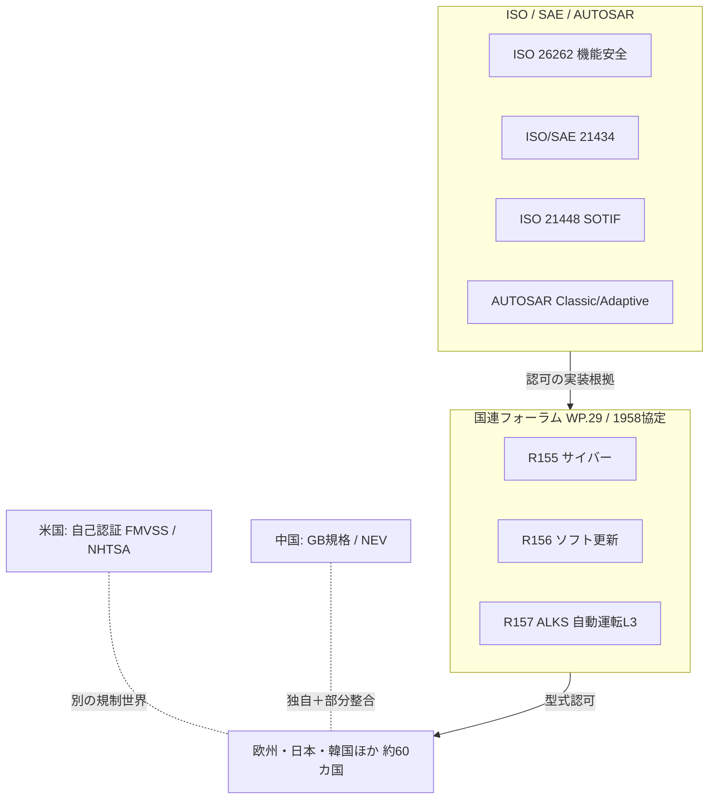
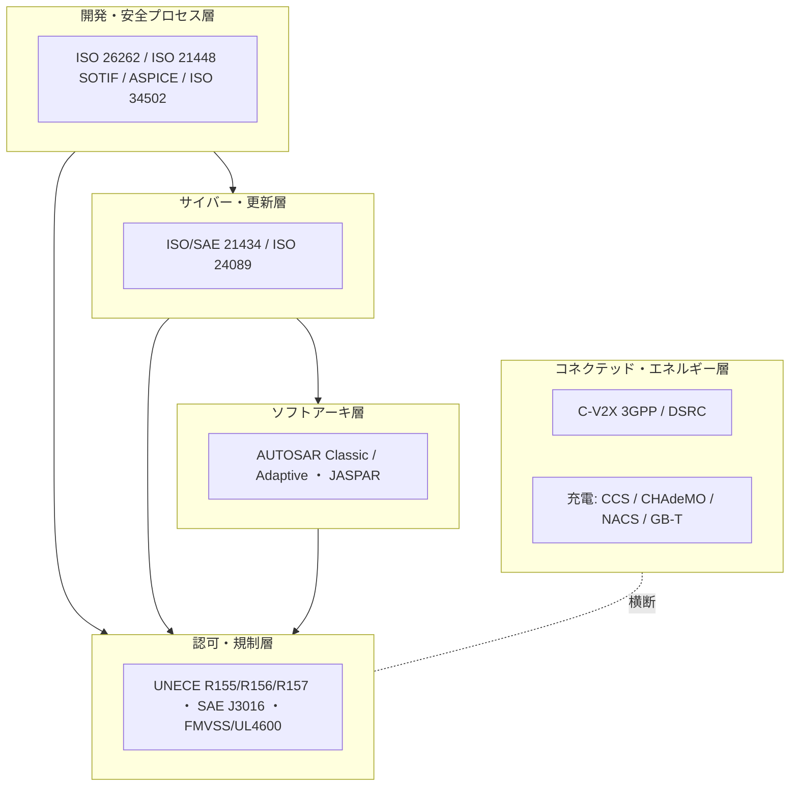

# 自動車・モビリティ標準の総括：領域横断カタログと採用実態分析

作成日: 2026年7月24日
対象: 機能安全（ISO 26262）、サイバーセキュリティ（ISO/SAE 21434・UNECE R155）、車載ソフトアーキテクチャ（AUTOSAR）、型式認可・自動運転（UNECE WP.29・R157）、コネクテッド・V2X、EV充電まで、自動車・モビリティを支える国際標準の全体像。
目的: 軍事・医療・金融・通信の総括レポートと同レベルで、前半に領域別カタログ（層構造）、後半に採用・相互運用の実態を分析する。**日本の関与を厚めに**扱い、横断コラム「標準化の地政学」のレンズを適用する。
凡例: 版・年号は2026年7月時点で確認した公開情報に基づく。断定を避ける箇所は〔要確認〕と付す。

---

## 1. はじめに：自動車標準の特殊性

自動車・モビリティは、本シリーズで **規制（M2）と型式認可（M3）が二重に効く** 領域である。安全認証を通らなければ市場に出せない、という点で医療機器に近いが、自動車には独自の構造的特徴が4つある。

第一に、**「二つの規制世界」が並立する**。欧州・日本・韓国など約60カ国は **UNECE（国連欧州経済委員会）の1958年協定** に基づく **型式認可（type approval）** ＝「売る前に第三者が認証」の世界。対して米国は **自己認証（self-certification／FMVSS）** ＝「メーカーが適合を宣言し、事後に当局が取り締まる」世界。同じ車でも、通す関門の思想が根本的に違う。

第二に、**規格が積層する**。土台の機能安全（ISO 26262）の上に、サイバー（ISO/SAE 21434）、意図機能安全（SOTIF＝ISO 21448）、ソフト更新（ISO 24089）、自動運転（ISO 34502等）が積み重なる。1つの標準ではなく「安全の地層」を成す。

第三に、**業界標準と法規制が直結する**。ISO/SAE 21434（業界標準）が UNECE R155（法規制）の実装根拠になるなど、「標準を満たすこと」が「型式認可の要件」に組み込まれる。医療で見た「業界標準の法規制統合」が、自動車では最も明瞭に制度化されている。

第四に、**ソフト定義自動車（SDV）への地殻変動**。車載ソフトが差別化の中心になり、リアルタイム制御中心の AUTOSAR Classic に加え、高性能・更新前提の AUTOSAR Adaptive が台頭。「作って売る製品」から「売った後も更新するプラットフォーム」への移行が標準を揺らしている。

そして日本。この領域は、通信・金融と違い、**日本が例外的にルール層へ食い込めている**分野である（後述6.4）。基幹産業ゆえに標準化外交へ投資してきた結果で、シリーズの「日本はルールで負ける」命題の重要な反例になる。

---

## 2. 標準の統治構造（誰がどう決めるか）

| 主体 | 性格 | 役割・主な標準 |
|------|------|----------------|
| **UNECE WP.29**（1958年協定、GRVA等の作業部会） | 国連の車両規制フォーラム | UN Regulations（R155サイバー・R156ソフト更新・R157 ALKS等）。**約60カ国が相互承認** |
| **ISO TC22**（道路車両） | 国際標準化機関 | ISO 26262、ISO 21448、ISO 24089、ISO 34502/34503 |
| **ISO ＋ SAE 共同** | 国際＋米国 | ISO/SAE 21434（サイバー）、SAE J3016（自動運転レベル）、SAE J3400（NACS充電） |
| **AUTOSAR** | 開発パートナーシップ（独主導） | 車載SWアーキ（Classic／Adaptive）。**トヨタがコアパートナー** |
| **3GPP** | 通信パートナーシップ | C-V2X（LTE-V2X／NR-V2X） |
| **各国・地域当局** | 法的強制 | EU（GSR2）、日本（国交省MLIT／警察庁）、米NHTSA、中国（GB規格） |
| **JASPAR**（日本） | 国内コンソーシアム | 車載SW・ネットワークの国内標準化、AUTOSARと連携 |

自動車標準は「国連フォーラム（WP.29）」「国際標準化機関（ISO/SAE）」「業界パートナーシップ（AUTOSAR/JASPAR）」「各国当局」の四層が **相互に参照** する。特徴は WP.29 が ISO/SAE 標準を型式認可要件に引き込む点で、**業界標準と法規制の結合が制度の中核**にある。



---

## 3. 領域別カタログ（層構造）

### 3.1 機能安全・開発プロセス

| 標準 | 版 | 用途・実態 |
|------|-----|-----------|
| **ISO 26262**（Road vehicles – Functional safety） | 2011初版／2018第2版 | E/E系の機能安全の土台。ASIL（安全度水準）でリスクを段階化。事実上必須のベースライン |
| **ISO 21448（SOTIF）** | 2022 | 「意図機能の安全」。故障ではなく**性能限界・誤認識（known unknowns）**を扱う。ISO 26262の隙間を埋め、ADAS/自動運転で重要 |
| **ISO 34502 / 34503** | 近年発行 | 自動運転の安全評価・シナリオ、運行設計領域（ODD）の記述 |
| **Automotive SPICE（ASPICE）** | 4.0 | 開発プロセス能力の評価モデル。OEMがサプライヤに要求 |

機能安全は「認証で担保するM3」の中核。ISO 26262 は法律ではないが、型式認可・OEM要求を通じて事実上の強制力を持つ。

### 3.2 サイバーセキュリティ・ソフト更新

| 標準/規則 | 版・時期 | 実態 |
|-----------|---------|------|
| **ISO/SAE 21434** | 2021年8月 | 自動車サイバーの国際標準。ISO 26262の枠組みをセキュリティへ拡張 |
| **UNECE R155（CSMS）** | 法規制 | サイバーセキュリティ管理システムの構築を義務化。**EUは新型式2022年7月・全新車2024年7月から必須**。ISO/SAE 21434が実装根拠 |
| **UNECE R156（SUMS）** | 法規制 | ソフト更新管理システム。OTA更新の要件 |
| **ISO 24089** | 2023 | ソフトウェア更新エンジニアリング。R156を支える |

**R155/R156は2024年1月にL区分（25km/h超の二輪・スクーター・電動自転車）へも拡張**。日本も同枠組みを採用（新型式2022年7月、OTAなしは2024年1月／全新車2024年7月、OTAなしは2026年5月）。

### 3.3 車載ソフトアーキテクチャ（AUTOSAR）

| プラットフォーム | 用途 | 実態 |
|------------------|------|------|
| **AUTOSAR Classic** | リアルタイム制御ECU | 従来型の車載制御。広く普及 |
| **AUTOSAR Adaptive** | 高性能・SDV | POSIX系、更新・高機能前提。自動運転・コネクテッドの中核へ |

AUTOSARは**独OEM/サプライヤ主導の開発パートナーシップ**（BMW・Bosch・Continental・Daimler・VW）だが、**コアパートナーにトヨタ、フォード、GMを含む**。SDVシフトでAdaptiveの比重が増す。

### 3.4 型式認可・自動運転

| 標準/規則 | 内容 | 実態 |
|-----------|------|------|
| **SAE J3016** | 自動運転レベル0〜5 | NHTSAもUNECEも参照する共通の物差し |
| **UNECE R157（ALKS）** | レベル3の型式認可 | **2021年に42カ国が初の統一要件に合意**。01系改訂（2023年1月）で**最高130km/h**・自動車線変更に拡張、トラック・バスへも拡大 |
| **ISO 34502/34503** | AV安全・シナリオ | R157等の技術的裏付け |
| **UL 4600（米）** | 自動運転の安全ケース | 米国流の自己認証を補完する業界標準 |

自動運転は「UNECE型式認可（欧日）」と「自己認証＋UL 4600（米）」で**制度が二分**する典型例。

### 3.5 コネクテッド・V2X

| 技術 | 主体 | 状況 |
|------|------|------|
| **C-V2X（LTE-V2X／NR-V2X）** | 3GPP | セルラー系V2X。Rel-14でLTE-V2X、Rel-16でNR-V2X。**米FCCは5.9GHz帯をDSRC→C-V2Xへ移行（最終規則2025年2月11日発効、DSRC免許は2026年12月まで）** |
| **DSRC（IEEE 802.11p）** | IEEE | 旧世代の路車間通信。C-V2Xに置換が進む |

V2Xは通信（3GPP）と自動車が交差する横断領域で、モバイル標準の進化に連動する。

### 3.6 EV充電インターフェース

| 方式 | 主体・地域 | 状況 |
|------|-----------|------|
| **CCS（Combo）** | 欧・米 | 欧米の主流 |
| **CHAdeMO** | 日本 | 日本発。国際的にはCCS/NACSに押される |
| **ChaoJi（CHAdeMO 3.0）** | 日中連携 | 次世代高出力。普及はこれから |
| **NACS（SAE J3400）** | 米（Tesla発） | 米国で標準化が進み急速に採用拡大 |
| **GB/T** | 中国 | 中国独自 |

充電規格は**地域分断の代表例**で、日本のCHAdeMOは技術で先行しつつ世界標準を取りきれなかった（横断コラム参照）。

---

## 4. 政策・地域動向

### 4.1 EU／UNECE ― 型式認可の規制エンジン（M2＋M3）

欧州は **UNECE WP.29の1958年協定** を軸に「売る前に第三者認証」を徹底。GSR2（一般安全規則）でADAS装備を義務化し、R155/R156でサイバー・OTAを、R157で自動運転L3を型式認可要件に組み込む。**規制で標準採用を強制する**EU流の典型で、この枠組みが約60カ国に相互承認で波及する。

### 4.2 米国 ― 自己認証の市場エンジン

米国は1958年協定に加盟せず、**FMVSS（連邦自動車安全基準）に基づく自己認証**。メーカーが適合を宣言し、NHTSAが事後にリコール等で取り締まる。自動運転の安全は**UL 4600**のような業界標準が補完。充電は**NACS（テスラ発、SAE J3400）**が市場主導で急拡大。「市場で決める」米国流がここでも表れる。

### 4.3 日本 ― 例外的にルール層へ食い込む（厚め）

自動車は、日本が**標準・規則の策定側に本当に食い込めている数少ない領域**である。

**型式認可外交**: 日本は1958年協定の主要メンバーで、WP.29の作業部会（特にGRVA＝自動運転・コネクテッド）で議論を主導。ALKS（R157）の策定では日本が独と並んで中心的役割を果たした〔要確認〕。基幹産業ゆえに標準化外交へ長年投資してきた成果。

**車載ソフト**: **トヨタがAUTOSARのコアパートナー**（欧州OEM中心の中で数少ない非欧州コア）。国内は**JASPAR**（2004年設立）が車載SW・ネットワークを標準化し、**2022年にAUTOSARと連携協定**、AUTOSARの日本ハブも設置。ソフト定義自動車（SDV）でも国のSDV戦略が動く。

**自動運転法制**: **改正道路交通法**（2022年改正・2023年4月施行）でレベル4を**「特定自動運行」**として制度化。都道府県公安委員会の許可制で、遠隔監視者等の配置を要件化。**2023年3月30日、福井県永平寺町で国内初のレベル4を許可**。

**EV充電**: CHAdeMOで先行しつつ国際標準は取りきれず、ChaoJi（日中連携）で巻き返しを図る。ここは「日本発が世界標準を取れなかった」側の事例。

総じて、**規制・型式認可（WP.29）とソフト（AUTOSAR/JASPAR）では影響力を持つが、充電規格では敗退**という、領域内でも明暗が分かれる。

### 4.4 中国 ― 独自規格＋NEV戦略

中国は**GB規格**と独自の型式認証、NEV（新エネルギー車）政策で自国市場を形成。充電はGB/T、通信はC-V2Xを積極推進。UNECEと部分整合しつつ独自エコシステムを拡大する第3極。

---

## 5. 層構造マップ（全体像）



---

## 6. 採用実態分析

### 6.1 何が採用を駆動するか

自動車は **型式認可（M3）＋規制（M2）** が二重に効く。ISO 26262・ISO/SAE 21434 は法律ではないが、UNECE規則やOEM要求を通じて「満たさないと型式認可が下りない／サプライヤになれない」ため、事実上の絶対要件になる。医療機器と同じ「認証が市場アクセスを支配する」構造だが、**WP.29という国連フォーラムが標準を法規制へ橋渡しする**点で制度化がさらに進んでいる。

### 6.2 二つの規制世界と実装ギャップ

最大の構造要因は **UNECE型式認可（欧日韓ほか約60カ国）と米国自己認証の並立**。同じ車を売るのに、欧日では第三者認証、米では自己宣言＋事後取締という別ルートを通る。結果、OEMは**地域ごとに別の適合プロセス**を維持し、これが重複コストと「同じ標準でも地域で運用が違う」ギャップを生む。自動運転（R157 vs UL 4600）、充電（CCS/CHAdeMO/NACS/GB-T）でも分断が顕著。

### 6.3 SDVシフトとレガシー

ソフト定義自動車への移行で、AUTOSAR Classic（実装が広く根付いたレガシー）と Adaptive（新世代）が併存。全面移行には時間がかかり、金融のMT→MXや医療のHL7 v2→FHIRと同型の**「新旧共存の過渡期」**が自動車にも現れている。

### 6.4 日本の位置づけ ― なぜ自動車では例外的に強いのか

通信・金融で「日本はルール層に食い込めない」と見たが、自動車は明確な**反例**である。理由は単純で、**基幹産業だから標準化外交へ人と金を継続投資してきた**からだ。

- WP.29で議論を主導し、型式認可の国際ルールづくりに参画（GRVA、ALKS等）。
- トヨタがAUTOSARコアパートナー、JASPARがAUTOSARと連携＝**車載ソフトの国際標準の“書く側”**にいる。
- レベル4法制を各国に先んじて整備（2023年）。

これは横断コラムの命題を精緻化する。日本が弱いのは「ルール層一般」ではなく、**「投資してこなかった領域のルール層」**である。自国の主力産業（自動車、そして材料・計測）では、日本はルールの共著者になれている。ただし充電規格（CHAdeMO）のように、囲い込みに寄れば主力産業でも世界標準を落とす。**「開いて共著すれば勝ち、囲えば落とす」**という教訓は自動車内部でも一貫する。

### 6.5 強制力スペクトラム上の位置づけ

```mermaid
quadrantChart
    title 自動車サブ領域の 強制力×実装ギャップ（編者による定性評価）
    x-axis 弱い強制力 --> 強い強制力
    y-axis 低い実装ギャップ --> 高い実装ギャップ
    quadrant-1 強制力強く・ギャップ大
    quadrant-2 強制力強く・ギャップ小
    quadrant-3 強制力弱く・ギャップ小
    quadrant-4 強制力弱く・ギャップ大
    機能安全(ISO26262): [0.85, 0.30]
    サイバー(21434/R155): [0.82, 0.40]
    ソフト更新(R156): [0.78, 0.45]
    型式認可(UNECE): [0.90, 0.35]
    自動運転(R157/L4): [0.70, 0.60]
    車載SW(AUTOSAR): [0.55, 0.50]
    V2X(C-V2X): [0.50, 0.55]
    EV充電: [0.55, 0.75]
```

型式認可・機能安全・サイバーは「強制力強・ギャップ小」に寄る（認可が市場アクセスを握る）。一方、自動運転は制度が二分し実装が分かれ、EV充電は地域分断でギャップが大きい。

---

## 7. まとめ

自動車・モビリティは、**型式認可（M3）と規制（M2）が二重に効く** 領域で、ISO 26262・ISO/SAE 21434 等の業界標準が UNECE R155/R156/R157 という法規制の実装根拠になる、「業界標準と法規制の結合」が最も制度化された分野である。2024年にサイバー（R155）が全新車で必須化し、2025年に米国がV2XをC-V2Xへ移すなど、規制主導で標準が現場に強制されている。

最大の構造要因は **二つの規制世界**――UNECE型式認可（欧日韓ほか約60カ国）と米国自己認証――の並立で、これが地域ごとの重複プロセスと実装ギャップを生む。自動運転（R157 vs UL 4600）、EV充電（CCS/CHAdeMO/NACS/GB-T）でも分断が顕著だ。加えてソフト定義自動車への移行で、AUTOSAR Classic と Adaptive の新旧共存という過渡期に入っている。

そして日本。この領域は、通信・金融と異なり**日本が例外的にルール層へ食い込めている**。WP.29での型式認可外交、トヨタのAUTOSARコアパートナー参画、JASPAR連携、レベル4法制の先行整備――いずれも「基幹産業ゆえに標準化外交へ投資した」成果である。これは「日本はルールで負ける」という命題を精緻化する。日本が弱いのは"ルール層一般"ではなく"投資してこなかった領域のルール層"であり、自動車のような主力産業では日本はルールの共著者になれる。ただし囲い込みに寄ったCHAdeMOは主力産業でも世界標準を落とした。「開いて共著すれば勝ち、囲えば落とす」という教訓は、ここでも貫かれている。

---

## 8. 主な出典（公開情報）

- 機能安全・サイバー: [ISO/SAE 21434 解説（Visure）](https://visuresolutions.com/automotive/iso-21434/) ／ [ISO 26262 と 21434（Cybellum）](https://cybellum.com/blog/iso-26262-and-iso-sae-21434-automotive-cybersecurity-must-go-hand-in-hand-with-functional-safety/)
- UNECE R155/R156: [WP.29 R155/R156（Applus）](https://www.appluslaboratories.com/global/en/news/publications/new-cybersecurity-regulations-vehicles-unece-wp29) ／ [R155/R156 一年（Trustonic）](https://www.trustonic.com/opinion/one-year-of-wp-29-and-gsr2-has-automotive-cybersecurity-caught-up/)
- 自動運転 R157/SAE J3016: [UN Regulation No.157 ALKS（UNECE）](https://unece.org/transport/documents/2021/03/standards/un-regulation-no-157-automated-lane-keeping-systems-alks) ／ [ALKS（Wikipedia）](https://en.wikipedia.org/wiki/Automated_lane_keeping_systems)
- V2X: [5.9GHz帯 DSRC→C-V2X 移行（Federal Register, 2024/2025）](https://www.federalregister.gov/documents/2024/12/13/2024-28980/use-of-the-5850-5925-ghz-band) ／ [Cellular V2X（Wikipedia）](https://en.wikipedia.org/wiki/Cellular_V2X)
- AUTOSAR/JASPAR: [AUTOSAR × JASPAR 連携（AUTOSAR）](https://www.autosar.org/news-events/detail/autosar-and-jaspar-announce-collaboration-in-strengthening-standardization-in-the-field-of-automotive-and-future-intelligent-mobility) ／ [AUTOSAR Japan Hub](https://www.autosar.org/regional-hubs/japan-hub)
- 日本レベル4法制: [レベル4を国内初認可（経産省, 2023/3/31）](https://www.meti.go.jp/english/press/2023/0331_003.html) ／ [自動運転 日本の現況（Lexology）](https://www.lexology.com/library/detail.aspx?g=fa274056-aa09-4dec-ba86-7752757f9a51)

> 注記: 版・年号は2026年7月時点の公開情報に基づく。ISO 34502/34503の版、WP.29でのALKS策定における日本の主導度、ChaoJi・SDVの普及状況など変動・評価が分かれる項目は〔要確認〕を付した。周波数政策や各国の細目規制は必要に応じ別途深掘りする。
