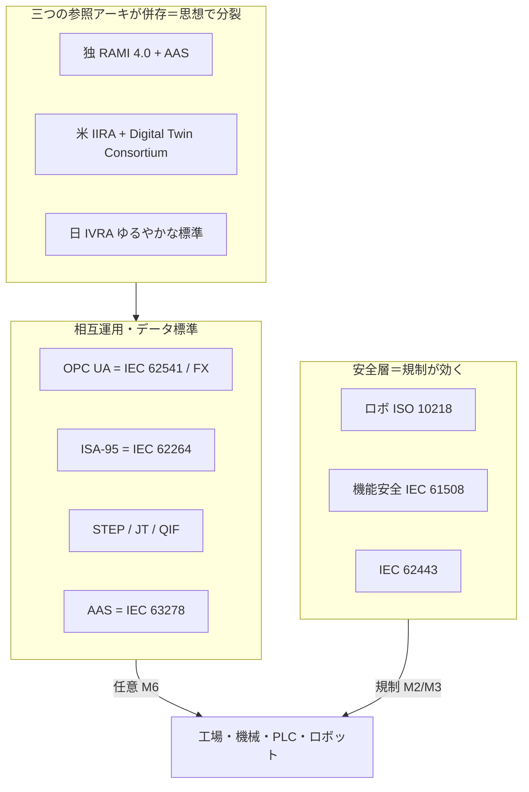
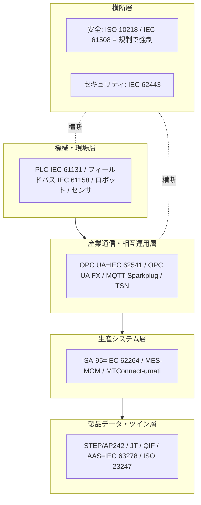

# 製造・産業データ・IoT標準の総括：領域横断カタログと採用実態分析

作成日: 2026年7月24日
対象: 産業オートメーション通信（OPC UA・フィールドバス）、生産システム階層（ISA-95・PLC）、製品データ・PLM（STEP・JT・QIF）、デジタルツイン・資産管理（AAS／Industrie 4.0）、産業ロボット（ISO 10218）、半導体・電子実装まで、製造・産業IoTを支える国際標準の全体像。
目的: 軍事・医療・金融・通信・自動車・エネルギーの総括レポートと同レベルで、前半に領域別カタログ（層構造）、後半に採用・相互運用の実態を分析する。**日本の関与を厚めに**扱い、横断コラム「標準化の地政学」のレンズを適用する。
凡例: 版・年号は2026年7月時点で確認した公開情報に基づく。断定を避ける箇所は〔要確認〕と付す。

---

## 1. はじめに：製造・産業データ・IoTの特殊性

製造・産業IoTは、本シリーズで **「任意（M6）」が主エンジンになる代表領域** である。金融の市場排除（M1）、医療・自動車の規制（M2）、エネルギーの地域系統（M5）と違い、**「OPC UAを使え」「AASを使え」と義務化する規制者がいない**。採用は顧客・OEMの要求と効率化の便益に委ねられ、その結果、本シリーズで**実装ギャップが最も大きい**領域になっている。特殊性は4点。

第一に、**強制が弱く（M6）、ベンダーロックが強い**。PLC・フィールドバス・PLMはベンダーごとに独自エコシステムが確立し、標準は主に「異ベンダー間の交換用途」に留まる。深い相互運用は限定的で、「標準準拠だが直結しない」典型。

第二に、**参照アーキが三つに分裂している**。ドイツの **RAMI 4.0**、米国の **IIRA**（Industrial Internet Reference Architecture）、日本の **IVRA**（Industrial Value Chain Reference Architecture）。地域というより**思想で分裂**し、単一の世界標準に収斂していない。

第三に、**「安全の層」だけは強制が効く**。産業ロボット安全（ISO 10218）や機能安全（IEC 61508）は、機械安全規制（EUの機械規則等）を通じて M2/M3 の強制力を持つ。**同じ製造でも、データ・相互運用は任意（M6）、安全は規制（M2/M3）**という二層構造。

第四に、**OT/IT融合とデジタルツインが統合の鍵**。工場の制御系（OT）とIT・クラウドが繋がり、Industrie 4.0 の中核概念 **AAS（アセット管理シェル）** が「資産のデジタル表現」を標準化して相互運用の土台になろうとしている。

そして日本。**産業用ロボット・CNC・センサなどハードでは世界最強クラス**だが、データ・プラットフォーム標準の層では、ドイツの厳密な RAMI/AAS に対し **「ゆるやかな標準（loose standards）」** という独自哲学（IVI/IVRA）を掲げ、世界標準の主導権は取りきれていない。一方ロボット安全（ISO 10218）では影響力を持つ。ここでも「ハードで勝ち、プラットフォーム標準で苦戦、戦略領域の安全ルールでは食い込む」という日本のパターンが現れる（後述6.4）。

---

## 2. 標準の統治構造（誰がどう決めるか）

| 主体 | 性格 | 役割・主な標準 |
|------|------|----------------|
| **OPC Foundation** | 業界団体（独系強い） | OPC UA（＝IEC 62541）、OPC UA FX |
| **Plattform Industrie 4.0 / IDTA** | 独主導の官民連携 | RAMI 4.0、AAS（＝IEC 63278） |
| **ISA ／ IEC TC65** | 業界＋国際標準化 | ISA-95（＝IEC 62264）、IEC 61131（PLC）、IEC 61158（フィールドバス）、IEC 62443（セキュリティ） |
| **ISO TC184/SC4** | 国際標準化 | STEP（ISO 10303）、JT（ISO 14306）、QIF、ISO 23247（デジタルツイン） |
| **ISO TC299** | 国際標準化 | ロボティクス（ISO 10218） |
| **OASIS / Eclipse** | 業界団体 | MQTT、Sparkplug（＝ISO/IEC 20237） |
| **IEEE 802.1 / IEC・IEEE** | 学会・国際 | TSN（時間高精度ネットワーク、IEC/IEEE 60802） |
| **Industrial Internet Consortium → Digital Twin Consortium** | 米業界団体 | IIRA、MTConnect連携 |
| **IVI / Edgecross / RRI（日本）** | 国内コンソーシアム | IVRA、ORiN、エッジ連携 |
| **SEMI / JEDEC / IPC** | 業界団体 | 半導体装置・メモリ・電子実装 |

製造標準は「業界団体（OPC・IDTA・ISA・OASIS）」「国際標準化機関（ISO/IEC）」「地域コンソーシアム（Plattform I4.0・IIC・IVI）」の三層。特徴は、**規制当局がほぼ登場せず、業界コンソーシアムの綱引きで標準が決まる**点。これが任意（M6）ゆえの分断を生む。



---

## 3. 領域別カタログ（層構造）

### 3.1 産業通信・相互運用

| 標準 | 版・状況 | 用途・実態 |
|------|---------|-----------|
| **OPC UA** | IEC 62541（各部2025年改訂進行） | 産業データのセマンティック相互運用の中核。プロトコル非依存、IIoT/Industrie 4.0の共通言語 |
| **OPC UA FX（Field eXchange）** | 拡張 | OPC UAをフィールド（コントローラ間）へ拡張。従来フィールドバスの統一を狙う |
| **OPC UA over TSN** | IEC/IEEE 60802 | TSNで決定論的（リアルタイム）通信を付与 |
| **MQTT / Sparkplug** | Sparkplug 3.0＝**ISO/IEC 20237:2023** | プラント・監視層のOT/IT統合。SCADA/MES/クラウド連携。軽量 |
| **フィールドバス（PROFINET/EtherNet-IP/EtherCAT/Sercos III）** | IEC 61158/61784 | 機械・セル層の高速・決定論通信。**ベンダー陣営ごとに分裂（標準戦争）** |

機械層はフィールドバスが**陣営分裂**したまま。OPC UA FX＋TSNがこれを統一しようとするが、道半ば。

### 3.2 生産システム階層・制御

| 標準 | 用途 | 実態 |
|------|------|------|
| **ISA-95（IEC 62264）** | 企業〜制御の階層モデル | MES/MOMと基幹系の連携。**ANSI/ISA-95.00.01-2025**改訂。RAMI 4.0と調和 |
| **IEC 61131-3** | PLCプログラミング | 5言語（LD/FBD/ST等）。産業制御の事実上標準 |
| **IEC 61499** | 分散制御 | 次世代の分散オートメーション |
| **MTConnect / umati** | 工作機械の接続 | 米MTConnect、独umati（OPC UAベース）。工作機械のデータ取得 |

### 3.3 製品データ・PLM

| 標準 | 版 | 用途・実態 |
|------|-----|-----------|
| **STEP（ISO 10303）** | 継続 | 製品モデルデータ交換の包括標準 |
| **STEP AP242** | ISO 10303-242 | 「管理されたモデルベース3D」。PMI/GD&T（製造情報）を3Dモデルに保持。スマート製造の基盤 |
| **JT** | ISO 14306:2017（初版2012） | 軽量3D可視化。マルチCAD協業 |
| **QIF** | ISO 23952:2020 | 品質情報の交換（計測・検査） |

製品データは交換用途で普及するが、PLMベンダーの独自形式も根強く、STEPは「共通の橋渡し」に留まりがち。

### 3.4 デジタルツイン・資産管理

| 標準 | 版 | 実態 |
|------|-----|------|
| **AAS（アセット管理シェル）** | **IEC 63278-1:2023** | Industrie 4.0の「標準デジタルツイン」。資産の機械可読・ベンダー非依存な記述（メタモデル）。**IDTA**がサブモデルを整備（2024年2月に18公開、計84予告） |
| **ISO 23247** | 2021 | 製造向けデジタルツイン枠組み |
| **参照アーキ** | — | **RAMI 4.0（独）／IIRA（米）／IVRA（日）** の三分裂 |

AASは「Industrie 4.0の切り札」だが、実装・サブモデルの整備途上で、三つの参照アーキ間の統合も課題。

### 3.5 産業ロボット

| 標準 | 版 | 実態 |
|------|-----|------|
| **ISO 10218-1/2** | **2025年に大改訂** | 産業ロボットの安全。**協働ロボット要件（旧ISO/TS 15066）を統合**、サイバー要件も追加。20カ国超・約8年をかけ改訂。「協働アプリケーション」の概念に整理 |
| **ORiN** | 日本発 | ロボット・装置のネットワーク接続インターフェース |

ロボット安全は機械安全規制を通じて**強制力を持つ層**。ここは日本（ロボット大国）が影響力を持つ（後述6.4）。

### 3.6 半導体・電子実装

| 標準 | 主体 | 用途 |
|------|------|------|
| **SEMI（SECS/GEM等）** | SEMI | 半導体製造装置の通信・自動化 |
| **JEDEC** | JEDEC | メモリ・半導体デバイス |
| **IPC** | IPC | プリント基板・電子実装 |

### 3.7 セキュリティ（横断）

**IEC 62443**（産業オートメーション・制御システムのサイバーセキュリティ）が、OT全体の包括枠組みとして全層に横断的に効く。エネルギー・自動車とも共有される横断標準。

---

## 4. 政策・地域動向

### 4.1 ドイツ／EU ― データ標準の主導者（コンソーシアム＋規制）

ドイツは **Industrie 4.0**（Plattform Industrie 4.0）を国家戦略に据え、**RAMI 4.0** と **AAS（IEC 63278）** で「製造のデジタルツイン標準」を主導。OPC Foundation・IDTA・umati もドイツ系の影響が強い。加えて機械規則（Machinery Regulation）でロボット・機械安全を法的に義務化。**製造データ標準の“書く側”に最も近いのがドイツ**。

### 4.2 米国 ― 市場・コンソーシアム主導

米国は **Industrial Internet Consortium（現Digital Twin Consortium）** の IIRA、工作機械の **MTConnect**、OT/IT統合の **MQTT/Sparkplug（Eclipse）** など、業界主導・市場適合で標準を形成。NISTが製造デジタル化を支援。「市場で決める」米国流。

### 4.3 日本 ― ハード世界一、データ標準は「ゆるやかな標準」（厚め）

日本は製造の**ハードウェア**では世界最強クラスだが、**データ・プラットフォーム標準**では独自路線を歩んできた。

**ハードの強さ**: 産業用ロボット（ファナック・安川電機・川崎・不二越）は世界供給の相当部分を占め〔要確認〕、CNC（ファナック）、センサ（キーエンス）、PLC（三菱電機・オムロン）でも世界的地位。**製品・装置の層では圧倒的**。

**データ標準の独自路線 ― 「ゆるやかな標準」**: 2015年設立の **IVI（Industrial Value Chain Initiative）** は、ドイツの厳密な RAMI に対し **「ゆるやかな標準（loose standards）」** を掲げ、2016年に **IVRA** を提示。日本のすり合わせ型ものづくりを反映した思想だが、**「ゆるさ」は世界共通の“硬いルール”として輸出しにくい**という弱みも抱える。**Edgecross**（三菱電機系のエッジ連携）、**ORiN**（ロボット接続）も国内主導色が濃い。

**ロボット安全 ― ルール層への食い込み**: ロボット大国ゆえ、**ISO 10218（ISO TC299）** の安全標準づくりでは日本が実質的な影響力を持つ。ここは自動車（WP.29）・エネルギー（水素ISO TC197）と同じ「戦略・主力領域では安全ルールの共著者になれる」パターン。

**政策**: **RRI（ロボット革命・産業IoTイニシアティブ）** が国際標準化を含む活動を主導し、Society 5.0 の旗の下でスマート製造を推進。

総じて、**装置・ロボットのハードでは世界一だが、データ・プラットフォーム標準の主導権はドイツに譲り、ロボット安全では影響力を持つ**という、領域内で明暗が分かれる構図。

### 4.4 中国 ― 規模と国家戦略

中国は **Made in China 2025** の下、巨大な製造規模を背景にIEC/ISOへの関与を強め、独自標準と国際標準の双方で存在感を拡大する第3極。

---

## 5. 層構造マップ（全体像）



---

## 6. 採用実態分析

### 6.1 何が採用を駆動するか

製造は本シリーズで **任意（M6）が主エンジン**の代表格。OPC UA・AAS・STEP を「使え」と命じる規制者はおらず、採用は顧客・OEMの要求と効率化の便益に依存する。例外は**安全層**で、ロボット安全（ISO 10218）や機能安全（IEC 61508）は機械安全規制を通じて **M2/M3** の強制力を持つ。つまり同じ製造でも「データ・相互運用＝任意」「安全＝規制」と、層で駆動力が割れる。

### 6.2 なぜ実装ギャップが最大なのか

任意（M6）ゆえに、次の要因でギャップが本シリーズ最大級になる。

第一に、**ベンダーロック**。PLC・PLM・フィールドバスはベンダーごとの独自エコシステムが強固で、標準は「異ベンダー交換の橋渡し」に留まる。第二に、**フィールドバスの標準戦争**（PROFINET/EtherNet-IP/EtherCAT/Sercos）で、機械層に事実上単一標準が存在しない。第三に、**参照アーキの三分裂**（RAMI/IIRA/IVRA）で、上位設計から統一されていない。結果、標準は「深い相互運用」ではなく「限定的な交換」に使われがちで、名目準拠と実質活用の差が大きい。

### 6.3 三つの参照アーキと「ゆるやかな標準」

製造の特徴は、**参照アーキが思想で三分裂**していること。ドイツのRAMI 4.0（厳密・トップダウン）、米国のIIRA（市場・実装志向）、日本のIVRA（ゆるやかな標準）。とりわけ日本の「**ゆるやかな標準（loose standards）**」は、すり合わせ文化を反映した独自哲学だが、横断コラムの視点で見ると弱点も露わになる。**「ゆるさ」は現場適応には強いが、世界共通の“硬いルール”として輸出しにくい**。ドイツの硬いAAS/RAMIが世界標準の座を狙えるのに対し、日本のIVRAは国内最適に留まりやすい。

### 6.4 日本の位置づけ ― ハードで勝ち、プラットフォームで苦戦、安全で食い込む

日本の製造標準は、これまでの領域の教訓を**最も凝縮**して示す。

- **ハード（ロボット・CNC・センサ・PLC）＝世界一**。M3（製品・計測）の土俵では圧倒的。
- **データ・プラットフォーム標準＝ドイツに譲る**。「ゆるやかな標準」は独自だが世界のルールにならず、AAS/RAMIの主導権はドイツ。
- **ロボット安全（ISO 10218）＝影響力あり**。主力産業ゆえ安全ルールの共著者になれる（自動車・水素と同型）。

これは横断コラムの命題を最も鮮明に裏づける。日本は**「製品・安全（M3）の土俵では強いが、プラットフォーム・データ標準（M5的な支配力）の土俵では取りにいけない」**。そして「ゆるやかな標準」は、その苦戦の文化的な理由そのもの――囲い込まないが硬く定義もしない日本の流儀は、世界共通ルールの覇権とは相性が悪い。

### 6.5 強制力スペクトラム上の位置づけ

```mermaid
quadrantChart
    title 製造・産業IoTサブ領域の 強制力×実装ギャップ（編者による定性評価）
    x-axis 弱い強制力 --> 強い強制力
    y-axis 低い実装ギャップ --> 高い実装ギャップ
    quadrant-1 強制力強く・ギャップ大
    quadrant-2 強制力強く・ギャップ小
    quadrant-3 強制力弱く・ギャップ小
    quadrant-4 強制力弱く・ギャップ大
    ロボット安全(ISO10218): [0.75, 0.35]
    機能安全(IEC61508): [0.75, 0.30]
    OPC-UA: [0.45, 0.55]
    ISA-95: [0.42, 0.55]
    製品データ(STEP): [0.35, 0.65]
    AAS-デジタルツイン: [0.40, 0.70]
    フィールドバス(標準戦争): [0.35, 0.78]
    MQTT-Sparkplug: [0.40, 0.50]
```

安全層（ISO 10218・IEC 61508）だけが右側（規制で強制）に寄り、データ・相互運用・フィールドバスは左側（任意）＋高ギャップに広がる。**本シリーズで最も“強制力弱・ギャップ大”に散る領域**である。

---

## 7. まとめ

製造・産業データ・IoTは、本シリーズで **任意（M6）が主エンジンになる代表領域** である。OPC UA・AAS・STEP を義務化する規制者はおらず、採用は顧客要求と効率化の便益に委ねられる。結果、ベンダーロック、フィールドバスの標準戦争、参照アーキの三分裂（RAMI／IIRA／IVRA）が重なり、**実装ギャップが本シリーズ最大級**になる。例外は安全層で、ロボット安全（ISO 10218:2025、協働ロボ要件を統合）や機能安全（IEC 61508）は機械安全規制を通じて強制力を持つ。「データは任意、安全は規制」という層別が、この領域の採用実態を規定する。

日本は、この領域に自国の標準化パターンを最も凝縮して映す。**産業用ロボット・CNC・センサ・PLCのハードでは世界一**だが、**データ・プラットフォーム標準ではドイツのAAS/RAMIに主導権を譲り**、独自の「**ゆるやかな標準（IVI/IVRA）**」は国内最適に留まった。一方、主力たるロボットの**安全標準（ISO 10218）では影響力を持つ**。自動車（WP.29）・エネルギー（水素ISO TC197）と同じく「戦略・主力領域の安全・製品ルールには食い込むが、プラットフォーム・データ標準は取れない」。そして「ゆるやかな標準」という流儀そのものが、囲い込まず硬く定義もしない日本の文化が世界共通ルールの覇権と相性が悪い、その理由を体現している。シリーズを通じた「日本は製品・安全で勝ち、プラットフォーム・ルールで苦戦する」という像が、製造でもっとも明瞭に確認できた。

---

## 8. 主な出典（公開情報）

- OPC UA / ISA-95 / TSN: [IEC 62541-1:2025（IEC）](https://webstore.iec.ch/en/publication/81513) ／ [OPC UA over TSN（ScienceDirect）](https://www.sciencedirect.com/org/science/article/pii/S1742737122000394) ／ [ISA-95 と米デジタル製造（Bowdark）](https://www.bowdark.com/blog/isa95-and-americas-digital-manufacturing-transformation)
- MQTT Sparkplug: [Sparkplug 3.0 が ISO/IEC 標準に（ARC Advisory）](https://www.arcweb.com/blog/sparkplug-now-official-isoiec-standard) ／ [ISO/IEC 20237:2023](https://standards.iteh.ai/catalog/standards/iso/de0a21c9-8fb4-40ba-a739-339f77098c69/iso-iec-20237-2023)
- AAS / デジタルツイン: [IEC 63278-1:2023（IEC）](https://webstore.iec.ch/en/publication/65628) ／ [ISO 23247 Digital Twin Framework](https://www.ap238.org/iso23247/)
- 製品データ STEP/JT/QIF: [ISO 10303 STEP（STEP Tools）](https://steptools.com/stds/step/)
- 産業ロボット: [ISO 10218-1:2025（ANSI Blog）](https://blog.ansi.org/ansi/iso-10218-1-2025-robots-and-robotic-devices-safety/) ／ [ISO 10218 大改訂（The Robot Report）](https://www.therobotreport.com/iso-10218-industrial-robot-safety-standard-receives-major-overhaul/)
- 日本: [Industrial Value Chain Initiative（IVI）](https://iv-i.org/en/thinking/) ／ [IVI × Edgecross 連携](https://iv-i.org/en/2021/11/27/english-ivi-and-edgecross-consortium-sign-a-comprehensive-agreement/) ／ [Robot Revolution & Industrial IoT Initiative（RRI）](https://www.hannovermesse.de/apollo/hannover_messe_2025/obs/Binary/A1428150/RRI_Pamphlet_en%20(1).pdf)

> 注記: 版・年号は2026年7月時点の公開情報に基づく。日本の産業用ロボット世界シェア、OPC UA FXやAASサブモデルの整備状況、IVRAの国際的採用度など変動・評価が分かれる項目は〔要確認〕を付した。半導体製造（SEMI）の詳細は別途深掘りの余地がある。
