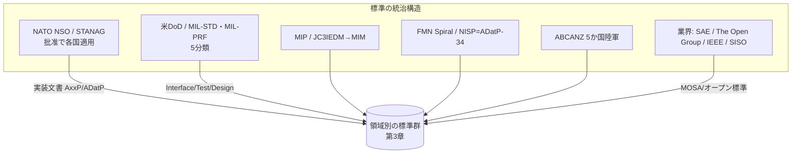
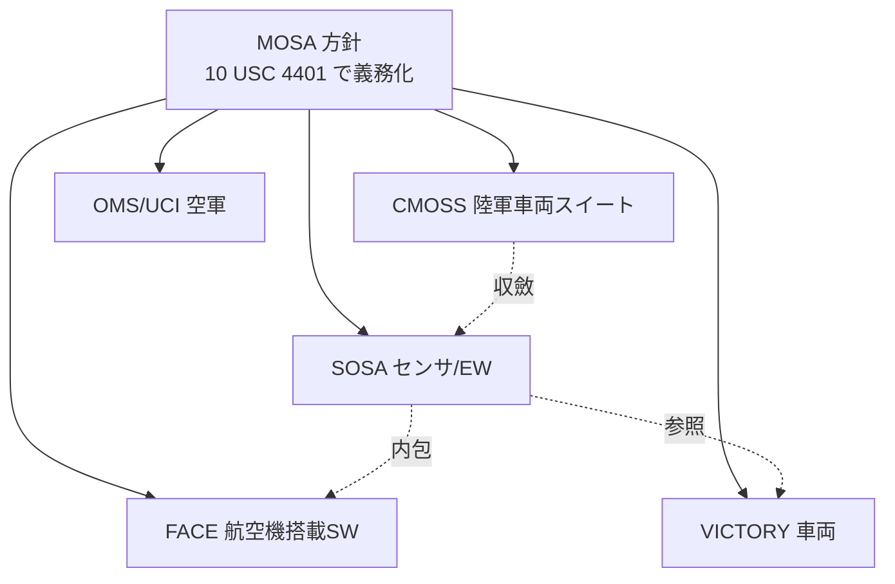
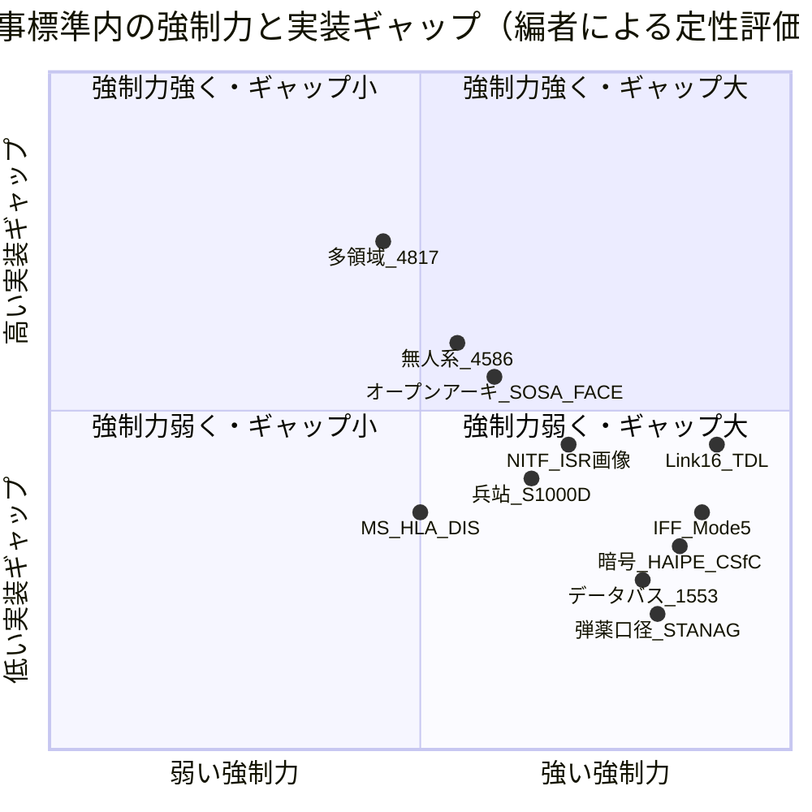

# 軍事標準の総括：領域横断カタログと採用実態分析

作成日: 2026年7月24日
対象: NATO（STANAG／AxxP系）、米国（MIL-STD／MIL-PRF等）、および主要な業界・多国間標準を含む軍事標準の全体像
目的: STANAG 4586周辺の技術マップを、軍事標準全体へ拡張。前半で領域別カタログ（層構造）、後半で採用・相互運用の実態を分析する。
凡例: 版・年号は2026年時点で確認した公開情報に基づく。STANAG／MIL-STD本文の多くは配布制限（RESTRICTED等）のため、番号・版・用途は公式カタログ（NSO／NISP／everyspec等）と規格団体の公表資料で裏取りしている。断定を避ける箇所は〔要確認〕と付す。

---

## 1. はじめに：軍事標準の特殊性

軍事標準は、民生標準（ISO・IEEE・W3C等）と共通の「相互運用のための合意」であると同時に、いくつかの固有の性質を持つ。

第一に、**強制力が構造的に強い**。相互運用性は作戦の成否・部隊の安全に直結するため、標準準拠は調達要件・運用要件として事実上必須になりやすい。第二に、**公開性が制約される**。多くの規格本文が機密・配布制限扱いで、民生標準のように誰でも全文を読めるわけではない。第三に、**多層の統治構造**を持つ。NATOのSTANAG、米国のMIL-STD、多国間プログラム（MIP、FMN、ABCANZ）、業界コンソーシアム（SAE、The Open Group）が並立し、相互に参照し合う。

本レポートは、この体系を「統治構造」→「領域別カタログ」→「採用実態分析」の順に整理する。

---

## 2. 標準の統治構造（誰がどう決めるか）

### 2.1 NATO：STANAG と NSO

**STANAG（Standardization Agreement）** はNATOの標準化合意。**NSO（NATO Standardization Office）** が統括し、加盟国が **批准（ratify）** して初めて国内適用される。批准には「無留保批准／留保付批准／将来実装／非批准／非参加」の区分があり、通常は一定数（おおむね複数国）の批准をもって **promulgate（発効告知）** される。現行のSTANAGは1200件以上。

重要なのは、STANAGは **自動的な一律義務ではない** 点である。各国の批准・実装宣言を通じて相互運用が担保される。近年は実装文書が **AxxP系**（AComP＝通信、AEDP＝ISR実装ガイド、AEP＝工学等）や **ADatP系**（データ交換）として整理されている。

### 2.2 米国：MIL-STD の5分類

米DoDの軍用規格は用途で5種に分かれる。

| 分類 | 内容 | 例 |
|------|------|----|
| Interface standards | 物理・機能インターフェース | MIL-STD-1553、MIL-STD-1760、MIL-STD-704 |
| Design criteria standards | 設計基準 | MIL-STD-1472（人間工学）、MIL-STD-1474（騒音） |
| Test method standards | 試験方法 | MIL-STD-810（環境）、MIL-STD-461（EMC） |
| Manufacturing process standards | 製造工程 | （各種） |
| Standard practices | 標準実務 | MIL-STD-882（システム安全）、MIL-STD-130（IUID） |

なお仕様書は **MIL-DTL（詳細仕様：材料・製法まで規定）** と **MIL-PRF（性能仕様：結果と検証基準のみ）** に分かれ、DoDは調達自由度の高いMIL-PRFを推進している。1994年の「MILSPEC改革」以降、DoDは可能な範囲で民生規格の採用を優先する方針をとる。

### 2.3 多国間・連合の枠組み

- **MIP（Multilateral Interoperability Programme）**: 各国C2情報システムの相互運用コンソーシアム。データモデルは **JC3IEDM（STANAG 5525）** から現行の **MIM（MIP Information Model）** へ、交換方式は **WSMP（Web Service Messaging Profile, ADatP-5644）** へと進化。24加盟国＋NATO。
- **FMN（Federated Mission Networking）**: 連合環境で任務ネットワークを迅速に「連邦化」する枠組み。成熟度を **Spiral** 単位で管理する。NATO ACT主導。
- **NISP（ADatP-34）**: NATO Interoperability Standards and Profiles。標準を Mandatory／Candidate 等に区分し、FMN準拠の技術的根拠を与える。
- **ABCANZ（旧ABCA）**: 米英加豪ニュージーランド陸軍の相互運用プログラム。NATO STANAGと並ぶ主要な相互運用ツール。



---

## 3. 領域別カタログ（層構造）

### 3.1 指揮統制（C2）・戦術データリンク・メッセージ形式

**戦術データリンク（TDL）**

| 標準 | 規格番号 | 用途 | 実態 |
|------|----------|------|------|
| Link 1 | STANAG 5501（ATDLP-5.01） | 防空管制間の第1世代エア・サーベイランス航跡交換 | 旧世代。置換が進む |
| Link 11 | STANAG 5511／米 MIL-STD-6011（旧TADIL-A） | 艦艇・航空機の見通し外レーダー航跡交換 | 現役だがLink 22へ移行対象 |
| Link 16 | STANAG 5516／米 MIL-STD-6016（Jシリーズ、搬送はJTIDS/MIDS端末） | TDMAの耐妨害・秒秘匿高速リンク。航跡・C2・デジタル音声 | **NATO主力TDL**。同盟国で事実上必須 |
| Link 22 | STANAG 5522（プログラム名NILE） | HF/UHFの秒秘匿リンク。Link 11の後継 | NILE参加国が導入中 |
| VMF | 米 MIL-STD-6017（Kシリーズ） | 帯域制約網でのビット指向可変長C4Iメッセージ | 米陸軍系で普及。NATO側は米主導 |

**メッセージテキスト形式・データモデル**

- **USMTF（MIL-STD-6040）**: 統合軍の定型メッセージ（ATO等）。スラッシュ区切り／XML。米DoD発行でNATOと調和。
- **ADatP-3（FORMETS）**: NATOのメッセージテキスト標準。メッセージカタログはAPP-11。USMTFとほぼ同一規則で相互調和〔STANAG紐付けの詳細は要確認〕。
- **JC3IEDM（STANAG 5525）／MIM**: 連合C2の共通データモデル。前掲MIPが策定。
- **NFFI（STANAG 5527、ADatP-36）**: 味方部隊位置情報のXML交換。同士討ち防止・状況認識。
- **Link 16 PPLI**: 精密参加者位置識別。MIDS端末が自動放送し、WGS-84基準の代替航法源にもなる。
- **Blue Force Tracking**: 米陸軍の FBCB2/BFT → JCR → 現行 **JBC-P**（共通HWはMFoCS）。12万台超のプラットフォームに展開。

### 3.2 通信・波形・衛星通信（SATCOM）

**無線波形・SDR**

- **SINCGARS**: VHF 30–88MHz、周波数ホッピングの耐妨害戦術ネット無線。米・同盟国の現役レガシー。
- **HAVE QUICK → SATURN（STANAG 4372, AComP-4372）**: UHF耐妨害波形。SATURN（Second-generation Anti-jam Tactical UHF Radio for NATO）が旧HAVE QUICKを置換。海上・航空作戦のNATO最低軍事要件に指定。移行は各国で継続中。
- **SRW（Soldier Radio Waveform）／WNW（Wideband Networking Waveform）**: 戦術エッジのMANET波形（米陸軍系、JTRS由来）。
- **SCA（Software Communications Architecture）**: SDRの波形アプリを実装・管理するオープンアーキテクチャ。現行 **SCA 4.1（2015）**。米 **DISR** で戦術無線標準として義務化。波形管理は **JTNC** が担当。

**衛星通信**

- **MUOS（Mobile User Objective System）**: UHF狭帯域、WCDMA系。2019年完全運用、67,000超の端末。**2024年6月にカナダが初の同盟国ユーザーとしてIOC達成**。現在は米宇宙軍運用。
- **WGS（Wideband Global SATCOM）**: X/Ka帯の広帯域。豪・加・蘭等と国際協力。10号機運用、後続機を準備中。
- **Advanced EHF（AEHF）**: EHF帯・耐妨害・低被探知の防護型SATCOM。
- **STANAG 4681（2015）**: UHF SATCOM端末間の統合波形（IWF）によるデジタル相互運用。

### 3.3 情報保証・暗号・サイバー

| 標準 | 規格番号 | 用途・実態 |
|------|----------|-----------|
| SCIP | 米国標準／NATO **STANAG 5068（AComP-5068）** | 1対1のセキュア音声・データ相互運用プロトコル。必須ボコーダは **MELPe（STANAG 4591）** 2400bit/s |
| HAIPE | NSA **HAIPE IS** | IPsec制約・拡張のType 1暗号装置。エンクレーブ間セキュアゲートウェイ |
| CSfC | NSA Commercial Solutions for Classified | COTS二重暗号（内層＋外層）でType 1を代替。展開期間を短縮 |
| Type 1暗号 | NSA認証 | NSA承認アルゴリズムによる政府用機密暗号 |
| Common Criteria | **ISO/IEC 15408:2022（CC:2022）** | 製品セキュリティ評価。EAL1〜7。民生ISO標準と共通 |
| RMF | 米 **DoDI 8510.01** ＋ **NIST SP 800-37 Rev.2／800-53** | DoDシステムの認可（ATO）取得プロセス |
| CMMC | **32 CFR Part 170**（2024年12月発効）＋ **48 CFR DFARS 252.204-7021**（**2025年11月10日発効**） | 防衛産業基盤のサイバー成熟度認証。段階導入で2027年11月に完全実施予定 |
| STIG | DISA発行 | OS・DB・機器の規範的セキュア設定。DoD網接続に必須。約500種 |

### 3.4 IFF（敵味方識別）・戦闘識別

- **Mark XIIA / Mode 5（STANAG 4193）**: Mode 4を置換する暗号化IFF。質問・応答を暗号化しGPS位置を付加。米側はAIMS 03-1000併用。**NATOはMode 4を2020年7月に退役**させMode 5へ移行。
- **Mode S**: 民間/軍民の航空監視。Mode 5はその秘匿版に相当。
- **NCTR（Non-Cooperative Target Recognition）**: 協力を要さない識別（ISAR、ジェットエンジン変調、特定エミッタ識別等）。協力型IFFを補完し同士討ちを回避。統一規格番号を持つより技術群。

### 3.5 ISR・画像・モーションイメージ

| 標準 | 規格番号 | 用途・実態 |
|------|----------|-----------|
| NITF / NSIF | 米 **MIL-STD-2500C**（NITF 2.1）／NATO **STANAG 4545**（NSIF） | 画像・メタデータを1コンテナに収める二次画像伝送の基盤。NGA維持、JITC適合試験 |
| 一次画像 | **STANAG 7023**（NPIF、2022年版） | 航空偵察の一次画像＋付随データの形式・転送 |
| GMTIF | **STANAG 4607** | 地上移動目標指示（GMTI）レーダーデータ交換 |
| デジタル動画 | **STANAG 4609**（Edition 5, 2020） | NATO動画（FMV）交換。KLVメタデータ枠組みを規定 |
| 動画メタデータ | **MISB** 標準群（ST 0601等）、KLVは **SMPTE ST 336** | MISBがモーションイメージ標準を策定。STANAG 4609が束ね、中身はMISB/MISPを参照 |
| ISRライブラリ | **STANAG 4559**（NSILI） | 異機種ISR製品ライブラリの横断照会・取得I/F |
| データ蓄積 | **STANAG 4575**（NADSI） | RMMから地上局へのデータ転送I/F |
| （廃止） | STANAG 7024 | 偵察テープレコーダ標準（2013年廃止、歴史的参照） |

### 3.6 地理空間・測地・PNT

- **DIGEST（STANAG 7074）**: 地理データ交換ファミリ。VPF（ベクタ）を含む。最終版2.1（2000）でほぼ更新停止、ISO/TC 211へ統合方針。
- **DTED（MIL-PRF-89020B）**: 標高格子データ（Level 0〜2）。NGA製品。
- **VMAP / VPF（MIL-STD-2407）**: 全世界ベクタ地理データ。レガシー、新製品へ置換傾向。
- **WGS 84**: 米国防測地系。GPSの基準座標系。最新実現は **WGS 84 (G2296)（2024年1月発効）**、ITRF2020整合。
- **S-57 / S-101（IHO）**: 電子海図。**2026年1月にS-100 Phase 1が発効**、S-101がS-57を将来置換。軍民共通の海図基盤。
- **GPS / PNT**: 軍用はM-code。測位・時刻同期の基盤で、Link 16やMode 5とも連接。

### 3.7 無人システム・オープンアーキテクチャ（MOSA）

| 標準 | 規格番号・管理 | 用途・実態 |
|------|----------------|-----------|
| STANAG 4586 | Edition 4（2017）、NSO | UAV管制システム（UCS）のI/F・メッセージ・データリンク。相互運用レベル（LOI）を5段階定義。CUCS/VSM/DLI/CCI/HCI構成 |
| STANAG 4817 | 策定中、NSO | 多領域管制（MDCS）。空・海・水中・地上の共通C2。REPMUS 2025等で実証 |
| JAUS | **SAE AS-4**（AS5710/AS6009等） | 無人システムのアプリ層論理I/F。UGV IOPの基盤。ドメイン横断でオープン |
| UCS Architecture | UCS WG、v3.0（2013） | 米UAS管制セグメント。近年OMS/UCIへ収斂 |
| MAVLink | オープンソース（デファクト） | 小型UAVのテレメトリ/C2。軍でも実験的利用、軍級の相互運用保証はない |
| OMS / UCI | 米空軍AFRL/VDL | Open Mission Systems／Universal C2 Interface。MOSA準拠の主要標準 |
| ROS 2 / ROS-M | オープン（デファクト） | 自律制御ミドルウェア。DDS基盤。軍派生ROS-M |

**オープンアーキテクチャの枠組み**

- **MOSA（Modular Open Systems Approach）**: 標準ではなく方針。**米国法（10 U.S.C. §4401(b)）で主要取得プログラムに義務化**。以下のオープン標準採用を促す。
- **SOSA（Sensor Open Systems Architecture, The Open Group）**: センサ/EWのHW（OpenVPX）・SW（FACE）統合。最新 Edition 2.0 v2（2024）。
- **FACE（Future Airborne Capability Environment, The Open Group）**: 航空機搭載ソフトの可搬コンポーネント参照アーキテクチャ。
- **VICTORY**: 車両搭載C4ISR/EW統合の車載アーキテクチャ。米陸軍管理。
- **CMOSS**: 陸軍車両向けMOSA標準スイート（VICTORY・MORA・SOSA等を束ねる）。SOSAと収斂中。



### 3.8 データバス・兵器統合

- **MIL-STD-1553**: 機体内時分割コマンド/レスポンス・データバス。形式上の最新は **1553C（2018）** だが、実質は1978年の **1553B** と機能同等で、1553Bが世界の軍用機・装甲車・ミサイルの事実上標準として現役。
- **MIL-STD-1760（AEIS）**: 航空機とストア（兵器）間の標準電気I/F。内部に1553バスを含む。F-15/16/18/35等の兵器搭載基盤。
- **UAI（Universal Armament Interface）**: MIL-STD-1760上の論理/メッセージ層。兵器統合コストを削減。米空軍管理仕様で公開MIL-STD番号は持たない。
- **MIL-STD-1773**: 1553の光ファイバ版。採用限定的、ほぼレガシー。
- **対比**: 民間の **ARINC 429**（単方向）や **ARINC 664/AFDX**（スイッチドEthernet）と異なり、1553は双方向コマンド/レスポンスのミッションクリティカル用途。現代機では1553BとARINC 429が共存。

### 3.9 兵站・コード化・統合製品支援（ILS/IPS）

- **NCS / NSN**: NATO Codification System（AC/135が統括）とNATO Stock Number（**13桁**、規則書 **ACodP-1**）。NATOマスターカタログに約1800万件。
- **MILSTRIP**: 米軍の標準請求・払出手続き（DoD 4000.25系、DLA運用）。
- **S-Series ILS/IPS**（ASD/AIA共同）: 呼称はILS→**IPS（Integrated Product Support）**へ移行中。
  - **S1000D**（技術出版物・共通ソースDB）: 最新 **Issue 6.0（2024）**
  - **S2000M**（資材管理）／**S3000L**（兵站解析・LSA）／**SX000i**（IPS共通ガイダンス、上位文書）
- **MIL-STD-130（IUID）**: DoD装備の一意識別マーキング。Data Matrix ECC 200の2次元シンボル＋人間可読情報。

### 3.10 工学・環境・安全 MIL-STD

| 標準 | 最新版 | 用途 |
|------|--------|------|
| MIL-STD-810 | 810H（2019） | 環境試験（温度・振動・衝撃・湿度） |
| MIL-STD-461 | **461H（2026年4月）** | サブシステムのEMI試験方法（CE/CS/RE/RS） |
| MIL-STD-464 | 464C | システムレベルの電磁環境効果（E3）要件 |
| MIL-STD-882 | 882E w/Ch.1（2023） | システム安全（ハザード除去・リスク最小化） |
| MIL-STD-1472 | 1472H（2020） | 人間工学設計基準 |
| MIL-STD-1474 | 1474E（2015） | 騒音限度 |
| MIL-STD-704 | 704F（2004） | 航空機電源特性（AC 115/200V・400Hz） |

### 3.11 弾薬・防護・口径相互運用

- **STANAG 4569**: 装甲車両の防護レベル（**Level 1〜6**、実装標準 **AEP-55**）。KE弾・砲弾片・IED爆風を対象。
- **STANAG 2920**: 個人装甲材の弾道試験法（**V50試験**：50%貫通速度）。
- **STANAG 4172**（5.56×45mm）／**STANAG 2310**（7.62×51mm）: NATO口径標準。
- **STANAG 4179**: 5.56mm着脱式箱型弾倉I/F（通称「STANAGマガジン」）。異なる小銃間の弾倉互換の代表例。

### 3.12 モデリング & シミュレーション（M&S）

| 標準 | 最新版 | 用途 |
|------|--------|------|
| DIS | **IEEE 1278.1-2012（DIS v7）** | ネットワーク化シミュレーション。PDUでエンティティ・交戦を交換 |
| HLA | **IEEE 1516-2025（"HLA 4"）** | シミュレーション連接フレームワーク。2025年版はクラウド/コンテナ対応・新Federate Protocol・セキュリティ強化 |
| TENA | DoDアーキテクチャ | 試験・訓練システム相互運用。DIS/HLAゲートウェイを持つ |
| C-BML | SISO-STD-011-2014 | C2・M&S・ロボット間の計画/命令/報告の共通言語 |
| MSDL | SISO-STD-007-2008 | XMLベースのシナリオ初期条件記述 |

---

## 4. 層構造マップ（全体像）

```text
上位C2・戦術情報共有
  └ Link 16 / VMF / USMTF・ADatP-3 / JC3IEDM・MIM / NFFI

相互運用の統治
  └ NSO(STANAG) / MIP / FMN・NISP / ABCANZ / MOSA

多領域・無人システム管制
  └ STANAG 4817（MDCS, 策定中）
  └ STANAG 4586（UAV: CUCS/VSM/DLI）/ JAUS(SAE AS-4) / OMS・UCI

通信・波形・SATCOM
  └ SINCGARS / SATURN(4372) / SRW・WNW / SCA(SDR) / MUOS・WGS・AEHF / 4681

情報保証・暗号・サイバー
  └ SCIP(5068)・MELPe(4591) / HAIPE / CSfC / CC(ISO15408) / RMF / CMMC / STIG

IFF・戦闘識別
  └ Mark XIIA / Mode 5(4193) / NCTR

ISR・画像・モーションイメージ
  └ NITF(2500C)・NSIF(4545) / 7023 / 4607(GMTI) / 4609・MISB・KLV / 4559 / 4575

地理空間・測地・PNT
  └ DIGEST(7074) / DTED / VMAP・VPF / WGS84 / S-100・S-101 / GPS(M-code)

データバス・兵器統合
  └ MIL-STD-1553 / 1760(AEIS) / UAI / 1773

兵站・工学・弾薬・M&S（基盤）
  └ NSN・ACodP-1 / S1000D・S2000M・S3000L / MIL-STD-130
  └ MIL-STD-810/461/464/882/1472/704
  └ STANAG 4569/2920/4172/4179
  └ DIS(IEEE1278) / HLA(IEEE1516) / TENA
```

---

## 5. 採用実態分析

前回の「国際標準採用実態レポート」で用いた枠組み（排除圧力・規制強制・ネットワーク効果・互換性リスク・実装品質ギャップ）を軍事に適用すると、軍事は **高強制力型の典型**でありながら、独自のばらつき構造を持つことが分かる。

### 5.1 なぜ軍事は採用が進むのか

相互運用性は作戦成否・部隊安全に直結する。準拠しなければ **連合作戦のネットワークから排除される**（Link 16に乗れない機体は共通航跡を共有できない）。加えて調達要件・法（MOSA義務化）・演習での適合試験（JITC等）が強制力を与える。この点で軍事は金融（ISO 20022）と似た「排除圧力が決定的」な領域である。

### 5.2 それでも残る「名目準拠と実質活用のギャップ」

軍事でも民生と同じギャップが観察される。要因は次の通り。

第一に **批准が一律義務ではない**。STANAGは各国が留保付きで批准したり、実装を先送りしたりできる。結果として「批准したが完全実装ではない」状態が生じる。第二に **レガシーの長期共存**。Link 11とLink 16、Mode 4とMode 5、1553Bと1553Cのように、旧世代が長く残る。兵器・機体のライフサイクルが数十年に及ぶため、置換は緩慢になる。第三に **プロプライエタリ拡張の残存**。VSM（機体固有モジュール）のように、標準メッセージへ変換する翻訳層で各社独自実装を吸収する設計が一般的で、標準の外側にベンダー固有部分が残る。第四に **機密性ゆえの検証困難**。規格本文が非公開のため、第三者による独立実装・適合検証が民生ほど働かない。

### 5.3 民生・ISO標準への接続（軍民融合）

軍事標準は孤立していない。むしろ近年は民生標準の取り込みが進む。

- **Common Criteria = ISO/IEC 15408**: セキュリティ評価は完全に民生ISO標準。
- **HLA / DIS = IEEE**、**KLV = SMPTE ST 336**、**MIL-STD-1553 ↔ ARINC**: M&S・メタデータ・データバスは業界標準と地続き。
- **S-100 / S-101（IHO）**、**WGS 84 ↔ ITRF/IGS**: 海図・測地は軍民共通基盤。
- **MOSA / SOSA / FACE / VICTORY**: The Open Group等のオープン標準を国防が採用する潮流。1994年のMILSPEC改革以降の「可能な限り民生規格を使う」方針の帰結。

### 5.4 強制力スペクトラム上の位置づけ



〔評価〕強制力が最も強く実装ギャップが小さいのは、暗号・IFF・データバス・弾薬口径のように「合わなければ物理的に接続・射撃・識別できない」領域。逆に、多領域無人管制（4817）や新しいオープンアーキテクチャ（SOSA/FACE）は、標準が発展途上で実装のばらつきが大きい。

### 5.5 STANAG 4586 の位置づけ（元資料との接続）

STANAG 4586は「UAV管制の相互運用コア」を担う。VSMで機体固有プロトコルを吸収し、CUCS側は標準メッセージだけを扱う **仕様層と実装層の分離** 設計が典型である。これは本レポート全体を貫く軍事標準の設計思想——「標準I/Fの外側にベンダー固有部分を閉じ込め、コアを共通化する」——の代表例であり、多領域へ拡張したのが4817、全無人システムへ広げたのがJAUSである。

---

## 6. 他国・日本の視点

NATO非加盟国も相互運用のためSTANAGを事実上参照する。日本の自衛隊は、Link 16、Mode 5 IFF、NITF、MIL-STD-1553/1760、MIL-STD-810/461などを米国製装備の導入とともに採用しており、米軍・NATO標準との相互運用が装備選定の要件になっている。FMS（対外有償軍事援助）で装備を導入する国は、同時に米軍標準の実装を引き受ける構造にある。これは「排除圧力（同盟ネットワークに乗るための必須条件）」が国境を越えて働く典型例である。〔各国の個別実装状況は公開情報が限られ、詳細は要確認〕

---

## 7. まとめ

1. **軍事標準は高強制力型の典型**である。相互運用が作戦・安全に直結するため、調達・運用・法（MOSA）で強制力が働き、採用は進む。
2. **それでも「名目準拠と実質活用のギャップ」は残る**。批准の非一律性、数十年に及ぶレガシー共存、翻訳層に吸収されるベンダー固有実装、機密性ゆえの検証困難がその源泉である。
3. **軍事標準は民生標準と地続きになりつつある**。CC＝ISO 15408、HLA/DIS＝IEEE、KLV＝SMPTE、S-100＝IHO、そしてMOSA/SOSA/FACEのオープン化潮流がそれを示す。
4. **設計思想は「コア共通化＋固有部分の分離」**。STANAG 4586のCUCS/VSM分離はその代表で、多領域（4817）・全無人系（JAUS）・オープンアーキテクチャ（SOSA/FACE）へと拡張されている。
5. **今後の焦点は多領域統合とオープン化**。4817やSOSA Edition 2系のように、領域横断・モジュール化の標準が発展途上にあり、ここに実装ギャップと機会が集中する。

---

## 8. 主な出典（公開情報）

- NATO NSO: https://www.nato.int/en/about-us/organization/nato-structure/nato-standardization-office
- NATO ACT — FMN: https://www.act.nato.int/activities/federated-mission-networking/
- MIP（MIM）: https://www.mimworld.org/
- 米陸軍 JBC-P: https://peoc3t.army.mil/mc/jbcp.php
- SCA 4.1（JTNC/DoD）: https://media.defense.gov/2020/Feb/13/2002249005/-1/-1/1/SCA_4.1_SCASPECIFICATION.PDF
- SATURN/STANAG 4372: https://standards.globalspec.com/std/14348265/stanag-4372
- MUOS: https://www.airandspaceforces.com/weapons/mobile-user-objective-system/
- STANAG 4681（NISP）: https://nisp.nw3.dk/standard/nato-stanag4681ed1.html
- SCIP/STANAG 5068: https://standards.globalspec.com/std/14347481/STANAG%205068
- Common Criteria ISO/IEC 15408:2022: https://www.iso.org/standard/72891.html
- DoDI 8510.01（RMF）: https://www.esd.whs.mil/Portals/54/Documents/DD/issuances/dodi/851001p.pdf ／ NIST SP 800-37 r2: https://csrc.nist.gov/pubs/sp/800/37/r2/final
- CMMC（Federal Register解説）: https://summit7.us/blog/final-rule-update-48-cfr-and-the-cmmc
- IFF Mode 5（DOT&E）: https://www.dote.osd.mil/Portals/97/pub/reports/FY2014/navy/2014mkxiiaiffmode5.pdf
- NITF MIL-STD-2500C（NGA）: https://gwg.nga.mil/ntb/baseline/docs/2500c/index.html
- STANAG 4609 Ed.5（NISP）: https://nisp.nw3.dk/coverdoc/nato-stanag4609ed5.html ／ MISB（NGA）: https://nsgreg.nga.mil/misb.jsp
- STANAG 4586（NATO STO）: https://www.sto.nato.int/document/stanag-4586-standard-interfaces-of-uav-control-system-ucs-for-nato-uav-interoperability/
- STANAG 4817/REPMUS 2025: https://udt-global.com/udt2026-agenda/
- JAUS（SAE AS-4）: https://www.sae.org/standards/content/as6009/
- MOSA / SOSA（The Open Group）: https://www.opengroup.org/face ／ https://www.opengroup.org/sosa
- VICTORY: https://victory-standards.org/
- WGS 84 (G2296)（NGA）: https://earth-info.nga.mil/
- S-101（IHO）: https://www.hydro-international.com/content/article/s-101-the-new-iho-electronic-navigational-chart-product-specification
- MIL-STD-1553C / 1760 / 810H / 461H / 882E / 1472H / 704F: everyspec.com 各原本ページ、MIL-STD-461H: https://ib-lenhardt.com/news/mil-std-461h-published-updated-dod-emc-standard
- NATOコード化 ACodP-1: https://eportal.nspa.nato.int/ac135/data/pdf/ACodP1_E.pdf ／ DLA: https://www.dla.mil/Working-With-DLA/Federal-and-International-Cataloging/NATO/
- S-Series（S1000D等）: https://www.s-series.org/all-downloads/
- STANAG 4569（AEP-55）: https://en.wikipedia.org/wiki/STANAG_4569
- IEEE 1516-2025（HLA 4）: https://standards.ieee.org/ieee/1516/6687/ ／ IEEE 1278.1-2012（DIS）: https://ieeexplore.ieee.org/document/6387564
- SISO C-BML / MSDL: https://www.sisostandards.org/

> 注記: STANAG／MIL-STD本文の多くは配布制限文書であり、上記の多くは公式カタログ・規格団体の公表ページ・実装ガイド解説による裏取りである。版数（edition）の最新性、および〔要確認〕を付した項目（ADatP-3のSTANAG紐付け、FMNの現行Spiral番号、UAIの仕様番号、STANAG 4817の批准状況、S2000M/S3000L/SX000iの個別Issue番号、各国の個別実装状況）は、NSO／NISP／各規格団体の一次情報での最終確認を推奨する。
