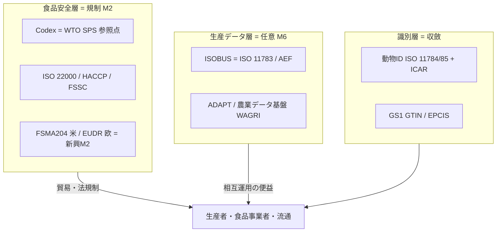
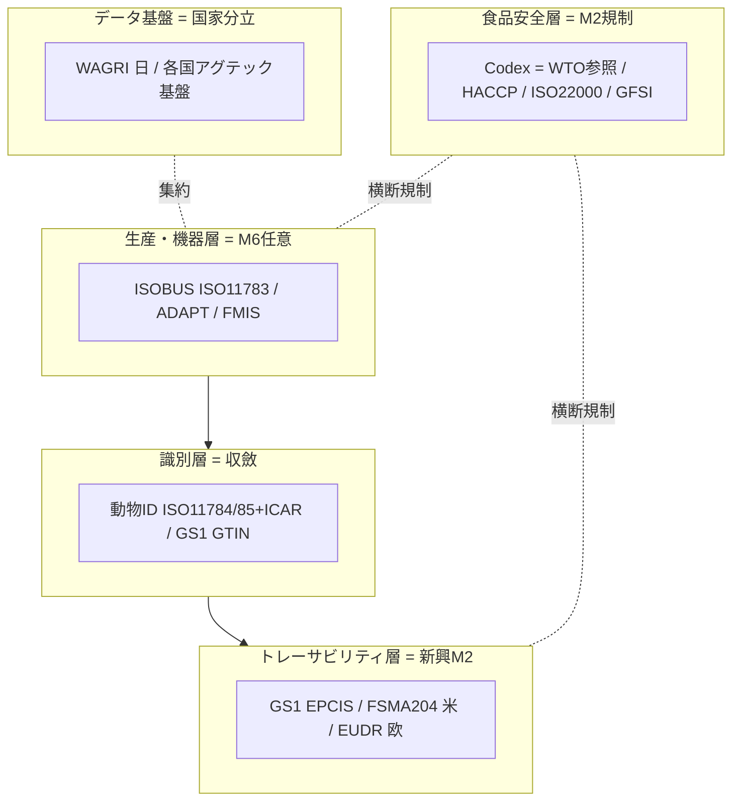

# 農業・畜産・食品標準の総括：領域横断カタログと採用実態分析

作成日: 2026年7月24日
対象: 精密農業・農機通信（ISOBUS）、家畜個体識別（ISO 11784/11785）、食品安全マネジメント（Codex・HACCP・ISO 22000）、農場認証（GLOBALG.A.P.）、食品トレーサビリティ（GS1・FSMA 204・EUDR）、農業データ基盤（WAGRI）まで、農業・畜産・食品を支える国際標準の全体像。
目的: 軍事・医療・金融・通信・自動車・エネルギー・製造・物流・地理空間・建設の総括レポートと同レベルで、前半に領域別カタログ（層構造）、後半に採用・相互運用の実態を分析する。**日本の関与を厚めに**扱い、横断コラム「標準化の地政学」のレンズを適用する。
凡例: 版・年号は2026年7月時点で確認した公開情報に基づく。断定を避ける箇所は〔要確認〕と付す。

---

## 1. はじめに：農業・畜産・食品標準の特殊性

この領域は、本シリーズで **「任意（M6）の生産データ層」と「規制（M2）の食品安全層」がくっきり二層に分かれる** 分野である。特殊性は4点。

第一に、**二層構造**。精密農業のデータ（ISOBUS・ADAPT・WAGRI）は相互運用の便益に委ねられた**任意（M6）**の世界。一方、食品安全・トレーサビリティ（Codex・HACCP・ISO 22000・家畜ID・FSMA・EUDR）は**規制（M2）**の世界。製造（データM6／安全M2）と同型の分裂がここでも起きる。

第二に、**Codexが特異な“準法的”アンカー**。Codex Alimentarius（FAO/WHO）は、**WTOのSPS協定が食品安全の国際的参照点として指定**しているため、貿易紛争の基準になる。任意規格でありながら**WTO経由で準法的な世界的強制力（M2）**を帯びる、他分野に類を見ない存在。

第三に、**トレーサビリティ規制が新興のM2として台頭**。米 **FSMA 204**（食品トレーサビリティ規則）、EU **EUDR**（森林破壊防止規則）が、farm-to-fork／農地単位までの追跡を義務化しつつある。安全とサステナビリティが規制で標準採用を駆動する成長領域。

第四に、**農機はISOBUSに収斂、家畜IDはISO＋ICARに収斂**。トラクタ-作業機の相互接続はISOBUS（ISO 11783）が事実上標準、動物RFIDはISO 11784/11785＋ICARが世界共通。物理・機器層は比較的よく収斂している。

そして日本。**WAGRI（農業データ基盤）・牛トレーサビリティ・HACCP義務化という国家実行では先進的**だが、コア標準（Codex・ISO 22000・ISOBUS）は国際機関・欧米メーカー主導で、日本は採用・実装の側。**食料自給率が低い（カロリーベースで約4割）にもかかわらず、食のルール層は握れていない**（後述6.4）。

---

## 2. 標準の統治構造（誰がどう決めるか）

| 主体 | 性格 | 役割・主な標準 |
|------|------|----------------|
| **Codex Alimentarius（FAO/WHO）** | 国連合同機関 | 食品安全の国際規格。**WTO SPS協定の参照点** |
| **ISO（TC34食品・TC23農機等）** | 国際標準化機関 | ISO 22000（食品安全）、ISO 11783（ISOBUS）、ISO 11784/85（動物ID） |
| **AEF（農業電子工業会）** | 業界団体（欧米メーカー） | ISOBUS適合認証。300超の会員 |
| **AgGateway** | 業界団体 | ADAPT（精密農業データ相互運用） |
| **ICAR** | 国際団体 | 動物記録・**動物RFIDの登録機関** |
| **GFSI / スキームオーナー** | 業界 | FSSC 22000・GLOBALG.A.P.等のベンチマーク |
| **GS1** | 業界団体 | GTIN/EPCIS（食品トレーサビリティ） |
| **各国・地域当局** | 法的強制 | 米FDA（FSMA）、EU（EUDR）、日本（農水省・厚労省） |

農業・食品標準は「国連（Codex）」「国際標準化機関（ISO）」「業界団体（AEF・GS1・GFSI・ICAR）」「各国当局」の四層。特徴は、**食品安全はCodex→WTOで世界収斂、生産データは業界任意、トレーサビリティは各国規制**という、層ごとに駆動力が異なる構造。



---

## 3. 領域別カタログ（層構造）

### 3.1 精密農業・農機通信

| 標準 | 主体 | 実態 |
|------|------|------|
| **ISOBUS（ISO 11783）** | ISO/AEF | トラクタ-作業機の**事実上の相互運用標準**（ISO-XML）。VRA（可変施用）・セクション制御・異メーカー間プラグ&プレイ。AEFが適合認証 |
| **ADAPT** | AgGateway | 精密農業データ（播種・施肥・散布）の相互運用フレームワーク |
| **ISO 23870（開発中）** | ISO | 次世代ISOBUS。Ethernet/IP、カメラ統合、高度自動化、サイバーセキュリティ |

農機はISOBUSに収斂したが、**農業経営データ（FMIS）やクラウド連携は各社・各基盤で分立**。機器は共通、データ経営は分断という段差。

### 3.2 家畜個体識別・畜産

| 標準 | 主体 | 実態 |
|------|------|------|
| **ISO 11784** | ISO | 動物RFIDのコード構造（64ビット、ISO 3166国コード＋国内番号） |
| **ISO 11785** | ISO | 技術仕様（134.2kHz、変調・通信）。**牛輸出の耳標のゴールドスタンダード** |
| **ICAR** | 国際団体 | 2007年にISOから**動物RFID登録機関**に指名。製造者コードを登録 |

動物IDは**ISO＋ICARで世界共通**に収斂。BSE以降、各国が家畜トレーサビリティを法制化した（日本は後述）。

### 3.3 食品安全マネジメント

| 標準 | 主体 | 実態 |
|------|------|------|
| **Codex Alimentarius** | FAO/WHO | 食品安全の国際規格・指針。**WTO SPS協定の参照点＝準法的アンカー** |
| **HACCP** | Codex由来 | 危害分析重要管理点。各国が法制化 |
| **ISO 22000** | ISO | 食品安全マネジメント（HACCPベース）。**世界最普及の任意食品安全規格、5.15万超の認証サイト** |
| **FSSC 22000** | 財団 | ISO 22000＋αで**GFSI承認**スキーム |
| **GFSI** | 業界 | 食品安全スキームのベンチマーク（相互承認の枠組み） |

食品安全は**Codex→WTOで世界収斂**した稀な領域。HACCP・ISO 22000はCodex原則を実装する。

### 3.4 農場認証（GAP）

**GLOBALG.A.P.**（欧州発の農場認証）等のGAP（適正農業規範）が、小売・輸出の要件として民間主導で普及。安全・環境・労働を農場段階で担保する。

### 3.5 食品トレーサビリティ・商流

| 標準/規制 | 主体 | 実態 |
|-----------|------|------|
| **GS1（GTIN/GLN/EPCIS）** | GS1 | 食品の識別・追跡イベントの共通言語（物流レポートと共有） |
| **FSMA 204（食品トレーサビリティ規則）** | 米FDA | KDE（重要データ要素）×CTE（重要追跡イベント）を義務化。**遵守期限は2028年7月20日へ延期**（当初2026年から30か月延長） |
| **EUDR（森林破壊防止規則）** | EU | コーヒー・カカオ・パーム・大豆・牛・ゴム・木材を**農地単位（地理座標）まで追跡**。牛は出生から屠畜まで。DDS（デューデリジェンス申告） |

**トレーサビリティは新興のM2**。安全（FSMA）とサステナビリティ（EUDR）を軸に、farm-to-fork／農地までの追跡義務が拡大。

### 3.6 農業データ基盤

各国・地域が農業データのクラウド基盤を持つ（日本WAGRI等）。**国際標準というより国家/地域プラットフォームで分立**し、相互運用は途上。

---

## 4. 政策・地域動向

### 4.1 国際 ― Codexという多国間アンカー

食品安全は **Codex（FAO/WHO）が WTO SPS協定の参照点** として、世界で最も収斂した規制領域の一つ。ISO 22000・HACCPがこれを実装し、ICARが動物IDを、GS1がトレーサビリティを担う。**多国間主義（物流の IMO/WCO に近い）**が効く。

### 4.2 EU ― 規制で農場まで縛る

EUは **EUDR** で森林破壊防止を農地単位の追跡で義務化し、**GLOBALG.A.P.**（欧州発）で農場認証を主導。安全・環境・持続可能性を規制と民間認証で二重に縛る、最も規制の強い地域。

### 4.3 米国 ― トレーサビリティ規制と大規模データ

米国は **FSMA 204** で食品トレーサビリティを義務化（2028年7月遵守）。大規模農業とアグテック（John Deere等）が精密農業データを牽引。

### 4.4 日本 ― 国家実行は先進、コア標準は採用側（厚め）

日本は、農業DXと食品安全の**国家実行**では先進的だが、**標準の策定**では国際機関・欧米メーカーに従う側にいる。

**農業データ基盤（WAGRI）**: 内閣府SIP第1期で開発され、**2019年度から農研機構（NARO）が運用する公的クラウド基盤**。農地・土壌・気象・市況データとプログラムをオープンAPIで提供。スマートフードチェーン（ukabis）やeMAFFと連携。**世界的に見ても先進的な国家農業データ基盤**だが、これは国内プラットフォームであって輸出された国際標準ではない。

**牛トレーサビリティ**: BSE（2001年）を機に、**牛トレーサビリティ法（2003年）で全頭の個体識別（10桁）を義務化**。世界でも早く徹底した家畜トレーサビリティを構築。

**HACCP義務化**: 食品衛生法改正で、**2021年6月からHACCPに沿った衛生管理を完全義務化**。Codex由来の国際手法を国内法に取り込んだ（M2）。

**農機**: クボタ・ヤンマー・井関はグローバルにも有力で、クボタは世界的トラクタメーカーとしてAEFにも参加〔要確認〕。ただしISOBUSの標準設定は欧米メーカー（Deere・CNH・CLAAS・AGCO）が主導。

総じて、**WAGRI・牛トレサ・HACCP義務化という国家実行は先進的だが、コア標準（Codex・ISO 22000・ISOBUS）は採用側**。しかも**食料自給率が低い（カロリーベース約4割）のに、食のルール層は握れていない**。エネルギー（自給率が低いから水素でルールを取りにいった）とは対照的で、その理由は後述6.4。

### 4.5 新興国・輸出国

輸出志向の農業国（豪州・ブラジル・NZ等）は、GLOBALG.A.P.やCodex準拠を市場アクセスの要件として採用。トレーサビリティは輸出競争力に直結する。

---

## 5. 層構造マップ（全体像）



---

## 6. 採用実態分析

### 6.1 二層駆動 ― 精密農業（M6）と食品安全（M2）

農業・畜産・食品は、**生産データ層が任意（M6）、食品安全層が規制（M2）**という二層で駆動する。ISOBUSやADAPT、WAGRIは相互運用の便益で普及する任意の世界。対して Codex・HACCP・ISO 22000・FSMA・EUDRは、法規制と貿易要件で強制される。製造（データM6／安全M2）と同じ二層構造がここでも現れる。

### 6.2 Codexの特異性 ― WTOが後ろ盾の“準法的”食品安全

この領域で最も特異なのは、**Codexが任意規格でありながらWTO SPS協定の参照点として準法的な強制力を持つ**ことだ。食品安全は、貿易紛争でCodexが基準になるため、**世界で最も収斂した規制領域の一つ**になった。物流のIMO/WCOに似た「多国間主義で世界が一つの基準に収斂した」稀な例で、通信・金融のような単一覇権ではなく、国連＋WTOの合意が効いている。

### 6.3 トレーサビリティ規制の台頭 ― 新しいM2の“二つの世界”

近年、**トレーサビリティが新興のM2**として急拡大している。米FSMA 204（安全）とEU EUDR（サステナビリティ）は、農地単位・出生から屠畜までの追跡を義務化する。ただし両者は**別々の地域規制**で、グローバルサプライヤは両方を満たす必要がある――自動車の「二つの規制世界（UNECE vs 米自己認証）」と同型の分断が、食品トレーサビリティでも生じている。

### 6.4 日本の位置づけ ― 自給率が低いのに、なぜ食のルールを握れないか

日本は、農業・食品でも**国家実行（WAGRI・牛トレサ・HACCP義務化）は先進的だが、コア標準は採用側**という、建設と同型のパターンを示す。ここで興味深い問いが立つ。**エネルギーは自給率が低いからこそ水素でルール層に食い込んだのに、なぜ食料は自給率が低いのに食のルールを握れないのか。**

答えは2つ。第一に、**食品安全のルール層はCodex＋WTOで既に多国間ロックされている**。水素のような「新しい空きフロンティア」がなく、一国が旗を立てる余地が小さい。第二に、**農業は日本の輸出主力産業ではない**（内需・輸入依存中心）。自動車・水素・測位のような「輸出主力か安全保障インフラ」の条件を満たさない。結果、日本は投資を標準策定より国内実装（WAGRI・トレサ）に振り、**優れた実装者・採用者**にとどまった。WAGRIもNACCS・PLATEAU同様、「国際標準の優れた国内実装」であって「輸出された標準」ではない。

### 6.5 強制力スペクトラム上の位置づけ

```mermaid
quadrantChart
    title 農業・畜産・食品サブ領域の 強制力×実装ギャップ（編者による定性評価）
    x-axis 弱い強制力 --> 強い強制力
    y-axis 低い実装ギャップ --> 高い実装ギャップ
    quadrant-1 強制力強く・ギャップ大
    quadrant-2 強制力強く・ギャップ小
    quadrant-3 強制力弱く・ギャップ小
    quadrant-4 強制力弱く・ギャップ大
    食品安全(Codex/HACCP): [0.85, 0.35]
    ISO22000認証: [0.70, 0.35]
    家畜ID(ISO11784/ICAR): [0.75, 0.30]
    トレーサビリティ(FSMA/EUDR): [0.78, 0.60]
    農機(ISOBUS): [0.55, 0.45]
    精密農業データ(ADAPT): [0.35, 0.65]
    農業経営基盤(WAGRI等): [0.40, 0.60]
    農場認証(GLOBALG.A.P.): [0.60, 0.45]
```

食品安全・家畜ID・ISOBUSは「強制力強〜中・ギャップ小」に寄る（Codex/WTO・ICAR・AEF認証が効く）。新興のトレーサビリティ規制（FSMA/EUDR）は強制力は強いが実装が追いつかずギャップ大。精密農業データ・農業経営基盤は任意（M6）でギャップが残る。

---

## 7. まとめ

農業・畜産・食品は、本シリーズで **生産データ層（M6任意）と食品安全層（M2規制）がくっきり二層に分かれる** 領域である。ISOBUS・ADAPT・WAGRIは相互運用の便益に委ねられ、Codex・HACCP・ISO 22000・家畜ID・FSMA・EUDRは法規制と貿易で強制される。最も特異なのはCodexで、**任意規格でありながらWTO SPS協定の参照点として準法的な強制力を持ち、食品安全を世界で最も収斂した規制領域の一つにした**。近年は米FSMA 204・EU EUDRという**トレーサビリティの新興M2**が、農地単位の追跡を義務化しつつ、自動車と同型の「二つの規制世界」に分かれている。

日本は、WAGRI・牛トレーサビリティ・HACCP義務化という**国家実行では先進的**だが、コア標準（Codex・ISO 22000・ISOBUS）は国際機関・欧米メーカーが主導し、**日本は優れた実装者・採用者**にとどまる。ここで浮かぶ「エネルギーは自給率が低いから水素でルールを取りにいったのに、なぜ食料は握れないか」という問いには、2つの答えがある――食品安全のルール層はCodex＋WTOで既に多国間ロックされ空きフロンティアがないこと、農業が日本の輸出主力産業ではないこと。だから日本は投資を国内実装に振り、WAGRIもNACCS・PLATEAU同様「国際標準の優れた国内実装であって輸出された標準ではない」。「主力・戦略・安全保障の“空きのある”領域ではルールを取りにいくが、多国間ロック済み・非主力の領域では優れた実装者にとどまる」という像が、農業・食品でも一貫して確認できた。

---

## 8. 主な出典（公開情報）

- 農機 ISOBUS: [What is ISOBUS / ISO 11783（AutoPi）](https://www.autopi.io/blog/what-is-isobus-and-iso11783/) ／ [Standards and data exchange in agriculture（Aspexit）](https://www.aspexit.com/standards-and-data-exchange-in-agriculture/)
- 動物ID: [ISO 11784 and ISO 11785（Grokipedia）](https://grokipedia.com/page/ISO_11784_and_ISO_11785) ／ [ICAR認証RFID](https://www.dorfidreader.com/portfolio-item/icar-certified-rfid-microchips-iso-compliant-for-all-animal-identification-needs/)
- 食品安全 Codex/ISO 22000/GFSI: [Global Food Safety Standards（Smart Food Safe）](https://smartfoodsafe.com/global-food-safety-standards/) ／ [HACCP と ISO 22000（DNV）](https://www.dnv.com/assurance/food-and-beverage/difference-between-haccp-and-iso-22000/)
- トレーサビリティ FSMA/EUDR: [FSMA 204 遵守2028年7月（inecta）](https://www.inecta.com/blog/fsma-204-compliance-guide) ／ [FDA が FSMA 204 を30か月延期（Food Safety Magazine）](https://www.food-safety.com/articles/10245-fda-delays-fsma-204-traceability-rule-compliance-date-by-30-months) ／ [EUDR for Food Companies](https://tracextech.com/eudr-for-food-companies/)
- 日本 WAGRI/スマート農業: [農業データ連携基盤 WAGRI](https://wagri.naro.go.jp/) ／ [スマート農業（農林水産省）](https://www.maff.go.jp/j/kanbo/smart/)

> 注記: 版・年号は2026年7月時点の公開情報に基づく。日本の食料自給率、クボタ等のAEF/ISOBUS関与度、FSMA 204/EUDRの最終施行状況、ISO 23870の標準化進捗など変動・評価が分かれる項目は〔要確認〕を付した。水産・林業、種苗・遺伝資源（ITPGRFA等）、農薬・肥料規制の細目は本レポートの範囲外とし、必要に応じ別途深掘りする。
