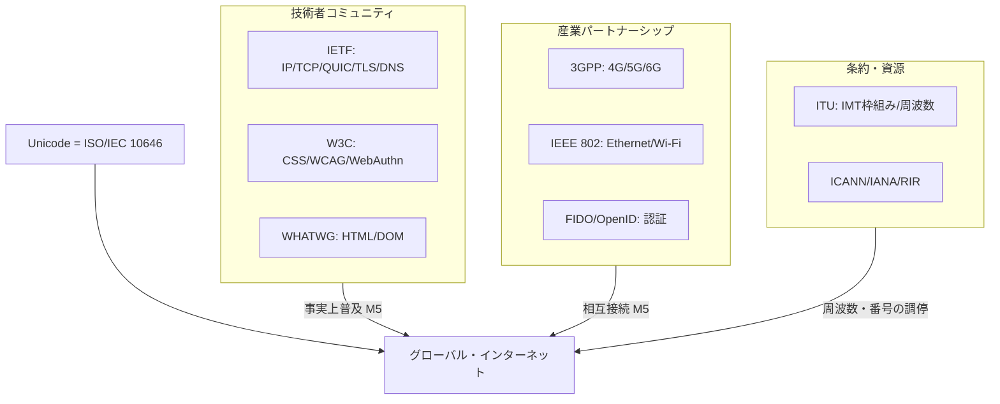
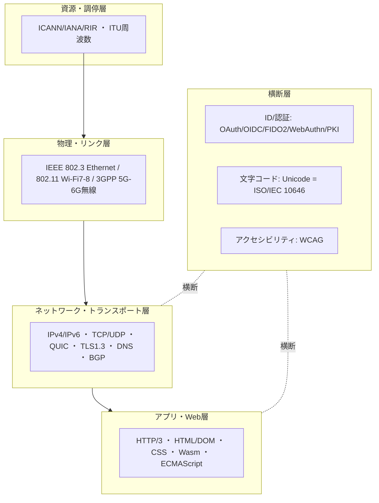

# 通信・ICT・Web標準の総括：領域横断カタログと採用実態分析

作成日: 2026年7月24日
対象: インターネット基盤（IETF）、Web（W3C/WHATWG）、モバイル（3GPP/ITU）、近距離・LAN（IEEE 802）、文字コード・国際化（Unicode）、ID・認証・セキュリティ、名前・番号資源（ICANN）まで、通信・ICTのフルスタックを支える国際標準の全体像。
目的: 軍事・医療・金融の総括レポートと同レベルで、前半に領域別カタログ（層構造）、後半に採用・相互運用の実態を分析する。**日本の関与を厚めに**扱い、横断コラム「標準化の地政学」のレンズ（EU規制／米市場／中国国家／日本は製品・要素）を適用する。
凡例: 版・年号は2026年7月時点で確認した公開情報に基づく。断定を避ける箇所は〔要確認〕と付す。

---

## 1. はじめに：通信・ICT・Web標準の特殊性

この領域は、本シリーズで **「ネットワーク効果（M5）」が主エンジンになる** 唯一の分野である。金融が市場排除（M1）＋規制（M2）、医療が規制（M2）、軍事が調達（M4）で動くのに対し、通信・ICTは **法規制がほとんど無いのに世界が一つの標準へ収斂する**。TCP/IP に従わなければインターネットに繋がらない、という「参加すること自体が強制」の構造が働くためだ。

特殊性は4点。

第一に、**強制の源が「繋がらないと無意味」というM5**。誰も義務化していないのに、TCP/IP・HTTP・DNS・Unicode は事実上の絶対標準になった。標準に従う動機は罰則ではなく「相互接続の便益」である。

第二に、**策定主体が“政府でも国際標準化機関でもない”ことが多い**。中核はIETF（RFC）とW3C/WHATWG（Web）という、条約でも国家でもない技術者コミュニティ。「大まかな合意と動くコード（rough consensus and running code）」という運営哲学が、ISO的な国家投票制と対照的である。

第三に、**層で主導国が分かれる**。インターネット・Webは米国重心（IETF/W3C）、モバイルは欧州発の共同体（GSM/ETSI→3GPP）が世界を取り、条約層（ITU）では中国が攻勢をかける。「EU規制エンジン／米市場エンジン」が層ごとに分業する典型例である。

第四に、**移行速度が層で桁違い**。HTTP/3 は数年で3割超に達する一方、IPv6 は四半世紀かけてなお道半ば。同じIETF標準でも普及の速さがまるで違う。

日本はこの領域で **要素技術・製品では世界的貢献をしたが、プラットフォーム/ルールの主導権は握れなかった**。ただし「絵文字」という、閉じずに世界標準へ開いた稀な成功例を持つ（後述6.4）。

---

## 2. 標準の統治構造（誰がどう決めるか）

| 主体 | 性格 | 役割・主な標準 |
|------|------|----------------|
| **IETF**（IAB/IESG、ISOC/Internet Society傘下） | 技術者コミュニティ（会員制なし） | インターネット基盤：IP/TCP/UDP/QUIC/TLS/DNS/BGP/HTTP。成果物はRFC |
| **W3C** | 会員制コンソーシアム | Web勧告：CSS、WCAG、WebAuthn、Wasm等 |
| **WHATWG**（Apple/Google/Mozilla/MS） | ブラウザベンダー連合 | HTML/DOMの「Living Standard」 |
| **3GPP** | 地域SDOのパートナーシップ | モバイル：3G/4G/5G/6G。**日本はARIB/TTCが参加主体** |
| **ITU（-T/-R）** | 国連の条約機関（国家単位） | 電気通信の枠組み、IMT-2020/2030（5G/6Gの傘）、周波数（WRC） |
| **IEEE 802** | 学会の作業部会 | LAN/MAN：Ethernet(802.3)、Wi-Fi(802.11)、802.1 |
| **Unicode Consortium** | 会員制 | Unicode（ISO/IEC 10646＝UCSと同期） |
| **FIDO Alliance / OpenID Foundation / OASIS** | 業界団体 | FIDO2/CTAP、OpenID Connect、SAML |
| **ICANN / IANA / RIR（日本はAPNIC/JPNIC）** | 資源管理 | ドメイン名・IPアドレス・プロトコル番号 |
| **CA/Browser Forum** | 業界団体 | 公開PKIの証明書要件 |

通信・ICTの統治は「技術者コミュニティ（IETF/W3C/WHATWG）」「産業パートナーシップ（3GPP/IEEE/FIDO）」「条約機関（ITU）」「資源管理（ICANN）」の四層。**ISO/IECはむしろ脇役**で、Unicode↔ISO 10646のように事後的に同期する関係が多い。これが金融（ISO/TC68中心）・医療（ISO＋規制当局）と大きく異なる点である。



---

## 3. 領域別カタログ（層構造）

### 3.1 インターネット基盤（IETF）

| 標準 | 版・RFC | 用途・実態 |
|------|---------|-----------|
| **IP** | IPv4 / IPv6 | IPv6は普及率 約4割前後で四半世紀かけ移行途上〔要確認〕。IPv4枯渇後もNAT等で延命 |
| **TCP / UDP** | 基幹 | 信頼/非信頼トランスポート |
| **QUIC** | RFC 9000 | UDP上の新トランスポート。TLS 1.3を統合し1RTTで接続確立 |
| **HTTP** | HTTP/1.1・/2・/3 | **HTTP/3（RFC 9114）はQUIC上。2025年10月で世界採用 約35%（Cloudflare）、上位1000万サイトの3割超、主要ブラウザ95%超が対応** |
| **TLS** | 1.3（RFC 8446） | **上位サイトの約75%が1.3対応（2025年6月）、QUIC込みの「modern TLS」は約94%**。1.0/1.1は非推奨化 |
| **DNS** | + DNSSEC / DoH / DoT | 名前解決。近年は暗号化（DoH RFC 8484）が普及 |
| **BGP** | 経路制御 | AS間ルーティング。RPKIで経路認証を補強 |
| **ACME** | RFC 8555 | 証明書自動発行（Let's Encrypt）。HTTPS常時化を加速 |

IETFは「RFC」を成果物とし、会員制を持たず「大まかな合意と動くコード」で進む。強制は皆無だが、実装が普及すれば標準になる純粋なM5世界。**HTTP/3が数年で3割超に達したのに対しIPv6が四半世紀を要した**対比は、後述6.2の中心論点。

### 3.2 Web（W3C / WHATWG）

| 標準 | 主体 | 状況 |
|------|------|------|
| **HTML / DOM** | WHATWG | 「Living Standard」（版なし継続更新）。2019年にW3CがHTML/DOMの策定をWHATWGへ一本化 |
| **CSS** | W3C | モジュール単位で継続進化 |
| **WCAG（アクセシビリティ）** | W3C | 2.2が最新勧告。行政調達・法規制（EU/米/日）で参照される横断標準 |
| **WebAuthn** | W3C（FIDOと共同） | パスワードレス認証のブラウザAPI。**2019年3月にW3C勧告**（後述3.6） |
| **WebAssembly (Wasm)** | W3C | ブラウザの高速実行基盤 |
| **ECMAScript (JavaScript)** | Ecma TC39 | 言語仕様。年次改訂 |

Webは「W3C（勧告トラック）」と「WHATWG（ブラウザ連合のLiving Standard）」の二頭体制。HTMLの主導権争いは **ブラウザ実装者（WHATWG）が勝ち**、W3Cが撤退合意した歴史があり、「実装が仕様を決める」M5の象徴的事件だった。

### 3.3 モバイル（3GPP / ITU）

| 世代 | 標準 | 状況 |
|------|------|------|
| 4G | LTE / LTE-Advanced | 稼働中 |
| 5G | Rel-15/16/17 | 商用展開済 |
| **5G-Advanced** | **Rel-18（完了）** | 5Gの高度化。AI/ML・省電力・測位等 |
| 5G-A進化 | **Rel-19（2024/1–2025/6）** | 商用課題の改善 |
| 5G-A完成＋6G研究 | **Rel-20（2025〜）** | 5G-Aを締めつつ6G RANの技術検討を開始 |
| **6G** | Rel-21で仕様化 | **商用は2030年頃の見込み**。ITUのIMT-2030が傘 |

3GPPは **欧州発（GSM/ETSI）の資産を核に、各地域SDO（欧ETSI・米ATIS・日ARIB/TTC・中CCSA・韓TTA・印TSDSI）が連携する世界パートナーシップ**。ITU-Rが「IMT-2020(5G)/IMT-2030(6G)」という国際的な傘と周波数を用意し、3GPPが具体仕様を書く分業。**モバイルは“EU heritage が世界標準になった”稀有な層**で、インターネット（米）と主導国が異なる。

### 3.4 近距離・LAN（IEEE 802）

| 標準 | 通称 | 状況 |
|------|------|------|
| **802.3** | Ethernet | 有線の基幹。800GbEへ高速化継続 |
| **802.11be** | **Wi-Fi 7** | **2025年7月22日に規格発行**（IEEE承認は2024年9月）。320MHz幅・MLO・4K-QAM |
| **802.11bn** | **Wi-Fi 8（UHR）** | 超高信頼性重視。認証は2027年12月頃の見込み |
| **802.1** | ブリッジ/TSN | 時間高精度ネットワーク（産業・車載と接続） |
| Bluetooth | （Bluetooth SIG） | 近接無線。IEEE外だが同層 |

### 3.5 文字コード・国際化（i18n）

| 標準 | 状況 |
|------|------|
| **Unicode** | **17.0（2025年9月9日）で約159,801文字**。ISO/IEC 10646（UCS）と同期。UTF-8がWebの事実上唯一の符号化 |
| **CJK統合漢字** | 日中韓の漢字を統合符号化。**Han Unification**は日本から字形・包摂の議論が絶えない横断論点 |
| 日本の従来コード | JIS X 0208/0201/0213、Shift-JIS、EUC-JP。UTF-8移行で「文字化け」「機種依存文字」の負債を長く抱えた |

文字コードは通信の最下層の「共通語彙」であり、Unicode↔ISO 10646という **業界標準と国際規格が同期する** 珍しい構造。日本は次章の通り、負の遺産（Shift-JIS）と正の遺産（絵文字）の両方を残した。

### 3.6 ID・認証・セキュリティ

| 標準 | 主体 | 状況 |
|------|------|------|
| **OAuth 2.0**（RFC 6749）/ **2.1** | IETF | 認可の事実上標準。2.1は2.0＋運用ベストプラクティスの統合ドラフト |
| **OpenID Connect** | OpenID Foundation | OAuth上の認証層。ソーシャルログインの基盤 |
| **SAML** | OASIS | 旧世代のSSO。企業で根強く残存 |
| **FIDO2 = WebAuthn＋CTAP** | W3C＋FIDO Alliance | パスワードレス。**パスキー（Passkeys）が2025年に主流化、調査で53%が1つ以上の口座で有効化** |
| **X.509 / PKI / ACME** | IETF＋CA/Browser Forum | 公開鍵基盤・証明書。HTTPS常時化 |
| **暗号アルゴリズム** | NIST等 | 近年はポスト量子暗号（PQC）標準化が進行〔要確認〕 |

ID・認証は「金融・医療・行政」すべてに刺さる **横断レイヤー**（横断コラム参照）。パスキーの主流化は、この10年で最大の実装トレンドの一つ。

### 3.7 名前・番号資源（ICANN / IANA / RIR）

ドメイン名・IPアドレス・プロトコル番号の一意割当を担う。ICANN配下のIANA機能が最上位、地域はRIR（アジア太平洋はAPNIC、日本の窓口はJPNIC）が分配。**技術標準ではなく“資源のガバナンス”**だが、インターネットの単一性を担保する不可欠の層。米国政府の監督下から2016年に多利害関係者モデルへ移管された経緯を持つ。

---

## 4. 政策・地域動向

### 4.1 米国 ― 市場エンジン（M5）

IETF・W3C・IEEEの重心は米国にあり、GAFA等のプラットフォーム企業が実装を通じて事実上の標準を世界化する。「先に普及させた者が標準」という de facto の勝ち方。インターネットとWebの根幹は米国が握る。

### 4.2 EU ― heritage＋規制エンジン（M2）

モバイルはGSM/ETSIの資産で3GPPを世界標準に押し上げた成功体験を持つ。加えて **規制で上位レイヤーを縛る**：GDPR（データ保護）、eIDAS（デジタルID・電子署名）、DMA/DSA（プラットフォーム規制）。技術標準そのものより「使い方のルール」を輸出するのがEU流。

### 4.3 中国 ― 条約層への攻勢

ITUで「New IP」提案（2019–2020年、次世代ネットのトップダウン設計を提唱し論争化）に見られるように、**条約機関（ITU）を舞台に主導権を取りにいく**。China Standards 2035の下、ITU/IEC/ISOへの人員・投票を増やす第3極。IETF/W3Cの“ボトムアップ”文化とは対照的なアプローチ。

### 4.4 日本 ― 要素で貢献、プラットフォームで届かず（厚め）

日本はこの領域で世界的な貢献をいくつも残したが、主導権の獲得という点では明暗が分かれる。

**インフラ層の貢献（村井純／WIDE）**: 村井純が1984年にJUNET、1988年にWIDE Projectを設立。「日本のインターネットの父」。WIDEは **世界初のIPv6実装（KAMEプロジェクト）**、M-root DNSサーバ運用、アジア太平洋バックボーン形成など、基盤の実装で国際貢献した。IPv6は日本が先行実装した領域である。

**モバイル層の貢献（NTTドコモ）**: 3GPPにARIB/TTCを通じて参加し、第3世代（W-CDMA/FOMA）で世界に先行。ただし **i-mode（1999〜）** に代表される「垂直統合の囲い込み（ウォールドガーデン）」モデルは、スマートフォン時代のオープンプラットフォーム（iOS/Android）に敗れ、ガラパゴス化した。i-modeは2026年に終了〔要確認〕。

**絵文字 ― 開いて世界標準になった稀な成功**: 絵文字はドコモの栗田穣崇がi-mode向けに1999年に考案（オリジナル176種、後にMoMA所蔵）。国内では各キャリアが独自実装したが、**2010年にUnicodeへ統合**され、日本発の記号系が世界共通のプラットフォーム標準に昇格した。現在3,600超がUnicodeに収録。**QRコードと並ぶ「囲わずに開いたから世界を取れた」代表例**（後述6.4）。

**言語標準（Ruby）**: まつもとゆきひろのRubyが、IPA（情報処理推進機構）主導で標準化され、**2011年にJIS X 3017、2012年にISO/IEC 30170** として国際規格化。プログラミング言語がISO化された数少ない例。

**組込みOS（TRON/μITRON）**: 坂村健のTRONは組込みで広く普及（横断コラム参照）。技術で成功しつつプラットフォーム層に届かなかった構図。

**負の遺産（文字コード）**: Shift-JIS・機種依存文字・CJK包摂問題など、独自コードの負債はUTF-8移行で長く尾を引いた。

### 4.5 国際 ― 条約層と資源ガバナンス

ITUが周波数（WRC）とIMT枠組みで国家間調停を担い、ICANN/IANAがネットの単一性を担保する。技術仕様の中身はIETF/3GPP/IEEEが書き、ITU・ICANNは「調停と資源」に徹する二重構造。

---

## 5. 層構造マップ（全体像）



---

## 6. 採用実態分析

### 6.1 何が採用を駆動するか ― M5が主役

通信・ICTは、本シリーズで唯一 **ネットワーク効果（M5）が単独で標準を決める** 領域である。法規制も市場排除も（ほぼ）ないのに、TCP/IP・HTTP・Unicode・TLS は世界が一つに収斂した。動機は「繋がる便益」。だから策定主体が国家でも国際標準化機関でもなく、IETF/W3C/WHATWGという技術者コミュニティで成立する。金融（ISO/TC68）や医療（規制当局）との最大の違いはここにある。

### 6.2 なぜ移行速度が層で桁違いなのか

同じM5でも普及の速さは大きく異なる。

**速い例（HTTP/3・TLS 1.3）**: ブラウザとCDN（Cloudflare/Google等）という **少数の実装者が更新すれば一斉に効く** 層は速い。HTTP/3は数年で世界採用35%、TLS 1.3はmodern TLSで94%。上位の意思決定点が集中しているほど移行は速い。

**遅い例（IPv6）**: 全世界の全機器・全ISPの足並みが必要な層は遅い。IPv6は四半世紀かけてなお4割前後で、NATによる延命が移行圧力を弱めた。**「切り替えないと困る」痛みが分散していると、M5でも動かない**。

この対比は「M5の速度は“実装意思決定点の集中度”に依存する」という一般則として、他領域の移行予測にも使える。

### 6.3 地政学レンズ ― 層で主導国が分かれる

横断コラムの4エンジンで見ると、通信・ICTは **層ごとに勝者が違う** 教科書的事例である。

- **インターネット・Web ＝ 米国（市場/M5）**: IETF/W3C/WHATWG＋プラットフォーム企業。
- **モバイル ＝ EU heritage（GSM/ETSI→3GPP）が世界標準**: 規制ではなく共同体運営で世界を取った例外的成功。
- **条約層（ITU）＝ 中国が攻勢**: New IP提案、China Standards 2035。
- **日本 ＝ 要素・製品で貢献、プラットフォームは握れず**: IPv6実装・3G先行・Ruby・絵文字。

「EUエンジンと米エンジンが正面衝突せず層で棲み分ける」という横断コラムの主張が、この領域ほど明瞭に出る分野はない。

### 6.4 日本の教訓 ― 「開けば世界標準、閉じればガラパゴス」

日本の通信・ICT史は、**同じ日本発でも“開いたもの”だけが世界を取った**という一貫した教訓を示す。

| 開いた → 世界標準 | 閉じた → ガラパゴス/敗退 |
|---|---|
| 絵文字（Unicodeへ統合、2010） | i-mode（垂直統合の囲い込み、スマホに敗退） |
| QRコード（特許開放、ISO/IEC 18004） | FeliCa（自社囲い→NFC-Fに留まる） |
| Ruby（JIS→ISO/IEC 30170） | ケータイ独自仕様（ワンセグ等） |
| IPv6実装の公開（KAME） | Shift-JIS等の独自コード |

栗田の絵文字は、キャリアが囲い続けていれば消えていた。Unicodeという **世界のプラットフォームに開いた瞬間に、日本発の記号系が人類共通言語になった**。これは横断コラムの「日本は下のレイヤー（M3）は取れるが上のレイヤー（M5）は取れない。ただし開けば例外的に勝てる」という命題の、最も鮮やかな実証例である。

### 6.5 強制力スペクトラム上の位置づけ

```mermaid
quadrantChart
    title 通信・ICTサブ領域の 強制力×実装ギャップ（編者による定性評価）
    x-axis 弱い強制力 --> 強い強制力
    y-axis 低い実装ギャップ --> 高い実装ギャップ
    quadrant-1 強制力強く・ギャップ大
    quadrant-2 強制力強く・ギャップ小
    quadrant-3 強制力弱く・ギャップ小
    quadrant-4 強制力弱く・ギャップ大
    TCP-IP-DNS基盤: [0.90, 0.20]
    HTTP-TLS(Web): [0.85, 0.25]
    Unicode-UTF8: [0.88, 0.20]
    モバイル(3GPP): [0.82, 0.35]
    Wi-Fi-Ethernet: [0.80, 0.25]
    ID認証(FIDO/OAuth): [0.55, 0.45]
    IPv6: [0.60, 0.70]
    アクセシビリティ(WCAG): [0.55, 0.55]
    WebAssembly: [0.40, 0.40]
```

通信・ICTは全体に「強制力＝強（M5）・ギャップ＝小」の左下〜右下に寄る。繋がる便益が実装を強制するため、名目準拠と実質活用の差が他分野より小さい。例外はIPv6（移行痛が分散し停滞）とWCAG（規制頼みで実装にばらつき）。

---

## 7. まとめ

通信・ICT・Webは、本シリーズで **ネットワーク効果（M5）が単独で標準を決める** 唯一の領域である。法規制も市場排除もほぼ無いのに、TCP/IP・HTTP・DNS・Unicode・TLS は世界が一つに収斂した。策定を担うのは国家でも国際標準化機関でもなく、IETF/W3C/WHATWGという技術者コミュニティで、これが金融（ISO/TC68）・医療（規制当局）との構造的な違いである。

移行速度は層で桁違いで、HTTP/3が数年で3割超に達する一方、IPv6は四半世紀かけてなお道半ば。「M5の速度は実装意思決定点の集中度に依存する」という一般則が読み取れる。

地政学的には、この領域は **層ごとに勝者が違う** 教科書例だ。インターネット・Webは米国（市場エンジン）、モバイルはEU heritage（GSM/ETSI→3GPP）が世界標準を取り、条約層（ITU）では中国が攻勢をかける。横断コラムの「米エンジンとEUエンジンが層で棲み分ける」主張が、ここほど鮮明に出る分野はない。

そして日本。IPv6実装（村井純/WIDE）、3G先行（ドコモ）、Ruby（ISO/IEC 30170）、そして絵文字と、要素・製品では確かな貢献を残した。だが主導権を握れたのは **「囲わずに世界のプラットフォームへ開いたもの」だけ** だった。i-modeは閉じてガラパゴス化し、絵文字はUnicodeへ開いて人類共通言語になった。QRコード・FeliCa・TRONと合わせて、「開けば勝ち、閉じれば負ける」という日本の標準化の教訓が、この領域に最も濃く刻まれている。

---

## 8. 主な出典（公開情報）

- 3GPP / 5G-Advanced / 6G: [3GPP Release 20（Qualcomm）](https://www.qualcomm.com/news/onq/2025/06/3gpp-release-20-completing-5g-advanced-evolution-preparing-for-global-6g-standardization) ／ [3GPP Rel-19 & 6G Planning（ATIS/3GPP）](https://www.3gpp.org/news-events/partner-news/atis-webinar-rel19)
- HTTP/3・QUIC・TLS: [HTTP/3（Wikipedia）](https://en.wikipedia.org/wiki/HTTP/3) ／ [HTTP/3 35% adoption（DEV）](https://dev.to/linou518/http3-is-at-35-adoption-you-cant-call-quic-a-future-technology-anymore-2ghm)
- Wi-Fi 7/8: [IEEE 802.11be-2024（Wikipedia）](https://en.wikipedia.org/wiki/IEEE_802.11be-2024) ／ [Wi-Fi 8 / 802.11bn UHR（Samsung Research）](https://research.samsung.com/blog/IEEE-802-11bn-Ultra-High-Reliability-UHR-Wi-Fi-8)
- FIDO/パスキー/WebAuthn: [FIDO Passkeys（FIDO Alliance）](https://fidoalliance.org/passkeys/) ／ [WebAuthn（Wikipedia）](https://en.wikipedia.org/wiki/WebAuthn)
- Unicode 17.0: [Unicode 17.0 Release（Unicode Blog, 2025-09-09）](https://blog.unicode.org/2025/09/unicode-170-release-announcement.html)
- 絵文字（日本発）: [Shigetaka Kurita（Wikipedia）](https://en.wikipedia.org/wiki/Shigetaka_Kurita) ／ [Shigetaka Kurita, Emoji（MoMA）](https://www.moma.org/collection/works/196070) ／ [i-Mode と絵文字（Nippon.com）](https://www.nippon.com/en/japan-topics/g02591/ntt-docomo-ends-i-mode-mobile-service-that-pioneered-the-emoji.html)
- 日本のインターネット基盤: [Jun Murai（Wikipedia）](https://en.wikipedia.org/wiki/Jun_Murai) ／ [WIDE Project（Wikipedia）](https://en.wikipedia.org/wiki/WIDE_Project) ／ [KAME project（Wikipedia）](https://en.wikipedia.org/wiki/KAME_project)
- Ruby標準化: [ISO/IEC 30170:2012（ISO）](https://www.iso.org/standard/59579.html)

> 注記: 版・年号は2026年7月時点の公開情報に基づく。IPv6普及率、i-mode終了時期、PQC標準化状況など変動・地域差のある項目は〔要確認〕を付した。周波数政策（ITU-R WRC）や各国電気通信規制の細目は本レポートの範囲外とし、必要に応じ別途深掘りする。
