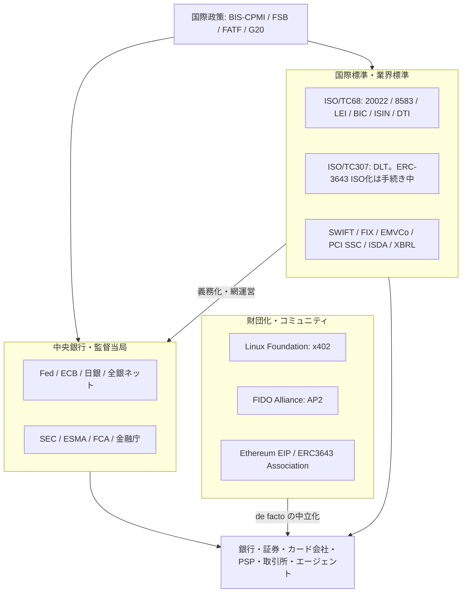
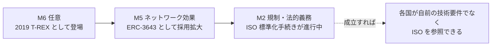
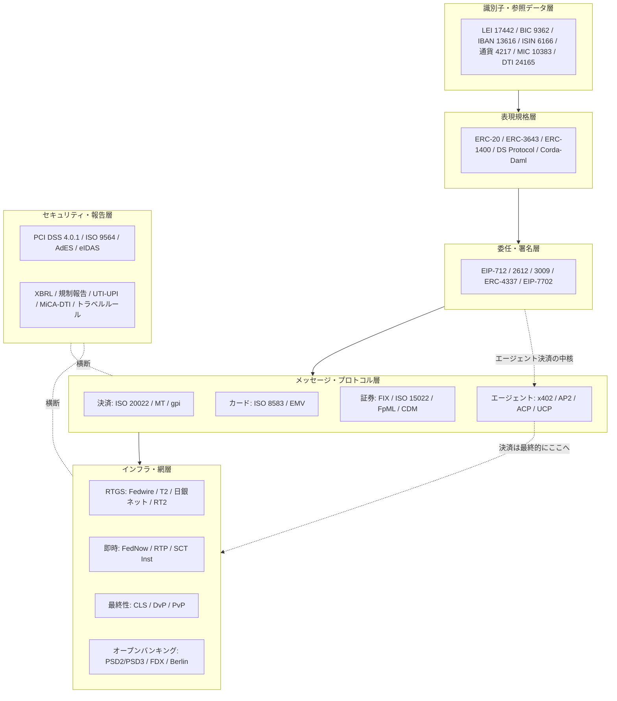
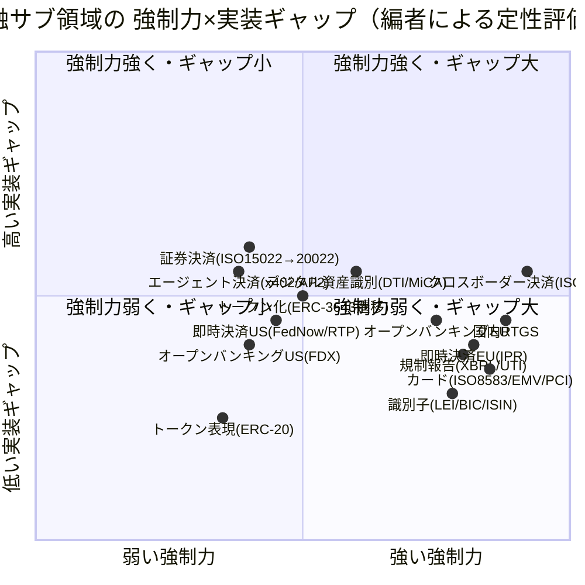

# 金融標準の総括：領域横断カタログと採用実態分析

作成日: 2026年7月24日
改訂: 2026年9月14日（トークン表現規格・委任署名・エージェント決済・中銀マネーの技術モデル・日本のトークン化実装を補完。主たる事実は2026年7月以前に公開されていた）
対象: 決済・証券・カード・銀行間インフラ・識別子・オープンバンキング・デジタル資産・エージェント決済・規制報告など、金融サービスを支える国際標準の全体像。
目的: 軍事・医療標準の総括レポートと同レベルで、前半に領域別カタログ（層構造）、後半に採用・相互運用の実態を分析する。国際標準を中心に、日本の動向を明記する。
凡例: 版・年号は改訂時点で確認した公開情報に基づく。断定を避ける箇所は〔要確認〕と付す。

---

## 1. はじめに：金融標準の特殊性

金融標準は、本シリーズの他分野と比べて **強制メカニズムが最も強い** 領域である。その特殊性は次の4点に集約できる。

第一に、**「市場排除（M1）」が決定的**。標準に従わない参加者は、決済網・清算網・取引所から物理的に締め出される。技術的な良し悪し以前に「繋がらなければ商売にならない」ため、採用は速い。医療の「規制・償還」や軍事の「作戦要求」よりも、金融の排除圧力は即物的である。

第二に、**排除（M1）と規制（M2）が二重に効く**。中央銀行・監督当局が特定標準（ISO 20022、LEI、PCI DSS等）を義務化し、市場圧力と法的義務が重なる。これが「readiness（準備できたか）」ではなく「operating requirement（前提条件）」へと標準を押し上げる。

第三に、**巨大なレガシーと長い移行期間**。SWIFT MT電文やISO 15022は数十年の稼働資産であり、ISO 20022への移行は「共存期間」を設けて数年がかりで進む。移行途中は **翻訳ゲートウェイ（変換レイヤー）** に依存し、これが後述の「名目準拠ギャップ」を生む。

第四に、**領域ごとに温度差が大きい**。決済（クロスボーダー・国内RTGS）はISO 20022移行が完了・進行する一方、証券決済は「業界に世界移行の食指が動いていない」状態が続く。同じ金融でもサブ領域で採用速度が桁違いになる。

本レポートは、この体系を「統治構造」→「領域別カタログ」→「政策・地域」→「採用実態分析」の順に整理する。

---

## 2. 標準の統治構造（誰がどう決めるか）

| 主体 | 役割 | 主な標準 |
|------|------|----------|
| **ISO / TC 68（金融サービス）** | 金融の国際規格の策定 | ISO 20022、ISO 8583、ISO 17442(LEI)、ISO 9362(BIC)、ISO 4217(通貨)、ISO 6166(ISIN)、ISO 24165(DTI) |
| **ISO / TC 307（ブロックチェーン・DLT）** | DLT技術の国際規格。TC 68とは別委員会 | ERC-3643 の ISO 化はスペイン国内委員会が NWIP 提出を準備〔要確認〕 |
| **SWIFT** | 標準登録機関(RA)＋メッセージ網運営 | ISO 20022(CBPR+)、ISO 15022、BIC登録、gpi |
| **FIX Trading Community** | 取引前・執行のプロトコル | FIX Protocol |
| **EMVCo**（Visa/MC/JCB/AmEx/Discover/UnionPay共同） | カード決済の技術仕様 | EMV Chip / Contactless / 3-D Secure / Tokenisation |
| **PCI SSC（PCI Security Standards Council）** | カードデータのセキュリティ | PCI DSS、PIN、P2PE |
| **GLEIF** | 法人識別子の運用（G20/FSB後援） | LEI（ISO 17442の運用） |
| **ISDA** | デリバティブの表現・データモデル | FpML、ISDA CDM |
| **XBRL International** | 事業報告の機械可読化 | XBRL / iXBRL |
| **Ethereum コミュニティ（EIP プロセス）** | トークン表現・委任署名の de facto | ERC-20、EIP-712、EIP-3009、ERC-4337 等 |
| **ERC3643 Association** | 許可付き証券トークンの仕様維持 | ERC-3643（T-REX）。ISO 化を推進〔要確認〕 |
| **Linux Foundation / x402 Foundation** | HTTP ネイティブ決済の中立統治 | x402（2026-04-02 に Coinbase から移管） |
| **FIDO Alliance** | 認証に加え、エージェント決済の委任証明 | AP2（2026-04-28 に Google から寄贈）、WebAuthn/CTAP |
| **各国中央銀行・監督当局** | 法的強制・インフラ運営 | 米Fed(Fedwire/FedNow)、ECB(T2/TIPS)、日銀(日銀ネット)、全銀ネット |
| **BIS / CPMI・FSB・FATF** | 国際的な整合・政策目標 | クロスボーダー決済ロードマップ、トラベルルール、Project Agorá |
| **業界標準化団体** | 地域API・オープンバンキング | Berlin Group(NextGenPSD2)、FDX、UK OBIE |

金融標準は長らく「国際標準化機関（ISO/TC68）」「業界コンソーシアム（SWIFT・FIX・EMVCo・PCI SSC・ISDA）」「中央銀行・監督当局」「国際政策機関（BIS/FSB/FATF）」の四層が相互参照してきた。近年は当局が業界標準を義務化へ取り込む動きが強く（例：EU MiCAがISO 24165を要求、Fedが自国決済網をISO 20022化）、**業界標準と規制の統合**が医療同様に進む。

2025〜2026年に、この四層に収まらない **第五の型** がはっきりした。企業が de facto を取ったあと、自社保有のまま押し通さず、1年以内に中立の財団へ移す。x402（Coinbase → Linux Foundation、2026-04-02）と AP2（Google → FIDO Alliance、2026-04-28）が典型で、ERC-3643 の Association 化も同型に近い。これは4エンジン論の「米国＝市場（de facto／M5）」を一段細かくする。**市場で取った標準を中立化して採用障壁を下げる** 戦略であり、企業標準のまま押し通す形とは別である。本レポートではこれを **「財団化」** と呼ぶ。

---

## 3. 領域別カタログ（層構造）

### 3.1 決済メッセージング（銀行間・クロスボーダー）

| 標準 | バージョン/状況 | 用途・実態 |
|------|-----------------|-----------|
| **ISO 20022** | 移行進行中 | XMLベースの豊富な構造化データを持つ次世代標準。クロスボーダー(CBPR+)・各国RTGSの共通言語。**SWIFTのMT→MX共存期間は2025年11月22日に終了**し、対象のクロスボーダー決済はISO 20022が前提条件に |
| **SWIFT MT（FIN）** | 段階的廃止 | 数十年稼働のレガシー電文。CBPR+領域では廃止済。移行期は変換ゲートウェイで延命 |
| **ISO 15022** | 併存 | 証券メッセージ（後述3.3）。決済系より移行が遅い |
| **SWIFT gpi** | 稼働 | クロスボーダー送金の追跡・即時性・透明性の枠組み。ISO 20022と併走 |

移行はグローバルには2025年3月開始（2023年3月20日に industry-wide transition 開始、共存終了2025年11月）で、各国RTGSがこれに歩調を合わせた。**米Fedwireは当初2025年3月予定を延期し、2025年7月14日にISO 20022へ移行完了**。欧州のT2（旧TARGET2）は先行移行済。J.P.モルガン等の大手行はpain.001系メッセージの受信を2025年11月に開始し、送信対応は2026年Q4へと段階化するなど、**「受信先行・送信後追い」の実装ギャップ**が観測される。

### 3.2 カード・POS・ATM決済

| 標準 | 主体 | 用途・実態 |
|------|------|-----------|
| **ISO 8583** | ISO/TC68 | カード取引の交換メッセージ。POS・ATM・オーソリの事実上の共通基盤。Visa/Mastercard/各国ネットワークが自社方言で実装。**「店頭カード決済の大半が通信経路のどこかでISO 8583を使う」** |
| **EMV仕様** | EMVCo | 接触/非接触ICチップ、トークナイゼーション、3-D Secure。**ISO 8583等のISO標準を土台に構築**。不正防止（偽造・スキミング対策）の中核 |
| **PCI DSS** | PCI SSC | カード会員データ保護（後述3.9） |

ISO 8583は古い標準だが極めて堅牢で、EMVCoが上位仕様を重ねる二層構造。ベンダー方言が多く「標準準拠だが相互直結はしない」典型例。

### 3.3 証券・デリバティブ

| 標準 | 主体 | 用途・実態 |
|------|------|-----------|
| **FIX Protocol** | FIX Trading Community | 取引前・執行の事実上の世界標準。**280超の会員（バイサイド/ブローカー/取引所/規制当局/ベンダー）、50超の国**。当初は株式、現在は債券・FX・デリバティブへ拡大。近年はAI/ML連携も |
| **ISO 15022** | ISO/TC68・SWIFT | 決済・カストディのメッセージ。ISO 20022と併存 |
| **ISO 20022（証券）** | ISO/TC68・SWIFT | 証券領域の次世代標準。ただし**世界一斉移行の期日は未設定**。「今のところ業界に世界移行の食指が動かない」（ISSA） |
| **FpML** | ISDA | デリバティブ取引のXML表現 |
| **ISDA CDM** | ISDA | 取引ライフサイクルの共通データモデル（近年推進） |

証券は決済系と対照的に **移行の腰が重い**。「クロスボーダー証券決済がようやくISO 15022に移ったばかりで、国内決済は依然として利用が少ない」との評もある。SWIFTはISO 15022とISO 20022の選択制を維持している。

### 3.4 識別子・参照データ

| 標準 | 番号 | 内容・実態 |
|------|------|-----------|
| **LEI（法人識別子）** | ISO 17442 | 20桁英数字。**G20/FSB後援、GLEIFが運用**、規制報告で義務化が拡大 |
| **BIC（金融機関コード）** | ISO 9362 | SWIFTが登録機関。送金の宛先識別。GLEIFとBIC↔LEIマッピングを公開 |
| **IBAN（口座番号）** | ISO 13616 | 国際銀行口座番号。欧州中心に普及 |
| **ISIN（証券識別）** | ISO 6166 | 金融商品の国際識別番号 |
| **通貨コード** | ISO 4217 | JPY/USD/EUR等 |
| **市場識別コード(MIC)** | ISO 10383 | 取引所・市場の識別 |
| **DTI（デジタルトークン識別子）** | ISO 24165 | 暗号資産等の**識別**（後述3.8）。トークンの振る舞いを決める表現規格とは別層 |
| **UTI/UPI** | ISO 23897/4914 | 取引・商品の一意識別（デリバティブ規制報告） |

識別子はネットワーク効果（M5）と規制報告義務（M2）の両輪で普及する。LEIは当局が報告要件に組み込むことで採用が伸びる典型。

### 3.5 決済インフラ・即時決済

| 仕組み | 地域 | 状況 |
|--------|------|------|
| **RTGS（大口即時グロス決済）** | 各国 | Fedwire(米)、T2(EU)、日銀ネット(日)。ISO 20022化が進行 |
| **SEPA / SCT Inst** | EU | 即時決済。**EU即時決済規則(IPR, 2024/886)** により2025年1月にユーロ圏PSPの受信義務化、送信義務は2025年10月。SCT Instルールブック2025は2025年10月5日発効 |
| **FedNow** | 米 | 2023年開始の即時決済網。**2025年半ばで約1,400機関が参加**、四半期あたり200万件超・2,450億ドル超。中小金融機関中心 |
| **RTP（The Clearing House）** | 米 | 2017年稼働の民間即時決済。全米普及は限定的 |
| **CLS** | グローバル | 多通貨 PvP（支払対支払）の現行標準。FX の決済最終性の参照点。トークン化後も「最終性をどこで取るか」の比較対象になる |

即時決済は「規制義務（EU）」と「網参加の任意＋普及圧力（米）」で採用ドライバーが対照的。EUは法規制で一気に、米は市場主導で漸進的に広がる。CLS はメッセージ層ではなく **決済の仕組み** であり、原子的決済（DvP / PvP）や HTLC と同じ層に置く（後述3.8）。

### 3.6 オープンバンキング・API

| 標準/枠組み | 地域 | 状況 |
|-------------|------|------|
| **PSD2 / NextGenPSD2（Berlin Group）** | EU | 口座アクセスAPIの事実上の技術標準。Berlin Groupが仕様提供 |
| **PSD3 / PSR** | EU | **2025年11月27日に欧州議会・理事会が暫定合意**。PSRは「指令」でなく「規則」で、加盟国裁量を排し統一適用 |
| **FDX（Financial Data Exchange）** | 米/加 | 業界主導。**6,000万超の消費者口座が接続**、急速に支配的に |
| **UK Open Banking（OBIE）** | 英 | 世界初の本格的オープンバンキング。標準API |
| **Berlin Group openFinance** | EU | PSD2規制範囲を超えた商用データ共有の拡張 |

API呼出量は2025年の1,370億回から2029年に7,200億回へ（＋427%）と予測される拡大領域。EUは規制主導（M2）、米は業界主導（M6→M5）で標準が形成される好対照。

この隣に、口座アクセスとは別の **エージェント向け API 層** が2025〜2026年に立ち上がった（次節）。

### 3.7 エージェント決済プロトコル

オープンバンキング（3.6）が「人間の委任で口座に触る」APIだとすれば、こちらは「エージェントが自ら支払う」APIである。層が違うので競合というより積み重ねで、**身元 → 委任 → 決済実行** の順に乗る。

| 名前 | 主体 | 状況 |
|------|------|------|
| **x402** | **Linux Foundation**（2026-04-02 に Coinbase から移管。x402 Foundation が統治） | HTTP 402 を決済に使う。**V2 は 2025-12-11**。**Stripe が 2026-02-11 に Base 上の USDC 決済で統合**（プレビュー）。中核は EIP-3009 系の「署名だけ渡して第三者に実行させる」仕組み |
| **AP2**（Agent Payments Protocol） | **FIDO Alliance**（2026-04-28 に Google から寄贈） | 公開仕様は **v0.2**（Human Not Present、Mastercard 共同の Verifiable Intent）。安定版の時期は未定 |
| **ACP**（Agentic Commerce Protocol） | OpenAI + Stripe | チェックアウト層。ChatGPT Instant Checkout の基盤として 2025-09 公開 |
| **UCP**（Universal Commerce Protocol） | Google + Shopify（Etsy/Target/Wayfair 等） | 商業意味論。発見〜カート〜購入後まで。2026-01 NRF で発表 |
| **Visa TAP** / **Mastercard Agent Pay** | カード網 | ネットワーク上の信頼（エージェント身元・トークン化決済）。Visa の Trusted Agent Protocol、Mastercard の Agentic Tokens / Verifiable Intent |

これらは多くが **別層** であり、直接の代替ではない。x402 は決済実行、AP2 は委任の証明、ACP はチェックアウト、UCP は商業意味論、カード網は既存レール上の信頼、という分担である。

エージェントの **身元** そのものは HTTP 層の問題である。**RFC 9421（HTTP Message Signatures）** と、そのプロファイルである **Web Bot Auth**（IETF ドラフト、2025-10 に WG 設置）が基盤になる。仕様の本体は通信・ICT 側に置き、金融側は「決済プロトコルが依拠する身元層」として参照するに留める（『通信・ICT・Web標準の総括』3.1 / 3.6）。

この節が本シリーズで重要なのは、2つの分析フレームの両方に直接効くからである。

1. **財団化**（第2章）。x402 も AP2 も、企業が作り、1年以内に中立財団へ移した。M5 で取った標準を中立化して採用障壁を下げる。
2. **規制の参照先**（第7章）。エージェント決済はまだ M2 に乗っていない。財団化は「規制が参照しやすい形」を先に作る手でもある。

### 3.8 デジタル資産・トークン化・CBDC

DTI（ISO 24165）は「そのトークンをどう呼ぶか」を決める識別子規格である。「そのトークンがどう振る舞うか」は別の規格が決める。識別子だけでこの節を構成すると、その対が見えなくなる。

#### トークン表現規格

| 規格 | 主体 | 状況 | 本プロジェクトにとっての意味 |
|------|------|------|------------------------------|
| **ERC-20** | Ethereum コミュニティ | 事実上の基盤。法的強制ゼロ | **M5 の純粋例** |
| **ERC-3643（T-REX）** | ERC3643 Association | 許可付き証券トークン。**ISO 標準化の手続きが進行中**〔要確認〕 | **M5 → M2 の遷移事例**（後述6.3） |
| **ERC-1400** | Polymath 主導 | Draft のまま停滞。Polymath は自前 L1（Polymesh）へ移行 | 先行標準が敗退した事例 |
| 許可付き独自 ERC-20 | Securitize（DS Protocol）等 | BlackRock BUIDL が採用 | 公開標準を使わず自前実装が選ばれる例 |
| Corda State / Daml | R3 / Digital Asset | 機関向け許可型 | EVM 系と競合する別系統。日本の Progmat は Corda5 から Avalanche L1 へ移行済（4.3） |

**ISO 24165 と ERC-3643 の関係**は、同じ ISO でも委員会が違う。DTI は **ISO/TC 68/SC 8**（金融の参照データ）の識別子規格である。ERC-3643 の ISO 化は **ISO/TC 307**（ブロックチェーン・DLT）のスペイン国内委員会が 2025-11-20 にイニシアティブを発表し、Committee Draft を英語で起草、TC 68 と調整のうえ NWIP を提出する、という段階である〔要確認〕。識別子と表現は相補であり、一方が他方を包含する関係ではない。ISO 標準になれば、トークン化の枠組みを作る法域が自前の技術要件を書く代わりに ISO を直接参照できるようになる。**「規制の参照先になれるか」が価値を左右する**という第7章の結論の、進行中の実例である。他分野の完了済み事例と違い、**結果が出る前に観察できる**。

#### 委任・署名の基盤

ISO 9564（PIN 管理）は 3.9 にあるが、鍵の権限分割という系譜が抜けていた。エージェント決済（3.7）の中核はここにある。

| 規格 | 内容 |
|------|------|
| **EIP-712** | 型付きデータへの署名。すべての土台 |
| **EIP-2612 / EIP-3009** | 署名だけ渡して第三者に実行させる。x402 の中核（当初は EIP-3009。のちに Permit2 等で汎用 ERC-20 へ拡張） |
| **ERC-4337 / EIP-7702** | スマートアカウント。鍵を渡さずに操作させる |

#### 中銀マネーの技術モデル

「CBDC標準｜ISO/TC68や各国で検討中」では、ホールセールとリテールが混ざる。実務に乗っているのは前者である。技術モデルは3つに分解できる。

| モデル | 内容 | 例 |
|--------|------|-----|
| **A. DLT 上に中銀負債を発行** | 台帳上のトークンが中銀への請求権 | Helvetia（SNB、SIX Digital Exchange 上のホールセール CBDC パイロット） |
| **B. 既存 RTGS と DLT を同期** | 中銀マネーは従来口座のまま、DLT 側と原子的に連動 | Pontes（Eurosystem、TARGET との橋）、英 RT2（2025-04 稼働、同期ラボは 2026） |
| **C. 統合台帳** | 預金トークンと準備を同じ台帳で動かす | BIS **Project Agorá**（日銀参加。2026-05 にプロトタイプ報告、実額試験へ） |

リテール CBDC は各国で検討が続くが、クロスボーダー決済の実験で動いているのはホールセールである。混同すると「CBDC がまだ無い」と「ホールセールのトークン化準備は進んでいる」が区別できなくなる。

#### 識別子・規制・決済の最終性

| 標準/枠組み | 内容・実態 |
|-------------|-----------|
| **ISO 24165（DTI）** | 暗号資産・トークンの一意識別。従来のISO 4217/6166が中央発行体を前提とするため新設。**ISO 24165-1:2025でNFTへ範囲拡張**。**2024年7月にESMAがMiCA下で使用を義務化** |
| **FATFトラベルルール** | 暗号資産移転時の送受金者情報付与義務。TRP等のプロトコルがISO 24165を採用（2,800超の資産をサポート） |
| **CLS / DvP / PvP / HTLC** | CLS は多通貨 PvP の現行標準（3.5）。原子的決済（証券対資金の DvP、通貨対通貨の PvP）と HTLC はメッセージ層ではなく **決済の仕組み**。トークン化後も最終性の参照点は CLS 型の PvP に置かれる |

デジタル資産は「規制（MiCA/FATF）が識別子の採用を牽引する」一方、表現規格はなお M5 が主エンジンで、ERC-3643 だけが M2 へ遷移しつつある。

### 3.9 セキュリティ・リスク・規制報告

| 標準 | 主体 | 状況 |
|------|------|------|
| **PCI DSS 4.0.1** | PCI SSC | カード会員データ保護。**64の新要件のうち51が「将来日付要件」で2025年3月31日に必須化**（全CDEアクセスのMFA義務化、ソフトウェア部品目録の維持等）。4.0→4.0.1は要件変更なしの明確化 |
| **ISO/TC68 セキュリティ標準** | ISO | 金融の暗号・鍵管理・PIN管理（ISO 9564等）〔要確認〕。PIN は「本人が知っている秘密」の管理であり、3.8 の委任署名（鍵の権限分割）とは系譜が違う |
| **ETSI EN 319 1xx（AdES） / eIDAS / NIST FIPS** | ETSI・EU・NIST | 金融文書の電子署名と長期検証。CAdES/XAdES/PAdES。eIDAS は適格署名の法的効果、FIPS は暗号モジュール。文書・PDF 領域および通信の暗号層と重複する |
| **XBRL / iXBRL** | XBRL International | 事業・監督報告の機械可読化。**65超の国が採用**。EBAはDPM 2.0へ移行、英は software-only 申告を義務化 |

規制報告（XBRL）とデータ保護（PCI DSS）は、法規制・監督が直接に強制（M2）する層。準拠は監査で検証され、逃げ場が少ない。電子署名は「誰が・いつ・何に署名したか」を長期に検証する層で、エージェント決済の委任証明（AP2）や EIP-712 と問題意識は近いが、規格族は別である。

---

## 4. 政策・地域動向（採用の実際の駆動力）

### 4.1 米国

Fedwireが2025年7月14日にISO 20022へ移行完了（当初3月予定を延期）。FedNowが2023年開始以降 約1,400機関へ拡大。カードはPCI DSS 4.0.1の将来日付要件が2025年3月31日に必須化。オープンバンキングはFDXが業界主導で拡大し、消費者データ権（Section 1033関連）と絡む。米国は「網運営者（Fed）」と「業界（FDX/PCI SSC）」が併走する構図。

### 4.2 EU

即時決済規則（IPR, EU 2024/886）で2025年1月に受信、10月に送信のユーロ圏義務化。PSD3/PSR暫定合意（2025年11月27日）で「規則」化により統一適用へ。MiCAでISO 24165(DTI)を義務化。ESEF（XBRL）で上場企業報告を機械可読化。EUは一貫して **規制で標準採用を強制** する最も明確なM2の実践者。

### 4.3 日本

日銀ネット（BOJ-NET）は2023年1月発表の計画に沿い2025年11月にISO 20022へ移行（MT/MX共存期間の終了）。クロスボーダーは世界の期日延長（2026年11月）とは別に、日本は当初の2025年11月方針を維持。全銀システム（Zengin）は次世代（第8次）がメインフレームからオープン系へ刷新され、**稼働は2028年5月へ**（当初計画から延期）。さらに2030年までに全く新しい決済システムを構築する合意があり、2026年度中にGo/No-Go判断予定。メッセージングと国内決済網については、日本は「インフラ更改のタイミングに標準移行を載せる」漸進型である。

トークン化については、別の像になり得る。**請求権の種類ごとに制度の箱を分ける** 設計は、日本が先に作った型である。

| 項目 | 内容 |
|------|------|
| **DCJPY** | ディーカレットDCP。預金債権をトークンとして移転。資金決済法上の電子決済手段ではなく **銀行預金として構成**。フィナンシャルゾーン（金流）とビジネスゾーン（商流）を **IBC で接続**。GMOあおぞらネット銀行が先行発行、ゆうちょ銀行・SBI新生等が 2026 年度の利用・発行を計画 |
| **JPYC / JPYSC / RLUSD** | 資金決済法の電子決済手段を号で分ける日本独自の類型。**JPYC**＝1号（資金移動業者型、2025-10-27 発行開始）、**JPYSC**＝3号（信託型、2026-06-24、SBI新生信託銀行）、**RLUSD**＝4号（外国発行型、同日に国内取扱い開始）。預金トークン（DCJPY）はこの箱の外にある |
| **Progmat** | 振替証券とオンチェーンの連携。**2026-07-13 に Corda5 から Avalanche L1 へ移行完了**（ST 案件総額 4,520 億円超、EVM 互換） |
| **PIP**（金融庁） | 2025-11-07、FinTech実証実験ハブ内に決済高度化プロジェクトを設置。第2号（2026-02-13）は **振替有価証券の権利移転とステーブルコイン決済の連動**（野村・大和・3メガ） |
| **日銀当座預金のオンチェーン** | 植田総裁が 2026-03-03 に内部サンドボックスを公表。ホールセール CBDC として当座預金をトークン化し、DLT 上の決済に使う可能性を検証。Project Agorá にも参加。リテール CBDC とは別系列 |

横断コラムの全体評価は「日本はルール層に食い込めていない」である。トークン化が例外なのか、国内限定で国際標準にならない（＝評価どおり）のかは、現時点ではどちらとも書けない。判定材料として置く。

### 4.4 国際

BIS/CPMIとG20の「クロスボーダー決済改善ロードマップ」がISO 20022共通化を後押し。FSBがLEI普及を後援。FATFがトラベルルールで暗号資産の識別・情報付与を要求。国際政策機関は「共通標準を政策目標に据える」ことで各国当局の義務化を連鎖させる。

---

## 5. 層構造マップ（全体像）

識別子（DTI）と表現規格（ERC-20 等）は対である。前者は「何と呼ぶか」、後者は「どう振る舞うか」。その上に委任署名があり、エージェント決済はメッセージ/API 層の隣に乗る。決済の最終性はインフラ層（CLS / RTGS）へ戻る。

---

## 6. 採用実態分析

### 6.1 何が採用を駆動するか

金融は本シリーズで最も **強制メカニズムが厚い**。決済・清算は **市場排除（M1）** が即物的に効き、繋がらなければ取引そのものが成立しない。そこに **規制・義務化（M2）** が重なる（中央銀行の網運営、IPR、MiCA、PCI DSS、LEI報告義務）。識別子は加えて **ネットワーク効果（M5）** が働く。トークン表現（ERC-20）とエージェント決済は M5 が主エンジンで、ERC-3643 だけが M2 へ遷移中である。この三重の圧力ゆえ、金融標準の採用は他分野より速く、期日で一斉に切り替わる（共存終了＝operating requirement化）。ただし新しい層ほど強制はまだ薄い。

### 6.2 なぜ実装ギャップが残るのか

強制が強くても、次の要因でギャップが残る。

第一に、**翻訳ゲートウェイ依存**。MT→MX移行期は変換レイヤーを噛ませるため、ISO 20022の豊富なデータが途中で切り詰められる（truncation）。名目はISO 20022でも中身はMT相当、という「名目準拠」が生じる。

第二に、**受信先行・送信後追い**。大手行でも受信は早く送信は遅れる（例：pain.001送信は2026年Q4）。ネットワーク全体が真価を発揮するのは送受信双方が揃ってから。

第三に、**サブ領域の温度差**。決済が走る一方、証券決済はISO 20022世界移行の期日すら未設定で、ISO 15022と併存が続く。同じ「金融ISO 20022」でも進度が桁違い。

第四に、**ベンダー方言**。ISO 8583やRTPは標準準拠でも実装が分かれ、直結には個別調整が要る。

第五に、**「bare-minimum で本番投入」**。Fedwire移行延期の背景には「最適でなく最低限のシステムで本番に出る」機関が多いとの当局評があった。準拠はしても品質は最小限、という金融特有の現実。

### 6.3 強制メカニズムの層別

同じ金融でも層で効くメカニズムが違う。

- **決済・清算（M1＋M2）**: 排除＋規制。最速・一斉移行。
- **カード（M1＋M2）**: EMV/PCIに従わないと決済網・ブランドから排除。
- **証券（M6寄り＋M5）**: 世界一斉移行の強制が弱く、業界の合意待ち。FIXはネットワーク効果で支配的だが、ISO 20022移行は任意色が濃い。
- **規制報告（M2）**: XBRL・LEI・UTI/UPIは当局が直接義務化。
- **オープンバンキング（EU=M2 / 米=M6→M5）**: 地域で駆動力が正反対。
- **トークン表現（M5、ERC-3643 は M5→M2 遷移中）**: ERC-20 は法的強制ゼロで支配的。ERC-3643 は Association 化のあと ISO 化を進め、規制の参照先になれるかを試している。結果は出ていない〔要確認〕。
- **エージェント決済（M5＋財団化）**: 法的義務はまだ薄い。企業が de facto を取った直後に中立財団へ移し、採用障壁を下げる段階。

### 6.4 強制力スペクトラム上の位置づけ

金融の大半は右側（強制力強）に寄るが、証券決済と米オープンバンキングは左側（業界主導・任意寄り）に残る。トークン表現とエージェント決済も左側で、前者は M5 が既に決まり、後者はまだ仕様が割れている。ERC-3643 だけが中央へ動きつつある。これが「金融は一枚岩ではない」ことを端的に示す。

---

## 7. まとめ

金融標準は、本シリーズで **市場排除（M1）と規制（M2）が最も濃く重なる** 領域である。決済・清算・カードは「繋がらなければ商売にならない」ため採用が速く、共存期間の終了とともに期日で一斉に切り替わる。ISO 20022移行はその象徴で、2025年にクロスボーダー（SWIFT CBPR+、11月共存終了）と各国RTGS（Fedwire 7月、日銀ネット 11月）が相次いで移行した。

一方で強制が強くても、翻訳ゲートウェイによるデータ切り詰め、受信先行・送信後追い、証券領域の移行遅延、ベンダー方言、「最低限で本番投入」という形で **名目準拠と実質活用のギャップ** は残る。医療で見た「業界標準の法規制統合」は金融でも顕著で（MiCA×DTI、Fed×ISO 20022、当局×LEI/XBRL）、標準戦略上は「規制の参照先になれるか」が価値を左右する。

その進行中の実例が **ERC-3643** である。T-REX として任意に始まり、ERC としてネットワーク効果を得て、いま ISO 化を進めている。識別子（ISO 24165）は既に MiCA の参照先になったが、表現規格はまだである。結果が出る前に観察できる点が、他分野の完了済み事例と違う。

統治では、四層に加えて **財団化** が第五の型として立った。x402 と AP2 は、米国勢が de facto を取ったあと自社保有のままにせず中立化して採用障壁を下げる、という手である。

日本は、メッセージングと決済網では漸進型の評価が維持される。トークン化では、預金・資金移動業型・信託型・外国発行型と請求権ごとに箱を分け、DCJPY / JPYC / Progmat / PIP / 日銀当座預金のオンチェーン検討が並走する。これがルール層への例外なのか、国内限定で国際標準にならないのかは、材料を揃えてから判定する。

金融を一枚岩と見ないことが重要だ。決済が高強制・高速で動く一方、証券決済・米オープンバンキング・トークン表現・エージェント決済は業界の合意とネットワーク効果に委ねられ、進度が大きく異なる。深掘りの際は、対象サブ領域に効く強制メカニズムをまず特定するのが有効である。

---

## 8. 主な出典（公開情報）

- SWIFT / ISO 20022 実装・共存終了（2025年11月22日）: [Swift ISO 20022 Implementation FAQ](https://www.swift.com/standards/iso-20022/iso-20022-faqs/implementation) ／ [CBPR+ is live（Mambu）](https://mambu.com/en/insights/articles/cbpr-is-live-what-iso-20022-means-in-practice) ／ [J.P. Morgan ISO 20022 Migration](https://www.jpmorgan.com/insights/payments/fx-cross-border/iso-20022-migration)
- Fedwire ISO 20022 移行（2025年7月14日完了）: [Federal Reserve Financial Services 実装センター](https://www.frbservices.org/resources/financial-services/wires/iso-20022-implementation-center) ／ [Datos Insights: Fedwire migration delayed](https://datos-insights.com/blog/fedwires-iso-20022-migration-has-been-delayed)
- FIX Protocol: [FIX Trading Community](https://fixtrading.org/standards/fix-protocol/)
- ISO 8583 / EMV: [ISO 8583（Wikipedia）](https://en.wikipedia.org/wiki/ISO_8583) ／ [EMV Contact Chip（EMVCo）](https://www.emvco.com/emv-technologies/emv-contact-chip/)
- 証券標準移行: [ISO 20022 Securities Markets（Swift）](https://www.swift.com/standards/iso-20022/iso-20022-faqs/securities-markets) ／ [ISSA ISO 20022 Migration Principles](https://issanet.org/content/uploads/2024/05/ISSA-Principles-for-ISO-20022-Migration-21052024-Final.pdf)
- LEI / BIC: [ISO 17442 The LEI Standard（GLEIF）](https://www.gleif.org/en/about-lei/iso-17442-the-lei-code-structure) ／ [What is BIC（ISO/TC68）](https://committee.iso.org/sites/tc68/home/articles/content-left-area/articles/what-is-bic.html)
- 即時決済: [SEPA Instant Rulebook 2025（ACI）](https://www.aciworldwide.com/blog/sepa-instant-payments-whats-new-in-rulebook-2025-and-why-it-matters) ／ [FedNow adoption（Routable）](https://www.routable.com/resources/the-rise-of-fednow-instant-payments/)
- オープンバンキング/PSD3: [Open Banking API Standards（Open Banking Tracker）](https://www.openbankingtracker.com/guides/open-banking-api-standards) ／ [Open Banking Regulations 2026: PSD2, PSD3](https://www.openbankingtracker.com/open-banking-regulations)
- PCI DSS 4.0.1: [Upcoming Deadline for PCI DSS 4.0.1（JDSupra）](https://www.jdsupra.com/legalnews/upcoming-deadline-for-pci-dss-4-0-1-4928127/) ／ [PCI SSC Blog](https://blog.pcisecuritystandards.org/coffee-with-the-council-podcast-guidance-for-pci-dss-e-commerce-requirements-effective-after-31-march-2025)
- デジタル資産DTI: [ISO 24165-1:2025（ISO）](https://www.iso.org/standard/85546.html) ／ [ISO 24165 DTI（21 Analytics）](https://www.21analytics.co/glossary/iso-24165/)
- ERC-3643 / ISO 化: [ERC-3643（Ethereum EIPs）](https://eips.ethereum.org/EIPS/eip-3643) ／ [ISO Standardization Initiative for T-REX / ERC-3643（ERC3643 Association, 2025-11-20）](https://www.erc3643.org/news/iso-standardization-initiative-for-the-t-rex-erc-3643-permissioned-tokens)
- x402: [Linux Foundation launches x402 Foundation（2026-04-02）](https://www.linuxfoundation.org/press/linux-foundation-is-launching-the-x402-foundation-and-welcoming-the-contribution-of-the-x402-protocol) ／ [x402 V2（2025-12-11）](https://x402.org/x402-v2-launch/) ／ [Stripe x402 on Base（The Block, 2026-02-11）](https://www.theblock.co/post/389352/stripe-adds-x402-integration-usdc-agent-payments)
- AP2: [Google donates AP2 to FIDO Alliance（2026-04-28）](https://blog.google/products-and-platforms/platforms/google-pay/agent-payments-protocol-fido-alliance/)
- ACP / UCP: [Agentic Commerce Protocol（OpenAI/Stripe）](https://www.agenticcommerceprotocol.info/standards/acp) ／ [UCP（Google/Shopify, NRF 2026）](https://www.agenticcommerceprotocol.info/)
- 中銀マネー: [Project Helvetia Q&A（SNB）](https://www.snb.ch/en/services-events/digital-services/faq-overview/qas_helvetia) ／ [Project Agorá（BIS, 2026-05-27）](https://www.bis.org/project/agora) ／ [RT2 / synchronisation（Bank of England）](https://www.bankofengland.co.uk/payments/rtgs-future-roadmap/project-meridian-securities)
- XBRL: [Implementations gathered pace across 2025（XBRL.org）](https://www.xbrl.org/news/implementations-gathered-pace-across-2025/)
- 日本（メッセージング）: [ISO 20022 Implementation in Japan（Zanders）](https://zandersgroup.com/en/insights/blog/iso-20022-implementation-in-japan-moving-toward-the-future-of-financial-messaging/) ／ [Next generation Zengin System delayed to 2028（Tokyo FinTech）](https://medium.com/tokyo-fintech/next-generation-zengin-system-delayed-to-2028-f8011652b686)
- 日本（トークン化）: [PIP 設置（金融庁, 2025-11-07）](https://www.fsa.go.jp/news/r7/sonota/20251107-2/01.html) ／ [PIP 第2号支援（金融庁, 2026-02-13）](https://www.fsa.go.jp/news/r7/sonota/20260213.html) ／ [植田総裁 FIN/SUM 2026（日銀, 2026-03-03）](https://www.boj.or.jp/about/press/koen_2026/ko260303a.htm) ／ [Progmat Avalanche L1 移行完了（2026-07-13）](https://progmat.co.jp/news/2026-7-13-press/) ／ [DCJPY White Paper（DeCurret DCP）](https://www.decurret-dcp.com/)
- RFC 9421 / Web Bot Auth: 『通信・ICT・Web標準の総括』3.1 / 3.6 および [RFC 9421](https://www.rfc-editor.org/rfc/rfc9421)

> 注記: 版・年号は2026年9月改訂時点の公開情報に基づく。ERC-3643 の ISO 化は NWIP 提出前のイニシアティブ段階であり、成立を前提にしない〔要確認〕。CBDC のリテール仕様、AP2 安定版の時期、Web Bot Auth の RFC 化も未確定。次段の相互運用検証（実装プロファイル単位）は個別サブ領域の追加調査で深掘りする。
